# 🏆️Anki Leaderboard Plus

  

*⚠️This is an add-on for patrons who supported my volunteer Anki add-on development and it is not available for free. Please wait.*

---
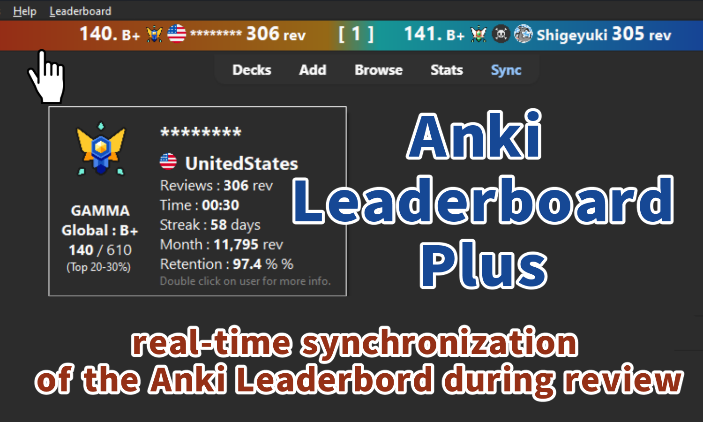

This add-on is for real-time synchronization of the Anki Leaderbord during review (prototype). The leaderbord is displayed on the top bar of Anki and updates as you review. User icons, country icons, and rank icons are displayed.

**\[ Download page ]** [🏆️Anki Leaderboard Plus (Anki Add-on Download Page, For Patrons Only)](https://www.patreon.com/posts/anki-leaderboard-115088003?utm_medium=clipboard_copy&utm_source=copyLink&utm_campaign=postshare_creator&utm_content=join_link)

---

 

- [🏆️Anki Leaderboard Plus](#️anki-leaderboard-plus)
- [📖How to use](#how-to-use)
  - [Reviewer \& Sync](#reviewer--sync)
- [Options](#options)
  - [Leaderbord Type](#leaderbord-type)
  - [Chase Mode](#chase-mode)
    - [Chase Mode Enable (default)](#chase-mode-enable-default)
      - [Target Rank (multiples)](#target-rank-multiples)
    - [Chase mode Disabled](#chase-mode-disabled)
  - [Battle mode](#battle-mode)
  - [Display Info](#display-info)
  - [Bar Position](#bar-position)
    - [1. Display the bar at the Top](#1-display-the-bar-at-the-top)
    - [2. Enable and display the Bar](#2-enable-and-display-the-bar)
  - [Color](#color)
  - [Credit](#credit)
  - [💡Frequently Asked Questions](#frequently-asked-questions)
    - [Q. Why is this not free?](#q-why-is-this-not-free)
    - [Q. When will it be free?](#q-when-will-it-be-free)
  - [🚨Report problems or requests](#report-problems-or-requests)
  - [📥Download](#download)

 

# 📖How to use

1. 🚨This add-on will not work without the Anki leaderboard. If you don't have it yet, [please download it from AnkiWeb and register. (Free)](anki-leaderboard.md)

2. 🚨To use this add-on you need to sync your leaderboard settings to AnkiWeb. Please turn on this new setting in the leaderboard.

Leaderboard Config -> Others tab -> Sync multiple devices -> Auto save this devices Config data to AnkiWeb \[ ON ]

## Reviewer & Sync
1. The bar's leaderboard is updated when a card is reviewed.
1. It may take a few seconds to update the leaderboard.
1. The bar leaderboard is updated after the deck is synced.
1. When you press "Decks" on Anki top toolbar it will sync.

 

# Options

1.🖱️Click on the bar to see the options.

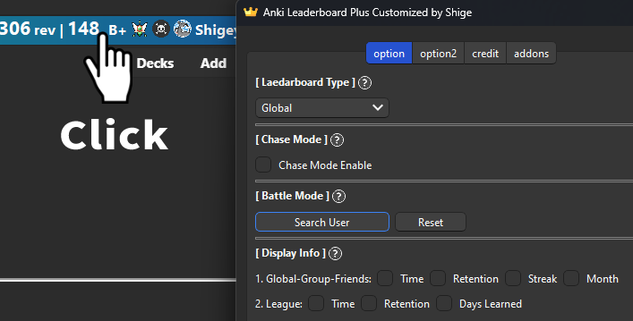

1. Or select "Plus Config" from the leaderboard menu.

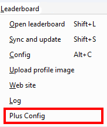

## Leaderbord Type

Toggles the type of leaderboard displayed in the bar.

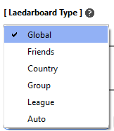

1. Use “Auto” to use the default leaderboard used in the original leaderboard.
1. This option is local, so changing it will not change the original leaderboard default. (e.g. if a group is displayed in Anki's Home, changing this option to Global will not change the leaderboard in Home)
1. League leaderboards only work during the season.

## Chase Mode

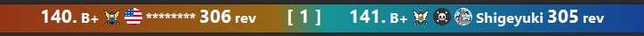

When enabled, the users displayed will be you and the user whose rank is one higher than yours. The idea for this feature was inspired by the chase mode in Anki-Kill-Streaks.

### Chase Mode Enable (default)

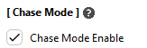

1. The center of the bar shows the difference between the user and your review (or XP): 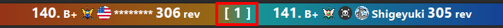
2. The color of the bar will change based on the difference in reviews.
e.g. If you have more reviews than your opponent, the color will be more blue. Conversely if the other party has more reviews than you, the color will be more red: 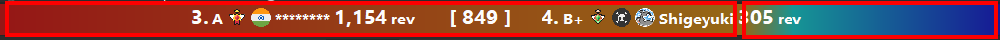
1. This color can optionally be reversed or the color can be disabled.
2. 🖱️Double click on the right or left side of the bar to open user info: 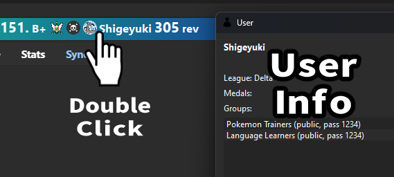

#### Target Rank (multiples)

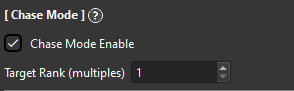

You can adjust the rank of users to be displayed. If you set it to 10, users with a multiple of 10 will be displayed. e.g.
1. Target rank: 1 -> other user rank 158, your rank : 159
1. Target rank: 10 -> other user rank 150, your rank : 159
1. Target rank: 100 -> other user rank 100, your rank : 159

### Chase mode Disabled

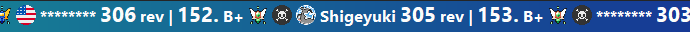

1. The bar displays about 30 users.
1. Your user name is auto displayed in the center of bar.
1. Your friends' names are blue.
2. The statuses displayed are review and time or xp and review. (You can optionally add more info)
3. The bar can be moved left or right. -> Mouse wheel scroll (up/down) or arrow keys (left/right)

## Battle mode

This option allows you to fix the users to be displayed in the bar. (The user does not auto change)

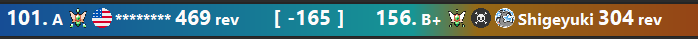

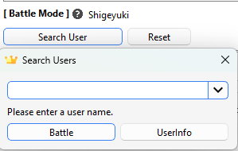

1. When you set a user, the name will be displayed on the right side of the option.
2. Values are displayed as negative or positive.(Not displayed when not in battle mode)
3. Press the reset button to exit battle mode.
4. If you use this option the user will not be notified. (At the moment there is no any communication feature on the leaderboard.)
5. If the user is not found, it will not be displayed even if set. (e.g. the user is not logged in yet today, or the leaderboard of the league but you and the user are in different leagues)

## Display Info

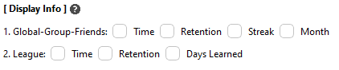

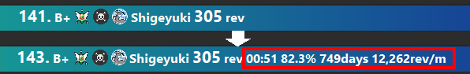

1. You can customize the info displayed on the bar. In Global reviewers are always displayed, in League XP is always displayed.

## Bar Position

### 1. Display the bar at the Top

Top: 
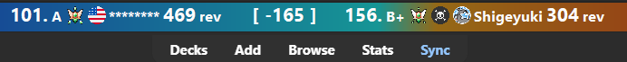

Bottom: 
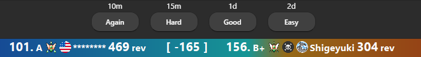

1. You can change the bar position to the top or bottom of Anki.
Default is the top.
1. If you set the bar at the bottom, Anki's auto-hide answer bar feature may not work. This issue has not yet been resolved.

### 2. Enable and display the Bar

1. Turning it off disables the add-on and hides the bar.
To show the bar again, use “Plus Config” in the leaderboard menu, or go to Tools -> Add-ons -> Select Leadearboard Plus -> Config

## Color

1. **Bacgtound Color Enable:** Enables or disables the background color of the bar: 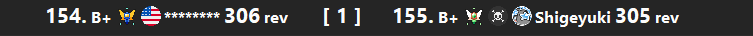
2. **Color Reverse:** Reverse the bar colors red on the left and blue on the right: 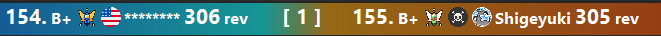

## Credit
1. This add-on is a customized version of the shutdown Anki LeaderBoard, originally created by Thore Tyborski and credit goes to him. [All Credit](anki-leaderboard.md#credit)
2. The idea for this feature was inspired by Anki KillStreaks Chase Mode.

 

---

## 💡Frequently Asked Questions

---

### Q. Why is this not free?

Basically the free leaderboard sync with the server only about 10 times per user/day, currently there are about 2,500 active users (2024-10-31).

This Plus add-on sync with every review so the server load increases from hundreds to thousands per one user, it is probably the same as the load increase in the number of users to about 250,000 to 25 million (maybe) so this feature is not sustainable for free for now.

In other words I plan to develop high risk functions with server load on this Plus and functions that are not server load will be developed on the free leaderboard.

---

### Q. When will it be free?

Leaderboard is not my original add-on so I want to make it free as soon as possible. It will be free when I develop a lot of workarounds, I plan to develop them in the future, e.g:
1. Make it work offline
1. Separate servers
1. Allow users to use their own servers
1. Disable servers only when they are busy

However the disadvantage of these is that development costs are a bit higher and server functions are power down. (e.g., splitting the server reduces costs but reduces users.)

 

## 🚨Report problems or requests
  1. <a href="https://www.patreon.com/Shigeyuki" target="_blank">Patreon (Direct Message)</a> : Feel free to contact me via DM on Patreon or in the comments of the post.

 

## 📥Download

* Download the .ankiaddon file and open it with a double-click, or install it from the "Install from file" menu in the Anki add-ons management screen. (Please note that you cannot install the file by dragging and dropping it into Anki) If you have any problems, questions or requests feel free to send them to me.

* **\[ Download page ]** [🏆️Anki Leaderboard Plus (Anki Add-on Download Page, For Patrons Only)](https://www.patreon.com/posts/anki-leaderboard-115088003?utm_medium=clipboard_copy&utm_source=copyLink&utm_campaign=postshare_creator&utm_content=join_link)