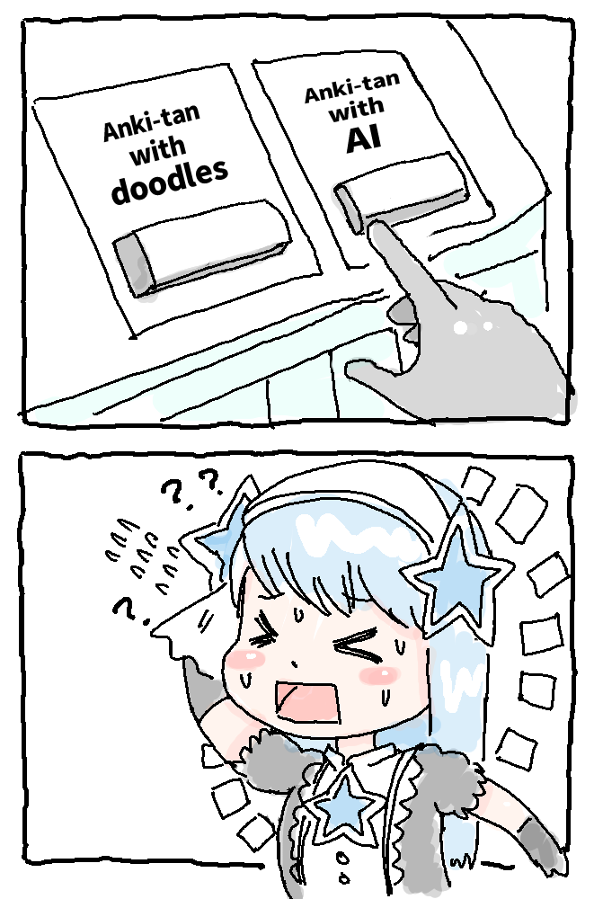
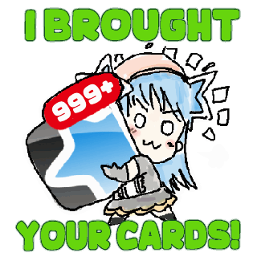

# Anki-tan

- [Anki-tan](#anki-tan)
    - [What is Anki-tan?](#what-is-anki-tan)
    - [Gallery](#gallery)
    - [Anki-tan App icon](#anki-tan-app-icon)
    - [Anki-tan emoji](#anki-tan-emoji)
    - [Anki-tan stickers](#anki-tan-stickers)
    - [License](#license)
      - [What is CC-BY-SA 4.0?](#what-is-cc-by-sa-40)
      - [Other Notes](#other-notes)

### What is Anki-tan?

Anki-tan is a doodle I drew for [April fool's day this year(2025, reddit)](https://www.reddit.com/r/Anki/comments/1joswls/today_april_1st_is_magical_girl_ankitans_12th/). (Nothing to do with official Anki.) To be frank I was too lazy to draw it so the next appearance was scheduled for April 1 next year, but some Anki users requested me so I added it a bit more. The next appearance is still undecided. It's inspired by [Wikipe-tan](https://en.wikipedia.org/wiki/Wikipedia:Wikipe-tan) and [Anki's fan art](https://www.reddit.com/r/Anki/comments/gt3zcb/made_an_anki_fanart_to_express_my_gratitude/).

### Gallery

 
This add-on does not exist because I drew it on April Fool's Day.

  
(*This Leech-tan was drawn on April Fool's Day, 2025, so it is not 2022. She is pretending to exist from 2022.)

### Anki-tan App icon

256x256, Transparent png.

### Anki-tan emoji

Anki-tan's emoji for the Anki Leaderboard Discord server. (128 x 128px)

                                                 

### Anki-tan stickers

Anki-tan's stickers for the Anki Leaderboard Discord server. (320 x 320px)

    

### License

[CC4 (CC-BY-SA 4.0)  
](https://creativecommons.org/licenses/by-sa/4.0/)

I licensed Anki-tan as CC4 (CC-BY-SA 4.0), because I received several inquiries confirming permission for them to draw Anki-tan.

This license is the same license as Wikipe-tan, and is close to the open source that Anki's program uses.

> *In short, these licenses mean that anybody can use the character, as long as they give appropriate credit to the creator and all derivative work uses the same licensing. ([Wikipe-tan wiki](https://hero.fandom.com/wiki/Wikipe-tan))*

#### What is CC-BY-SA 4.0?

1. You are free to use or customize Anki-tan designs and these my Anki-tan illustrations, but you need to credit me. -> `Shigeyuki https://www.patreon.com/Shigeyuki`
2. If you customize Anki-tan you need to make it CC4 so that other people can use it too. (e.g. I and others are free to use any new Anki-tan illustrations and designs that you customize by crediting you.)
3. Commercial use is possible, but since it is CC4, purchasers are free to use Anki-tan's illustrations and designs. (e.g. Purchasers can customize their purchased Anki-tan illustrations to create new products and sell them on CC4.)
4. This license already allows free use, so you don't need to ask me for permission.

#### Other Notes
* If you want to use Anki's official logo you probably need to make it clear that it is not the official Anki project. -> [Anki License](https://github.com/ankitects/anki/blob/main/LICENSE)
