# Anki-tan

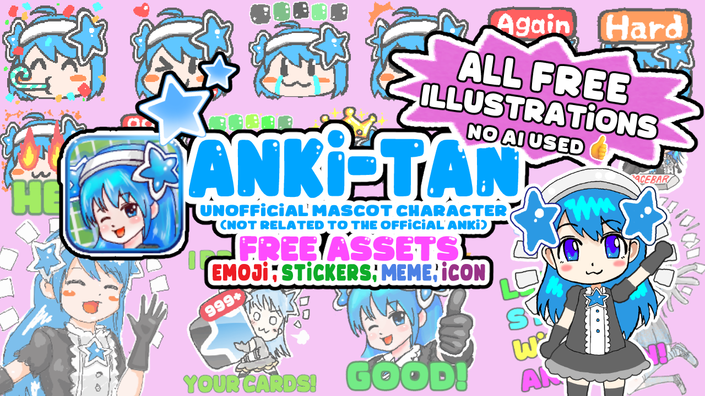

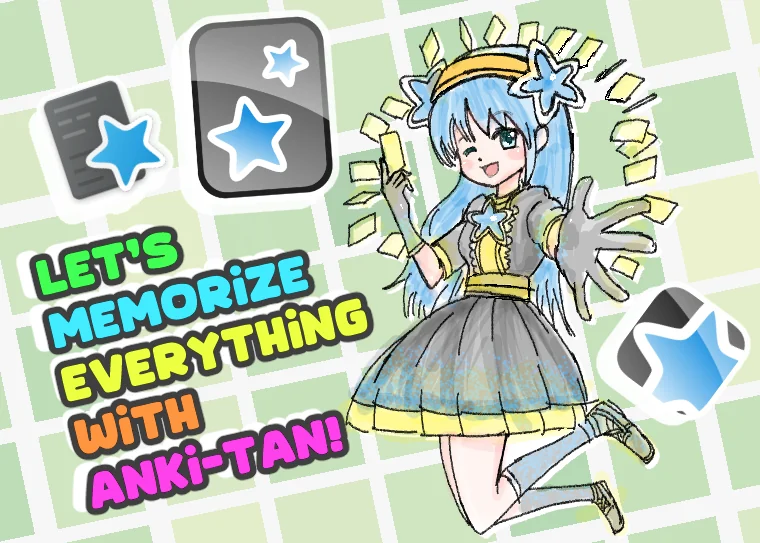

- [Anki-tan](#anki-tan)
    - [What is Anki-tan?](#what-is-anki-tan)
    - [Gallery](#gallery)
- [Asset](#asset)
    - [Anki-tan App icon](#anki-tan-app-icon)
    - [Anki-tan emoji](#anki-tan-emoji)
    - [Anki-tan stickers](#anki-tan-stickers)
    - [Anki-tan sprite](#anki-tan-sprite)
- [Batch download](#batch-download)
- [License](#license)
  - [What is CC-BY-SA 4.0?](#what-is-cc-by-sa-40)
  - [Notes](#notes)

### What is Anki-tan?

Anki-tan is a doodle I drew for [April fool's day this year(2025, reddit)](https://www.reddit.com/r/Anki/comments/1joswls/today_april_1st_is_magical_girl_ankitans_12th/). (Nothing to do with official Anki.) To be frank I was too lazy to draw it so the next appearance was scheduled for April 1 next year, but some Anki users requested me so I added it a bit more. The next appearance is still undecided.

**Design:** It's inspired by [Wikipe-tan](https://en.wikipedia.org/wiki/Wikipedia:Wikipe-tan) and [Anki's fan art](https://www.reddit.com/r/Anki/comments/gt3zcb/made_an_anki_fanart_to_express_my_gratitude/). The floating flashcards are inspired by the design of [Flandre Scarlet](https://touhou.fandom.com/wiki/Flandre_Scarlet) a character from the Touhou Project (Touhou is a game that influenced Undertale). "-tan" is Japanese slang and is often used in the names of cute anime characters. (e.g. yomitan, binchou-tan)

**Why Ankitan?:** There are already several fan art characters for Anki but their licensing status is unclear. Also if you use them without permission, authors may get angry or restrictions may be placed on how they can be used. By drawing them myself I can avoid all of these issues.

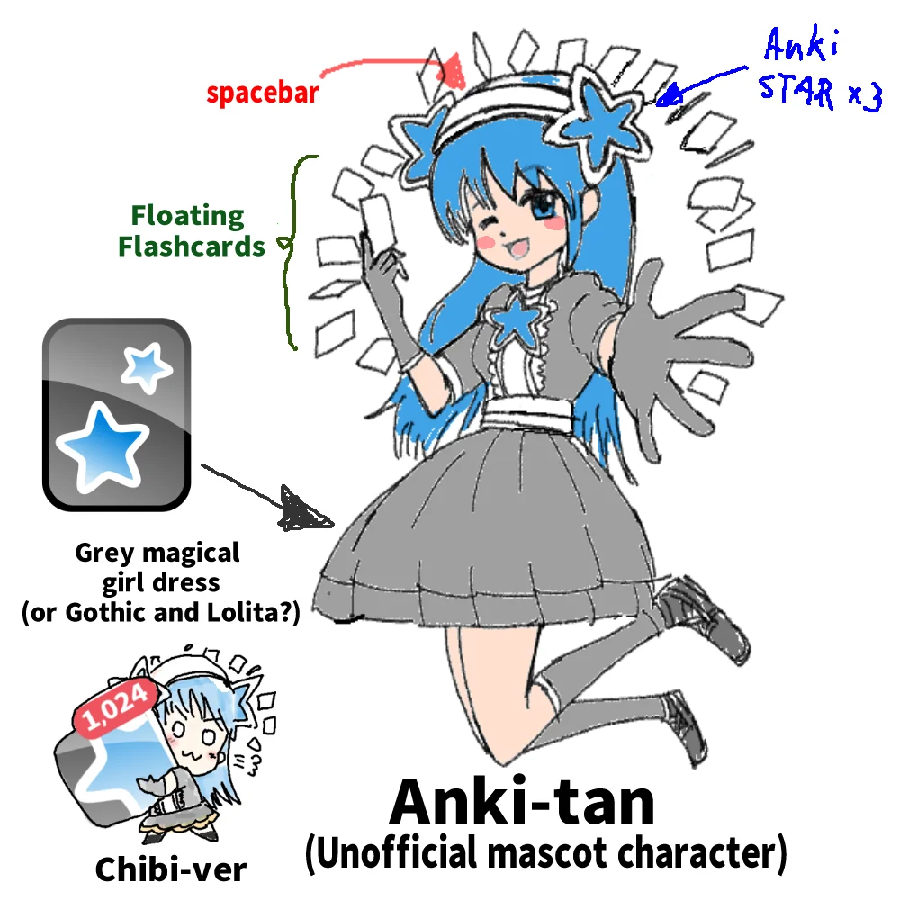

### Gallery

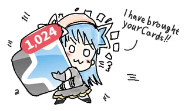

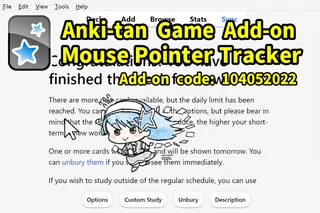 
This add-on does not exist because I drew it on April Fool's Day.

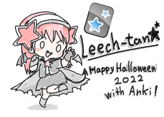  
(*This Leech-tan was drawn on April Fool's Day, 2025, so it is not 2022. She is pretending to exist from 2022.)

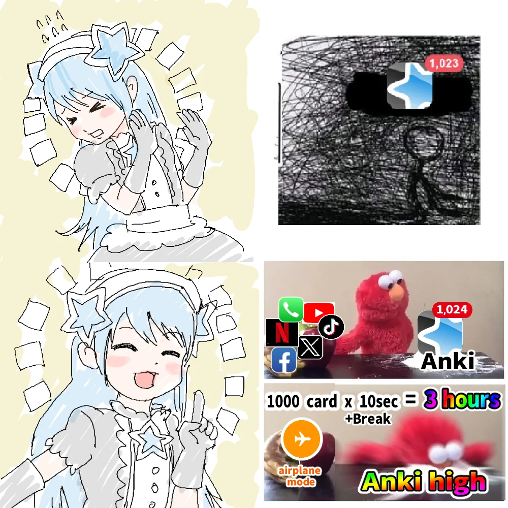

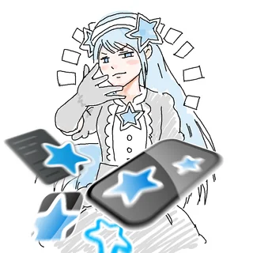

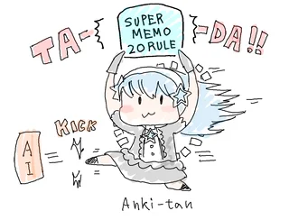

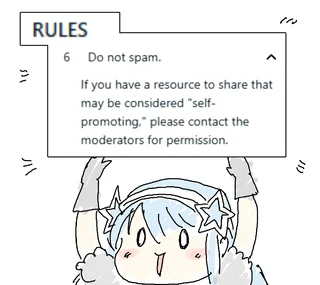

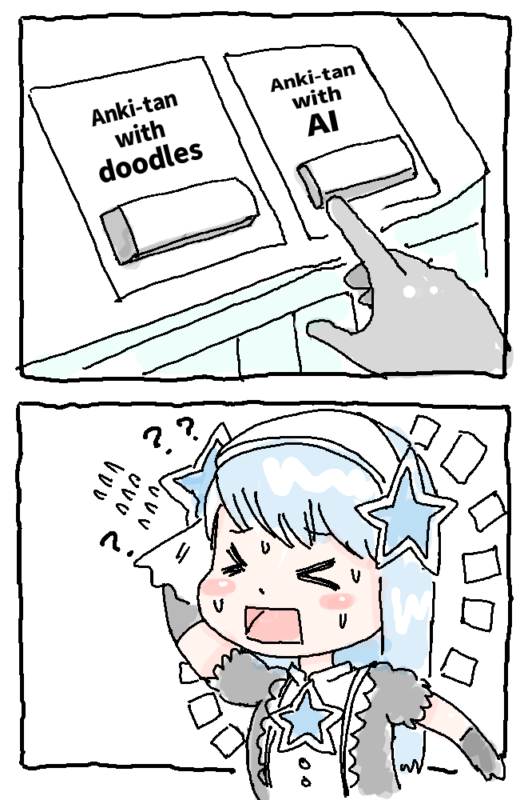

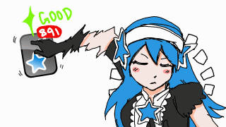

# Asset

### Anki-tan App icon

256x256, Transparent png.

### Anki-tan emoji

Anki-tan's emoji for the Anki Leaderboard Discord server. (128 x 128px)

                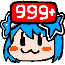                                 

### Anki-tan stickers

Anki-tan's stickers for the Anki Leaderboard Discord server. (320 x 320px)

  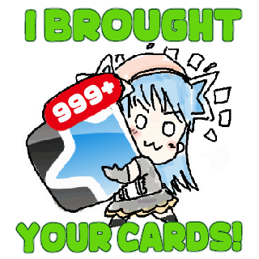  

### Anki-tan sprite

These are animated Anki-tan illustrations I created for my Youtube videos, they include 240px animated png and 720px image sequences.

idle, hello (240px)

# Batch download

* [Anki-tan.asset.pack.v1.0.zip](https://github.com/shigeyukey/shige-addons-wiki/releases/download/Anki-tan/Anki-tan.asset.pack.v1.0.zip) 2026-04-01 (8.74 MB)

  

# License

Typically non commercial meme and fan art use characters without permission so personally I think it’s fine to freely use Anki-tan in such cases.

If you need a specific license for reasons such as development, corporate use, commercial purposes, or simply because you’re overly meticulous, Anki-tan is licensed under CC4.

[CC4 (CC-BY-SA 4.0)  
](https://creativecommons.org/licenses/by-sa/4.0/)

I licensed Anki-tan as CC4 (CC-BY-SA 4.0). This license is the same license as Wikipe-tan, and is close to the open source that Anki's program uses.

> *In short, these licenses mean that anybody can use the character, as long as they give appropriate credit to the creator and all derivative work uses the same licensing. ([Wikipe-tan wiki](https://hero.fandom.com/wiki/Wikipe-tan))*

## What is CC-BY-SA 4.0?

1. You are free to use or customize Anki-tan designs and these my Anki-tan illustrations, but you need to credit me. -> `Shigeyuki https://www.patreon.com/Shigeyuki`
2. If you customize Anki-tan you need to make it CC4 so that other people can use it too. (e.g. I and others are free to use any new Anki-tan illustrations and designs that you customize by crediting you.)
3. Commercial use is possible, but since it is CC4, purchasers are free to use Anki-tan's illustrations and designs. (e.g. Purchasers can customize their purchased Anki-tan illustrations to create new products and sell them on CC4.)
4. This license already allows free use, so you don't need to ask me for permission.

## Notes

* **Trademark:** Anki-tan contains the word "Anki" but "Anki" is the official Anki trademark and I have not obtained permission to use this name, if it's for non commercial use I think no one will probably care but if it's for commercial purposes or if you're a competitor of Anki problems may arise so please use it at your own risk. (in other words Anki-tan may be shut down if the official Anki raises complaints.)

* **Anki-Logo:** If you want to use Anki's official logo you probably need to make it clear that it is not the official Anki project. -> [Anki License](https://github.com/ankitects/anki/blob/main/LICENSE)

