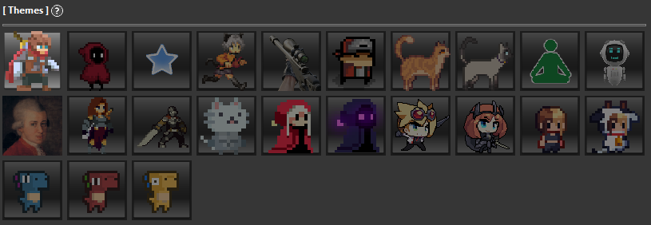
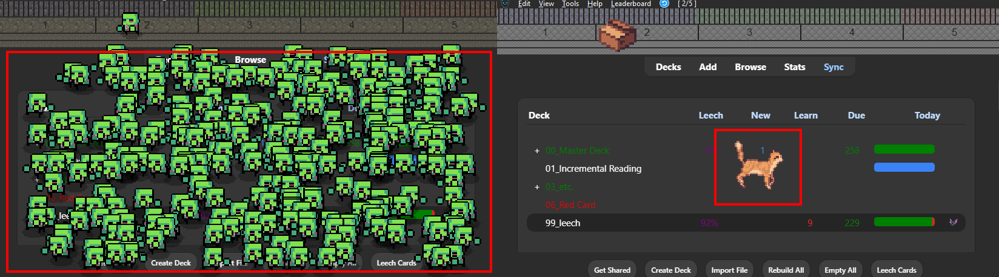
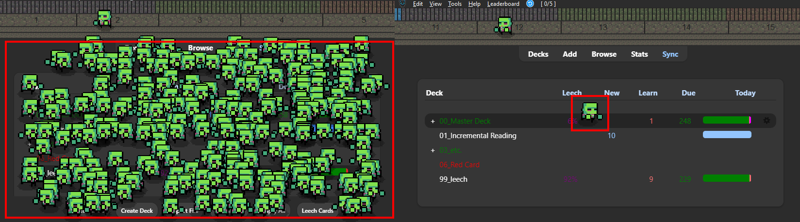
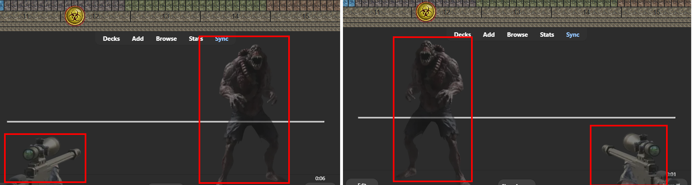
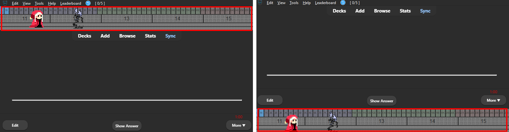
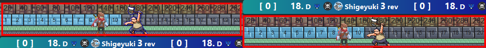

# 🎨Change Theme

## 1. Change Theme 

You can change the character from the Theme tab. 

## 2. Change Theme - Right click

Themes can also be changed by right-clicking on the progressbar during review. 

 

## 3. Change Size ( 0.5 ~ 3 )
Change the size setting on the Theme tab to scale the character and progress bar. (Some themes are not affected) 

 

 

## Animation outside bars

### Show outside of progress bar

Sets whether or not animations are displayed outside of the progress bars. This option is only effective for Cat Gathering in Anki or Resident Anki.
 
 

### Max Mini Zombies 300

The number of mini zombies in Resident Anki auto changes depending on the number of review cards. This option limits the number of mini zombies to one.
 
 

### Reverse left and right

* Reverses the left and right sides of the animation.
* This option is only available on Study With Zombie or AnkiTerminator.
* It cannot be changed during reviews, To activate it, the review must be closed.

 

## Progress bars position

Change the position of the progress bars (and Animations) to the top or bottom.

## Multiple progress bars position

If there are multiple bars other than AnkiArcade, change the position to the top or bottom. (e.g. [Anki LeaderBoard Plus](../Anki-Leaderboard-Plus.md))

 
 