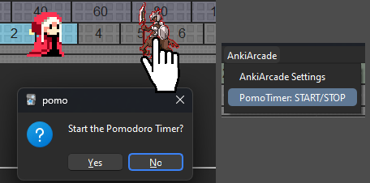

# ⏱️Pomodoro & Break Timer

- [⏱️Pomodoro \& Break Timer](#️pomodoro--break-timer)
    - [Pomodoro Timer Bar](#pomodoro-timer-bar)
    - [Pomodoro in menu bar](#pomodoro-in-menu-bar)
    - [Character glows green](#character-glows-green)
    - [Custom Pomodoro Time](#custom-pomodoro-time)
  - [Break Timer](#break-timer)
    - [compatible addon: ☕Break Timer](#compatible-addon-break-timer)
    - [Start Break Timer](#start-break-timer)

### Pomodoro Timer Bar
The progress bar at the bottom is the Pomodoro timer. You can start/stop the 25 minute timer by clicking on an enemy character or from the menu.

### Pomodoro in menu bar
While the Pomodoro Timer is counting,  the remaining time is displayed in the menu bar. 

### Character glows green
The character glows green while the Pomodoro Timer is active, it can be optionally disabled. 

### Custom Pomodoro Time
 The Pomodoro Timer time can be changed in the settings. Minimum 1 minute, maximum 1 hour. 

 

## Break Timer

### compatible addon: [☕Break Timer](../break-timer.md)

* Downloading the addon BreakTimer will auto start BreakTimer from AnkiArcade. (The BreakTimer functionality incorporated into AnkiArcade has been discontinued.)

<!-- ### 1 . Run break timer from menu bar

Break timer can be activated from the menu bar. The default setting is 5 minutes.   -->
<!--

### 2. Interrupt break timer

This break timer can be interrupted by right-clicking.
   -->

###  Start Break Timer
This break timer can be started in three different ways.
1. Start from the menu bar (BreakTimer)
1. When the Pomodoro timer is done.
1. when the target number of cards has been completed.

<!-- #### Start Break Timer - Pomodoro timer done
The setting to start the break timer when the Pomodoro timer is done is located under the time set for the Pomodoro timer. The default setting is off.
   -->

<!-- #### Start Break Timer - Target number of cards done
The setting to auto start the break timer when the target card count is done can be found in the advanced settings on the Card tab. Enable "Advanced" and then enable "Start break timer after target cards count is done". The default setting is OFF.

  -->

<!-- ##  3. Hide Anki

When the break timer is started, there is a function to auto hide Anki by put it into the taskbar. The default setting is OFF.
   -->

<!--
### 1. Fade in/out
There is a fade and fade out function when you hide Anki. But this function may not work outside of Windows. (I have tested it on Mac and Linux and it causes flickering.)
     -->

