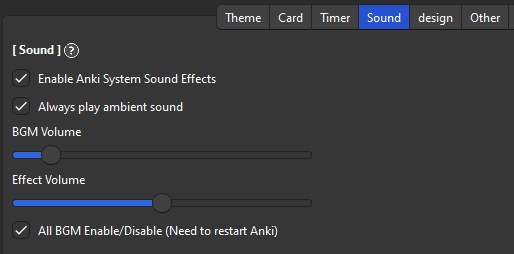

# 🎵Sound

## Sound Volume

The volume of background music and action effects can be adjusted in the Sound tab.

### Enable Anki System Sound Effects

* Enable or disable the sound of Anki's UI. e.g. sound when starting Anki, opening Browse or Editor

### Always play ambient sound

* Always make background music ambient sound. (Sounds of rain and bonfires, etc.)

### BGM Volume

* Adjust the volume of background music and ambient sound. If it is distracting, try setting it to 0.

### Effect Volume

* Short sound effects such as slashes or progress bar completion. If it is distracting, try setting it to 0.

### All BGM Enable or Disable

1. Completely disables or enables all sound functions. To enable this function it is necessary to restart Anki.

1. The AnkiArcade sound system is not compatible with some devices. So if you are using Linux and add-on does not work disabling sound may solve the problem.

   * If you cannot activate it completely you can disable it manually by setting “all_bgm_enable” to `false` from add-on config: `"all_bgm_enable" : false,`

### Crash Check

I added a new function to automatically detect crashes. If Anki does not exit normally a pop-up will be displayed and you can choose to enable or disable the sound system. If there are misdetections you can disable this option. (e.g. Another add-on is causing crashes. The sound is already working fine so it's not relevant.)

### Sound System

If sound effects do not work you can change the sound system (Anki must be restarted after changing). This option only affects Sound effects, BGM uses a different mechanism (MIDI) and is unaffected.

1. pyglet (default)
   * The default sound system for games. Lightweight and supports many platforms.

2. qmedia_player
   * Plays sounds using Anki's Qt. Lightweight but may not work on some devices or older versions of Anki.

3. mpv_player
   * Plays sounds using mpv, which Anki uses for audio playback. Relatively likely to work, but it may be a bit more load on your PC.

