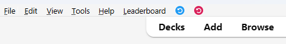
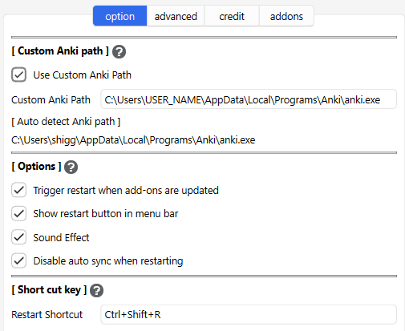
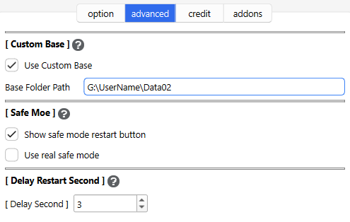

# 🔂AnkiRestart V2

<!-- Created -->

Quickly restart Anki. This is an improved version of the old AnkiRestart (Prototype), use only the add-on to restart, not external files.

## How to use

Installing the add-on will add an icon to the Anki menu bar. Clicking on this icon will quickly restart Anki. MAC cannot display the icon here, so it will be displayed in the system tray instead. Blue is a normal restart, and red is an optional safe mode restart.

### Custom Anki Path

To restart Anki, the path to the Anki executable file is required (win:anki.exe, Mac:anki.app, Linux:anki). If the automatically detected Anki path is incorrect, you will need to set it manually.

### Options

### Trigger restart when add-ons are updated

When add-ons are updated Anki needs to be restarted. This option displays a pop-up window to restart Anki when add-ons are updated (it is enabled by default). e.g.
1. When Anki is launched and add-ons are updated.
2. When add-ons are updated from the Add-ons dialog.

### Show restart button in menu bar

Show or hide the buttons displayed on Anki's Home menu bar.

### Sound Effect

Enable or disable a sound when restarting.

### Short cut key

You can change the shortcut key for restarting Anki. The shortcut key will not work if it conflicts with other add-ons or Anki shortcut keys, so if the key does not work try changing it.

## Advanced tab

These are options for advanced users, there is no need to change them unless you need to.

### Custom Base

Anki allows you to specify the path to the file containing the user profile when it starts up. If you restart Anki as is, this path will not be used. If you set a path for this option, you can use that path to start up when you restart.
 For more info please read the Anki Manual:

* AnkiManual: [Startup Options](https://docs.ankiweb.net/files.html#startup-options)

### Safe Mode

This new safe mode disables all add-ons except AnkiRestart and then restart. Disabled add-ons will be enabled after restarting, so restarting again will restore the original state. This option is disabled by default.

#### Show safe mode restart button

Enabling this will display a menu and button to restart in safe mode. (Red icon)

#### Use real safe mode

This mode manually disables add-ons, so it is not Anki's default safe mode. Enabling this option will restart Anki in its native safe mode. In this case, AnkiRestart will also be disabled.

### Delay Restart Second

This add-on waits a few seconds when restarting Anki. It probably works even with 0 seconds, but I set it to 3 seconds just to be safe.

## FAQ

#### Q. What is the difference between V1 and V2?

 This version restarts Anki using only the add-on without using external files. (Beta) So there is no problem with misdetection by antivirus software. I also fixed some bugs, enhanced features, and optimized the code.

#### Q. What is Safe Mode used for?

* When a bug occurs checking whether the cause is an add-on or native Anki.
* Sometimes you want to use native Anki.

