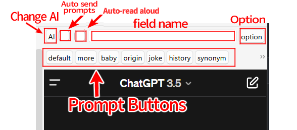
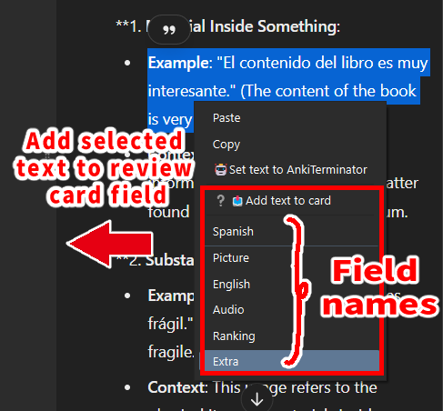
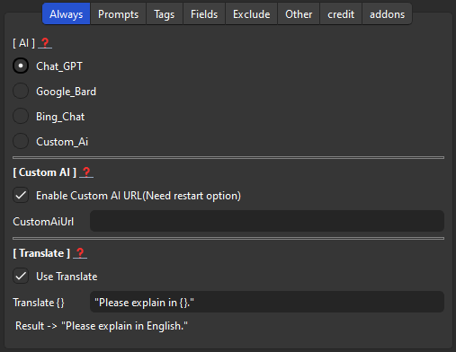
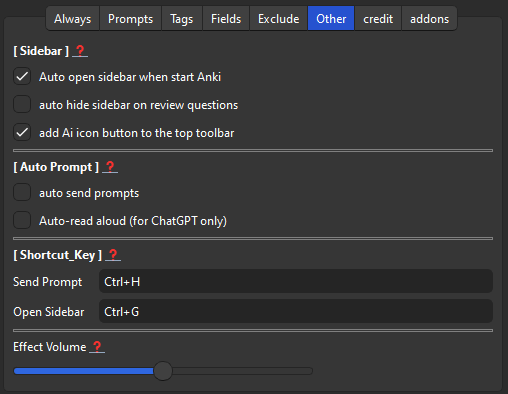

# 🤖Anki Terminator Wiki
**ChatGPT Sidebar for Review, GoogleGemini (Created by Shige)**

**Report->**
[ **RateThis**<!--🟢--> ](https://ankiweb.net/shared/review/1428126516) 
|[ **Reddit** ](https://new.reddit.com/r/Anki/comments/1b0eybn/simple_fix_of_broken_addons_for_the_latest_anki/)
| [ **Forums**](https://forums.ankiweb.net/t/addon-support-ankiterminator-chatgpt-sidebar-for-anki-review-googlebard-bingchat-by-shige/41090)
| [ **Github**<!--🟢--> ](https://github.com/shigeyukey/Anki-Terminator-/issues)
| [ **Patreon** ](https://www.patreon.com/Shigeyuki)

AI sidebar for reviews. Just login to use ChatGPT, GoogleGemini, and Bing Chat for free and easy, no OpenAI API required.There is a feature to auto-send prompts when flipping Anki cards. 

| [**Add-on page (AnkiWeb)**](https://ankiweb.net/shared/info/1428126516)
| **add-on code:** `1428126516`  

<iframe src="https://www.youtube.com/embed/rLXM63Jc8ng?list=PLZhrgD6s-LFVsEhxRdEHf_OkGVe2YZfeo" frameborder="0" allow="accelerometer; autoplay; clipboard-write; encrypted-media; gyroscope; picture-in-picture" allowfullscreen style="aspect-ratio: 16/9; width: 100%;"></iframe>

##  ▲ Attention
 This add-on stores your login information in a Cookie. If you are concerned about security, please do not use this add-on. (To delete the cookie, delete the add-on or delete the User_files folder.) 

*  ➕️ Advantages of using cookie 
    * No need for tedious 2-step authentication
    * Free AI can be used as much as you want (no need for API)
 
*  ➖️ Disadvantages of using cookie 
    * Poor security.
    * Add-on is easily broken. 

To resolve this cookie issue, API is needed (in short, it will be paid for). I have not yet developed the function to use the API. 

### Limits of each AI 
 * **Chat GPT** 
    * The fastest, but has an hourly limit (30 times per hour, so about 1 time every 2 minutes), so if you use it continuously, it will reach the limit soon.
 * **Google Gemini** 
    * Unlimited number of replies, but replies are a bit slow.
    * Edit : 
 * **Bing Chat** 
    * 30 chats per session and 300 chats per day, but GPT-4 is free.

### 🛠️Known Issues
* Mac Anki23.12.1 cannot open Bird and Bing(ChatGPT is good), but Mac23.12 can. This problem is a Qt issue, so perhaps the latest Anki update will fix it when Qt is updated.

 
 

# 📖How to Use

- [🤖Anki Terminator Wiki](#anki-terminator-wiki)
  - [▲ Attention](#-attention)
    - [Limits of each AI](#limits-of-each-ai)
    - [🛠️Known Issues](#️known-issues)
- [📖How to Use](#how-to-use)
  - [AI Sidebar](#ai-sidebar)
  - [Right Click Actions](#right-click-actions)
  - [Options](#options)
    - [Always tab](#always-tab)
      - [AI : ChatGPT, GoogleGemini, BingChat](#ai--chatgpt-googlegemini-bingchat)
      - [Enable Custom AI URL](#enable-custom-ai-url)
      - [Translate](#translate)
    - [Prompts tab](#prompts-tab)
    - [Tags tab](#tags-tab)
    - [Priority Fields tab](#priority-fields-tab)
    - [Exclude tab](#exclude-tab)
    - [Other tab](#other-tab)
      - [AI Sidebar options](#ai-sidebar-options)
      - [Auto Prompt](#auto-prompt)
      - [Shortcut Keys](#shortcut-keys)
      - [Effect Volume](#effect-volume)
  - [📥 How do I install this add-on?](#-how-do-i-install-this-add-on)

  

 

When the add-on is installed, the ChatGPT icon will be added to the right side of the top toolbar. 
Clicking on it will open the AI sidebar. 

 
 

## AI Sidebar

 

 1.  **Change AI:**  Click to change the AI.
 1.  **Auto Send Pronpts:**  Automatically sends prompts when card answer is shown and when Pronpts button is pressed.
 1.  **Auto-read aloud (for ChatGPT only):** The ChatGPT read aloud button is automatically pressed after the text is generated. This feature may break if the ChatGPT website changes, please contact me if it does not work.
 1.  **Field Name:**  The text of the field used in prompts is automatically inputted.
      1. **Right click:**  You can enter text in this box by right-clicking.
      1. Select text in Anki -> Right click -> Chat GPT
 1. **Pronpts Buttons:** Input prompts into ChatGPT. Optionally customizable.
 1. **Option :** Open the Options dialog.

## Right Click Actions

  1. **Add text to card (AI-Sidebar)**
     1. To add a selected text in the sidebar to the Reviewer's card.(Beta)
     2. Drag to select text in the AI sidebar.
     3. Right click to display context menu.
     4. Select name of the field.
  1. **Set text to AnkiTerminator (AI-Sidebar)**
     1. Set the selected text in the sidebar to the AI sidebar text box. The purpose of this is to submit using the prompts set on the buttons.

  2. **Explain with AnkiTerminator (Reviewer, Editor)**
     1. Send the selected text in the reviewer or editor to the AI for description. This menu will not appear if the AI sidebar is not initialized.

 

## Options

### Always tab

 

####  AI : ChatGPT, GoogleGemini, BingChat
  * Select the AI you wish to use. You can also quickly change the AI by pressing the AI icon button in the upper left corner of the sidebar.

#### Enable Custom AI URL
  * A page with the specified URL can be displayed in the sidebar.
When this setting is enabled, a custom URL will be added to the \[ AI ] at the top (option must be restarted). Prompts and automatic submissions are not available for the custom URL.

####  Translate
 * The default prompt is English, so non-native English speakers cannot use it, but you can request translation to ChatGPT using prompts. The "{}" is auto-replaced with the language used by Anki.

 

### Prompts tab

 

* You can customize the name of each prompt and button. 
* `{}` will be replaced by field text. 
* The ability to add more prompts is still under development, please wait.
 

### Tags tab

 

* If you use a special tag, you can tell ChatGPT that you are studying that tag. 
* `{}` will be replaced by tag. 

 

### Priority Fields tab

 

* This add-on grabs the text to be used in the prompt from the first field. You can specify which fields are to be prioritized. 

 

### Exclude tab

 

* Does not grab the text from the field by the specified note type. E.g. image occlusion cannot be used because there is no text. 

 

### Other tab

#### AI Sidebar options
 1. **Auto open sidebar when start Anki :**
    * Automatically open the sidebar when you start Anki to display the AI. If the sidebar does not display well, this option may solve the problem.
 2. **auto hide sidebar on review questions:**
    * Hide the sidebar with the reviewer's answer, the purpose is to prevent the answer from being displayed.
 3. **add Ai icon buton to the top toolbar:**
    * Whether to add AI icons to the top toolbar (Deck, Add, Browse, Stat, Sync), Clicking on the icon will open the sidebar. The sidebar can also be opened using shortcut keys.

#### Auto Prompt
 * **auto send pronpts :**
   * Automatically prompts when card answer is shown.
 * **Auto-read aloud (for ChatGPT only):**
   * The ChatGPT read aloud button is automatically pressed after the text is generated. This feature may break if the ChatGPT website changes, please contact me if it does not work.

#### Shortcut Keys
  * **Send pronpts :**
    * There is a bug that when you press enter to send a prompt to ChatGPT, the reviewer's card is answered. This shortcut key allows you to send the prompt without using the enter key.
  * **Open Sidebar :**
    * You can use the shortcut keys to open the sidebar. If it does not work, it may be that you are typing the key incorrectly or that a shortcut key already in use is interfering, if so, try changing it to a different key.

#### Effect Volume
  * You can adjust the volume of the sound effects played when you press the buttons on the sidebar (0-10). If you find it distracting, set it to the leftmost 0.

 

## 📥 How do I install this add-on?
1. Copy and paste the add-on code ( `1428126516` )  into Anki and you can install it. ( Menu -> Tools -> Add-ons -> Get Add-ons -> Code : add-on code )
2. When I develop bug fixes, create new features, or compatibility for New Anki, I will notify you and you can install it.
3. If you rate and recommend it, I will receive a notice and my tedious and sleepy add-ons volunteer work will become more enjoyable and exciting.(This add-on is developed by free volunteer work!👍️)

[Click here and please Rate this add-on, Thank you! :-)  
 ](https://ankiweb.net/shared/review/1428126516)

| [**Add-on page (AnkiWeb)**](https://ankiweb.net/shared/info/1428126516)
| **add-on code:** `1428126516`  