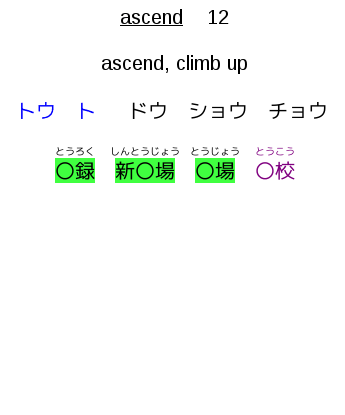
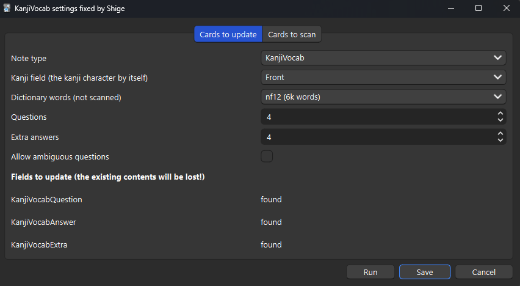

# 🍣KanjiVocab - smart automatic vocab for RTK Fixed by Shige

[](http://patreon.com/Shigeyuki)   <br>

\> *This Anki addon adds Japanese words to a kanji writing deck (such as Remembering The Kanji), using known words from other decks.*

This add-on is a fixed version (fork) of the "KanjiVocab" for Anki24+ (Qt6, Qt5).<br>
(If the original add-on has been updated to Anki 24+ this fork is not required.)

### Credit:
   * Original add-on：[KanjiVocab - smart automatic vocab for RTK](https://ankiweb.net/shared/info/1600796261) / Author : [Helen Foster](https://github.com/HelenFoster)

<br>

(These images are edited and re-uploaded from the original add-on images.)


<br>



## 📖How to use

(These descriptions are edited and re-uploaded from the original add-on.)

### Quick Start

1. Add fields to your kanji deck, named "KanjiVocabQuestion", "KanjiVocabAnswer" and "KanjiVocabExtra". 
2. Edit the card template. Add "KanjiVocabQuestion" to the front of the card, and the other two to the back of the card. They contain furigana, so use {{furigana:KanjiVocabQuestion}} etc. 

### Notes :
1. If you are concerned make a backup of your decks before using the add-on.
1. To get the colours in the screenshots, add these codes to the card styling (CSS)

    ```
    .kv_kanji_known, .kv_kanji_mature {
    background-color: #40ff40
    }

    .kv_kana_known, .kv_kana_mature {
    background-color: #ffff40
    }

    .kv_confuse {
    color: #ff0000
    }

    .kv_likely {
    color: #800080
    }
    ```
2. Vocab card scanning is self-contained. Text scanning requires a recent version of the "[Japanese Support](https://ankiweb.net/shared/info/3918629684)" addon.


<br>

## Detailed Description

#### KanjiVocab - smart automatic vocab for RTK


#### Introduction


This Anki addon adds Japanese words to a kanji writing deck (such as Remembering The Kanji), using known words from other decks. It makes post-completion RTK reviews much more pleasant, and helps link all the new words you're learning with what you learned in RTK.

The addon can add words to the question side with the target kanji hidden, to help decide which kanji to write. It tries to prioritise known words and common words, and avoid words that might suggest the wrong answer. It scans cards in other decks to determine which words are known. It gets the best results from vocab cards, particularly if they have vocab expression and reading fields. It can also scan sentence fields for the words within (this requires the Japanese Support addon). The results are saved into the kanji cards, so can be synced to non-desktop versions of Anki.


Vocab card scanning is self-contained. Text scanning requires a recent version of the "[Japanese Support](https://ankiweb.net/shared/info/3918629684)"

The Python code is licensed under the GNU AGPL, version 3 or later (the same as Anki itself). See http://www.gnu.org/licenses/agpl.html

This addon includes a dictionary derived from the JMdict dictionary file. JMdict is property of the Electronic Dictionary Research and Development Group, and is used in conformance with the Group's licence. See http://www.edrdg.org/jmdict/j_jmdict.html

### Installation

This fixed version is for Anki 24+.

If you are concerned, make a backup of your decks before using the add-on.

Restart Anki, and "KanjiVocab..." should appear on the Tools menu. This opens a dialog with the various options.

### Field Setup

Add fields to your kanji deck for the new information, named as follows:

1. "KanjiVocabQuestion" for the words with masked kanji (put this on the front of the card);
1. "KanjiVocabAnswer" for the answers to the questions (put this on the back of the card, ideally so that it appears in the same place as the question field);
1. "KanjiVocabExtra" for words which would have more than one likely answer (put this on the back of the card).

The above fields contain furigana, so add them using {{furigana:KanjiVocabQuestion}} etc.

Note: These were renamed to remove spaces (as spaces make searching etc more awkward). You can rename existing fields within Anki. Apologies for any inconvenience.

With each run of KanjiVocab, these fields will be overwritten and anything already in them will be lost. Notes with the tag "KanjiVocabFreeze" are left alone; but heavy use of this tag may create more work for you later. Consider putting hand-edited material into other fields instead.

### CSS Setup

Add CSS to your kanji deck to style the words as you like. There is an example in cards_example.css (so just copy that unless you have a different idea). Each word will have exactly one of the following classes:

1. "kv_unique" for words with only one possible answer;
1. "kv_likely" for words with only one likely answer;
1. "kv_confuse" for words with more than one likely answer (by default these only appear as "extra" words).

Also, each word will have exactly one of the following classes (with the ones listed first being higher priority):

1. "kv_kanji_mature" for words where the kanji version is mature;
1. "kv_kanji_known" for words where the kanji version is known;
1. "kv_kana_mature" for words where the kana version is mature;
1. "kv_kana_known" for words where the kana version is known;
1. "kv_kanji_inactive" for words where the kanji version was scanned from a new or suspended card;
1. "kv_kana_inactive" for words where the kana version was scanned from a new or suspended card;
1. "kv_unknown" for words which were not scanned.

Since they are separated like this, it makes sense to use text styles for one set and background colour for the other.

### Settings Dialog

In the "Cards to update" tab:

1. "Note type" is the note type you wish to add the words to.
1. "Kanji field" is the name of the field containing only the kanji character being tested (used to decide which words to add to the card).
1. "Dictionary words" allows words to be taken from the dictionary by frequency (based on JMdict priority tags), even if they did not appear in any scans.
1. "Questions" is the maximum number of words with masked kanji to add to each card.
1. "Extra answers" is the maximum number of extra words to add to each card.
1. "Allow ambiguous questions" lets you choose whether to allow questions with more than one likely answer. Even if not, they can still appear as "extra".
1. The "Fields to update" section shows whether the listed fields have been added correctly.

In the "Cards to scan" tab, each row can be set to a different scan:

1. "Note type" is the note type you wish to scan. A note type can appear more than once with different options.
1. "Scan type" can be "vocab" or "text". A vocab scan considers the expression and reading as-is (the reading is optional). A text scan splits the expression with MeCab (and does not use a reading).
1. The other drop-downs let you select the expression and reading fields for each scan.
1. The checkboxes let you choose whether each scan will consider new and suspended cards. Words from such cards will be prioritised above dictionary words, but not counted as "known".


<br>
<br>


## 🚨Report

If you have any problems or requests feel free to send them to me.

  <!-- 1. <a href="https://ankiweb.net/shared/review/🟢" target="_blank">👍️Rate Comment</a> : You can contact me anonymously, and AnkiWeb will send you an email when I reply, a high rating increases priority of development. -->
  2. <a href="https://www.reddit.com/r/Anki/comments/1b0eybn/simple_fix_of_broken_addons_for_the_latest_anki/" target="_blank">👩‍🚀Reddit</a> : You can request me to repair broken Add-ons.
  3. <a href="https://forums.ankiweb.net/t/simple-fix-of-broken-add-ons-for-the-latest-anki-by-shige/41650" target="_blank">🌟AnkiForums</a> : You can request me to repair broken Add-ons, and it is ideal for open discussions.
  4. <a href="https://github.com/shigeyukey/my_addons/issues" target="_blank">🐙Github </a> : Makes it easier to track problems.
  5. <a href="https://www.patreon.com/Shigeyuki" target="_blank">💖Patreon DM</a> : Response will be prioritized.

<br>
<br>
<br>
<br>
<br>
<br>