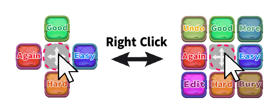

# 🎮Virtual AnkiPad

<!--
(Not Free)🎮Virtual AnkiPad - Floating answer buttons (Created by Shigeඞ)

-->

<!-- Created -->

[](https://www.reddit.com/user/Shige-yuki)

<!-- 🟢 not free yet -->

Hi I'm Shigeඞ! This add-on was developed as a special thanks for the support from my patrons [($5/month)](https://www.patreon.com/Shigeyuki) so it is not yet available for free.

<!-- If you want it for free, download [this empty add-on](https://ankiweb.net/shared/info/🟡) (`🟡`) and please wait, when it becomes free I will notify you and you can install it.
 -->

Patreon: [Virtual AnkiPad - Floating answer buttons, Anki add-on download page for patrons only](https://www.patreon.com/posts/97422306)

<!-- 🟢 not free yet -->


<!-- 🔴 Wiki page ver  -->
<!-- <iframe src="https://www.youtube.com/embed/-wnvkWz8GHg?" frameborder="0" allow="accelerometer; autoplay; clipboard-write; encrypted-media; gyroscope; picture-in-picture" allowfullscreen style="aspect-ratio: 16/9; width: 100%;"></iframe> -->

<!-- 🔴 AnkiWeb ver -->

[youtube demo video (bit old)](https://youtu.be/-wnvkWz8GHg)


Show colorful answer buttons for the reviewer. This makes the buttons more intuitive to press and visually more enjoyable. Their position can be moved by dragging.

This add-on is a standalone version of a feature previously integrated into AnkiArcade and other prototype add-ons.


## How to use

### Show or Hide

Quickly show or hide buttons using the reviewer's right-click action.


### Drag to move

Drag the center box to move all buttons.


### Change button position

Right-click the button to change its position to another position.


### Additional buttons

Right-click the central box to quickly show or hide additional buttons. (Undo, More, Edit, Bury)




### Cancel

Cancel button by pressing and holding it for more than 1 second. (e.g. you pressed the wrong button so hold down the click instead of releasing it to cancel.)


## Option

Options can be accessed from the Tools add-on menu or the right-click menu.


### Button Type

For now there are 2 button types, default and military.


### Enable V-AnkiPad

Show or hide buttons. It's the same as the reviewer's right-click action.

### Show the button inside the reviewer

The button is set to remain inside the reviewer window. Disabling this option will move the button outside the Anki window.

### Zoom Scale

Change button size.

### Block Press button (seconds)

Presses are blocked for 0.5 seconds to prevent accidental repeated button presses. (Related add-on: [🏃🏻No Space Dash - Prevents answer for 1.5 seconds ](https://ankiweb.net/shared/info/1573867049)) This option changes that duration. If not needed please set it to 0.

### Reset window position

Resets the button's window position. This is for when the button moves off-screen and becomes inaccessible.

## Note

I recommend checking that each button is functioning properly before use.

Also I recommend using an add-on that provides feedback to help avoid pressing the wrong button. (e.g. my add-on: [Answer Text feedback](https://shigeyukey.github.io/shige-addons-wiki/answer-text-feedback.html))

## Change log

```
2025-06-14
    - Developed enhanced standalone add-on (V-AnkiPad)
2024-01-30
    - Developed enhanced add-on (AnkiArcade)
2023-05-21
    - Developed prototype add-on (Button Blos)
```


<br>

<h4><a href="http://patreon.com/Shigeyuki">💖Please Support Shige's Anki add-ons development!</a></h4>

Hi thank you for using this add-on I'm Shigeඞ!
1. \[ 🛠️Fix add-ons ] So far I fixed and customized 80+ broken add-ons for free and developed over 30 add-ons as a hobby ([all add-ons](https://ankiweb.net/shared/addons?search=Please%20Support%20Shige%27s%20Anki%20add-ons%20development&sort=rating)). If you have requests to fix broken add-ons feel free to contact me. [Fix broken addons (Free)](https://new.reddit.com/r/Anki/comments/1b0eybn/simple_fix_of_broken_addons_for_the_latest_anki/)
2. \[ 💖Donation ] I'm looking for supporters for my add-ons development because I like Anki!👍️ If you support my volunteer development you will get 14 add-ons for patrons only and 15 game themes included in AnkiArcade ($5/month).

[](http://patreon.com/Shigeyuki)<br>
[Get Patrons only addons](https://www.patreon.com/Shigeyuki) | [Patrons Q and A](https://shigeyukey.github.io/shige-addons-wiki/patrons_q_and_a.html) | [Contact](https://shigeyukey.github.io/shige-addons-wiki/contact.html) <br>

<!-- 🟢 template_patreon_100.md -->

**[[ Special Thanks ]](https://shigeyukey.github.io/shige-addons-wiki/patrons_credit.html#patrons)** <br>
 So far I received donations from 569 patrons and without their support I never could develop this, thank you very much!🙏<br><br>
  **Patrons:** Arthur Bookstein Haruka  Luis Alberto, Letona Quispe 07951350313540  Lily Daniel Kohl-Fink Tim NamelessGO Kyle Mondlak ElAnki Matthew Hartford Abhi S Jonathan Contreras findus161 K  Juan Salgado Peasant of Anki David C Ernest Chan Yaeerrrrrr Christopher Lam Elisabeth Barber Steven Banner Jesse Asiedu GP O'Byrne KM Kolorophyll  Jake Stucki Kaitlyn Bowler Isabel Guan Heidi  Leonora Lomoki Akporyoe ellie Tobias Klös Xiuxuan Wang Aydin Herik Ujwal Chadha gus forester Mia Hoang Hung iuventius Patrick ellis Orlando Frey Take Root tarek Iggi qiting zeng Carly Burdorf Austin Regal Muneeb Khan Sameer Al Matheus Chagas Bryn Price pie_is_good Svel1989 Vivian Cao Keeler Kime Kurt Grabow Zarina Balde Pansanity Gabriel Farrugia R Rebecca Lis Y. Fahim Shaik Augusto Stein Ashok Rajpurohit mootcourt NoirHassassin alpha male, shredded af Morgan Torres Dennis Obis Anh-Tai Nguyen Tae Lee Devon Williams Joseph Howell Gabriel Vinicio Guedes sab hoque Terence Bartenbach only Ythalo Vlogs Ketan Pal Aurora Dzurko Kevin Galvez Tyler Schulte Kmyungc Mac Will S. Meeyah Davis Eric Allen alex han Douglas Beeman Andrew Yick Robert Remedios Marley Easterbrook Temi Jide Ansel Ng Simeon Azfar Hussain Haley Schwarz Woody kenken  [...full list](https://shigeyukey.github.io/shige-addons-wiki/patrons_credit.html#patrons)