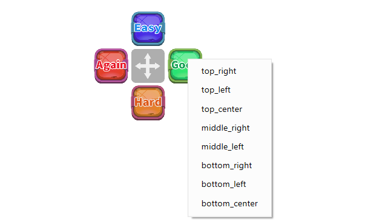
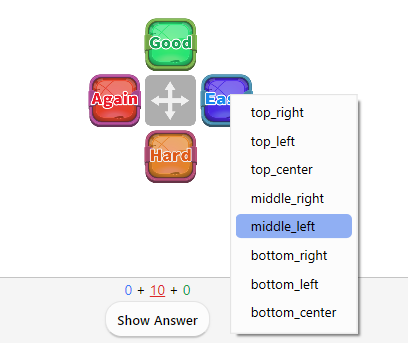

# 🎮Virtual AnkiPad

Review screens will show answer buttons like the gamepad, drag and drop to move it.

<iframe src="https://www.youtube.com/embed/-wnvkWz8GHg?list=PLZhrgD6s-LFVsEhxRdEHf_OkGVe2YZfeo" frameborder="0" allow="accelerometer; autoplay; clipboard-write; encrypted-media; gyroscope; picture-in-picture" allowfullscreen style="aspect-ratio: 16/9; width: 100%;"></iframe>

## How to use

 * Right-click to show additional buttons.
 * Cancel button by pressing and holding it for more than 1 second.
 * Show/hide the buttons in the "Theme" tab of the options.(Top position)

### 
To turn on/off V-AnkiPad by right-clicking during review.

### Change button position

V-AnkiPad buttons positions can be changed by right-clicking. (This menu is not optimized so it is still a bit difficult to use.)

<!--  
This add-on is part of [AnkiArcade](../Home.md), if you become a Patron you can use it. 

 * Review screens will show answer buttons like the gamepad.
 * Drag and drop to move it.
 * Right-click to show additional buttons.
 * Cancel button by pressing and holding it for more than 1 second.
 * Show/hide the buttons in the "Theme" tab of the options.(Top position)
 * Added a function to turn on/off V-AnkiPad by right-clicking during review.

 * Virtual AnkiPad buttons positions can be changed by right-clicking. (This menu is not optimized so it is still a bit difficult to use.)

-->

