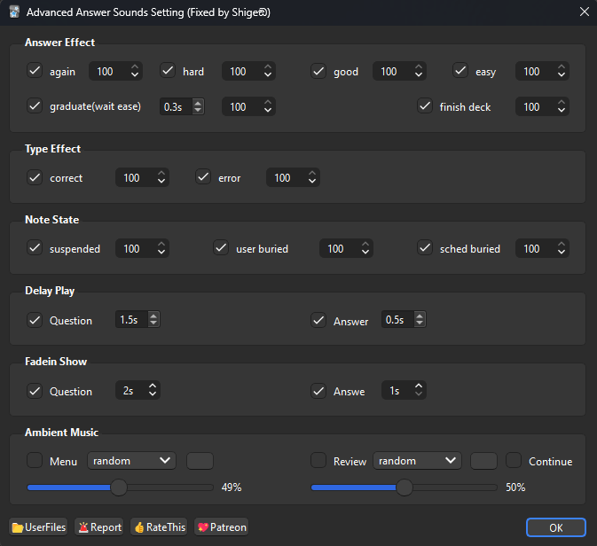

### 🎧️Advanced Answer sound

<!--
### [AnkiWeb Page](https://ankiweb.net/shared/info/🟢) | Code : `🟢`
**[AnkiWeb Page](https://ankiweb.net/shared/info/🟢) | Code : `🟢`** -->

This add-on is a fixed and customized version of the addon <a href="https://ankiweb.net/shared/info/1167194350" target="_blank">"Advanced Answer Sounds"</a>. Linux and Mac support has been added (beta).

It plays ambient music when Anki is started and plays audio when buttons are pressed.

### How to use

Audio files can be customized.

1. Only wav audio files are supported for buttons. (Please convert mp3 to wav)
1. Ambient music supports mp3.

For more info see the <a href="https://ankiweb.net/shared/info/1167194350" target="_blank">original add-on page.</a>

