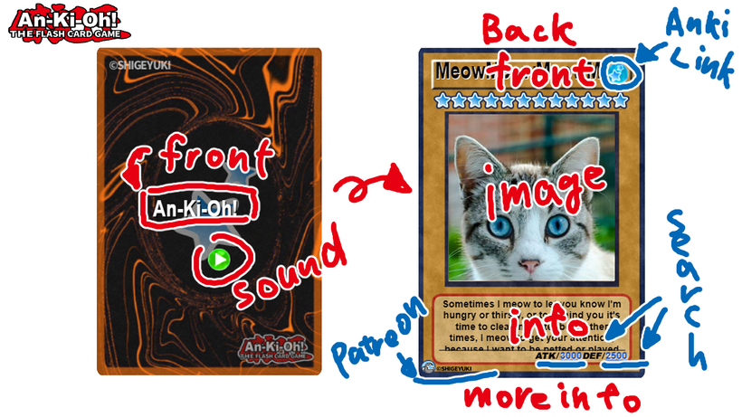
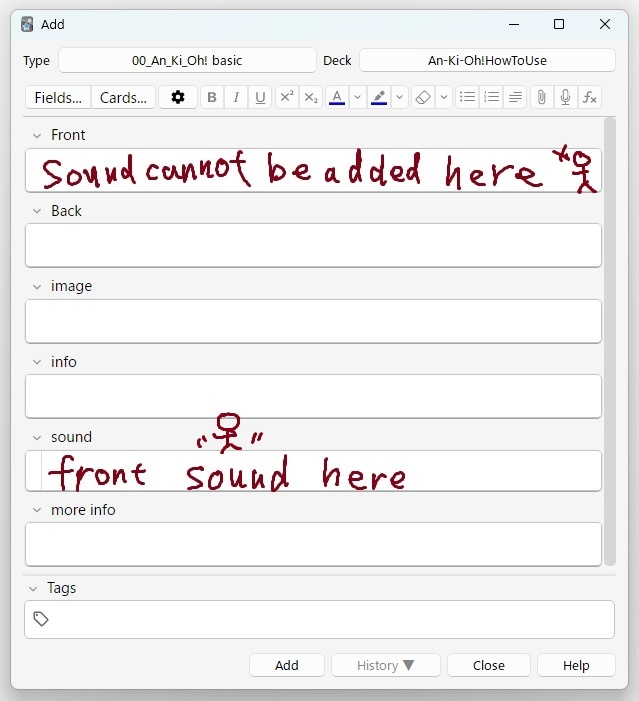

# 🎮An-Ki-Oh! Template
#### Anki card templates like a monster card game.

<iframe src="https://www.youtube.com/embed/7F0uWskPwyc" frameborder="0" allow="accelerometer; autoplay; clipboard-write; encrypted-media; gyroscope; picture-in-picture" allowfullscreen style="aspect-ratio: 16/9; width: 100%;"></iframe>

 

This Anki Card Template is still in development and not yet complete. If you become a Patreon, you will get early access to beta versions that are in development. (Operation is not guaranteed)

### [Download from this down load page.](https://www.patreon.com/posts/download-page-ki-82497888?utm_medium=clipboard_copy&utm_source=copyLink&utm_campaign=postshare_creator&utm_content=join_link)

It should work on Ankimobile, Anki desktop, Ankidroid, and AnkiWeb.
The desktop version has been confirmed to work on Windows, but has not been tested on Mac and Linux.

# An-Ki-Oh! - Anki Card  Template \[Prototype]

## === Description ===
I made a video on how to use this template. Please check it.

Although I forgot to mention it in the video, there is a feature to play slide-in and flip sounds. However, this feature does not work on AnkiWeb since it does not support autoplay. It should work otherwise.

## ===  Issues (still debugging) ===
1. There is a bug in Ankimobile where you cannot display the preview while editing cards. However, there are no issues with using it as the cards are displayed correctly during reviews.
1. Large font size changes are not supported yet.
1. Sometimes experiencing flickering on Android
1. When displayed on AnkiWeb, the screen may not zoom properly if it is too small
1. Positioning is slightly shifted to the right on Ankimobile
1. Anki's default zoom function is not working
1. Ankimobile's default zoom button is not working
1. When audio is added to the front, the layout is broken

## === info ===

1. Note Types (2)
   1. 00_An_Ki_Oh! Basic
   2. 01_An_Ki_Oh! reversed
   3. Sample Deck

2. Deck Name : An-Ki-Oh!HoToUse
   1. demo cards : 6
   2. how to use cards : 20
   3. size: 8.07 MB
   4. template file : 13 (jpe,png,mp3) 898KB

## ===↓↓↓Download ↓↓↓===
### [Download from this down load page.](https://www.patreon.com/posts/download-page-ki-82497888?utm_medium=clipboard_copy&utm_source=copyLink&utm_campaign=postshare_creator&utm_content=join_link)

Thank you for reading! If you like this Anki Card Template and need more development, and free version, press the heart button or high rating. Enjoy Anki!

Created by Shigeyuki

