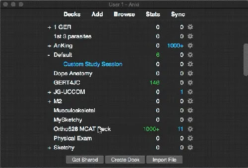
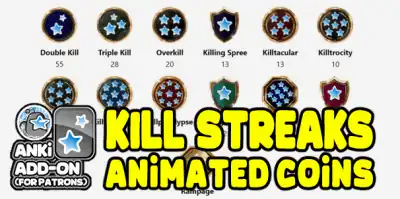

# 🎖️Anki Killstreaks
Reward Medals for Correct Answers (Fixed by Shige)

    
### [AnkiWeb Page](https://ankiweb.net/shared/info/1562475180) | Code : `1562475180`

\> A Halo and Call of Duty inspired add-on that makes doing your reviews more bearable.

This add-on is a fixed version of the "Anki Killstreaks" for Anki23.12+. How to use it, please refer to the original add-on. If the original add-on has been fixed, this add-on is not needed.  

* **How to use :**  
    **Original Add-on : [ Anki Killstreaks ](https://ankiweb.net/shared/info/579111794) / Author : [James Castiglione](https://github.com/jac241)**

 

 
(This image is re-uploaded from the original add-on image.)

 

 **Notes :**  
 * Leaderboards and Chase Mode were removed because the server does not exist. (Development resource is a bit scarce yet.)
 * The latest Anki is supported, older Anki is not supported (The latest Anki is always excellent).
* If you become a patron you will get additional animation coins.(Not Free) 👉️ [🎖️additional animation coins](additional-animation-coins.md)

   * 

 

## Related Add-ons
 1.  <b>addon : <a href="https://ankiweb.net/shared/info/368161874" target="_blank">AnkiCraft</a> / Author : <a href="https://github.com/Foxy-null" target="_blank">Foxy_null</a></b>/ Customized version of Killstreaks (like Minecraft!)
 1.  <b>addon : <a href="https://ankiweb.net/shared/info/1797615099" target="_blank">📌Rearrange home addons</a> / (Created by Shige)</a></b>
    / This is an add-on to rearrange the add-ons displayed on Anki's home screen.
 2.  <b>addon : <a href="https://ankiweb.net/shared/info/906950015" target="_blank">🐻TidyAnkiBear 	</a> / (Created by Shige)</a>
    /</b> Select and hide Anki menu bar items.

 
 

## 🚨Report

If you have any problems or requests feel free to send them to me.

  1. <a href="https://ankiweb.net/shared/review/1562475180" target="_blank">👍️Rate Comment</a> : You can contact me anonymously, and AnkiWeb will send you an email when I reply, a high rating increases priority of development.
  2. <a href="https://www.reddit.com/r/Anki/comments/1b0eybn/simple_fix_of_broken_addons_for_the_latest_anki/" target="_blank">👩‍🚀Reddit</a> : You can request me to repair broken Add-ons.
  3. <a href="https://github.com/shigeyukey/my_addons/issues" target="_blank">🐙Github </a> : Makes it easier to track problems.
  4. <a href="https://www.patreon.com/Shigeyuki" target="_blank">💖Patreon DM</a> : Response will be prioritized.

 
 
 

## 📥 How do I install this add-on?
1. Copy and paste the add-on code ( `1562475180` )  into Anki and you can install it. ( *Menu -> Tools -> Add-ons -> Get Add-ons -> Code \[ add-on code ]* )
2. When I develop bug fixes, create new features, or compatibility for New Anki, I will notify you and you can install it.
3. Add-ons will be broken when the official Anki gets a major update, so if you like this add-on please support my volunteer development by rating, sharing, and donating. Thank you!

[Click here and please Rate this add-on, Thank you! :-)  
 ](https://ankiweb.net/shared/review/1562475180)
