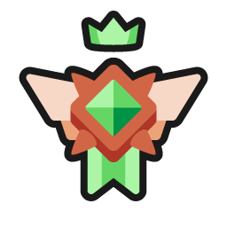
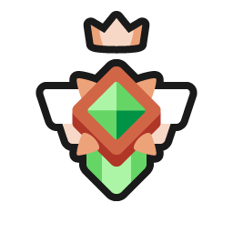
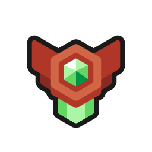
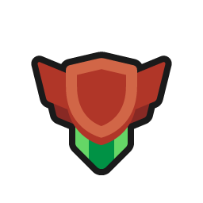
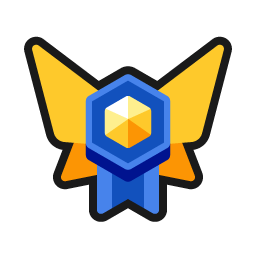

# 🏆️Anki leaderboard Wiki

<a href="http://patreon.com/Shigeyuki" target="_blank">
  
</a> <br>

* **<a href="https://ankiweb.net/shared/info/175794613" target="_blank">AnkiWeb Page</a> | Code : `175794613`**<br>
* **<a href="https://shigeyuki.pythonanywhere.com/" target="_blank">🌐Anki Leaderboard Web </a>** : You can check the leaderboard on this website.<br>

> *This add-on ranks all of its users by the number of cards reviewed today*


This add-on is a customized version (fork) of the shutdown <a href="https://github.com/ThoreBor/Anki_Leaderboard" target="_blank">Anki LeaderBoard</a>, originally created by <a href="https://github.com/ThoreBor" target="_blank">Thore Tyborski</a> and credit goes to him.


<br>
 *I've enhanced graphics by adding countries, ranks, tooltips, etc. If you find it distracting you can disable it in the settings. (Config -> others tab -> add Pic country and league)*
<br>
<br>
*(This image is a sample so all user names are hidden.)*


<br>


- [🏆️Anki leaderboard Wiki](#️anki-leaderboard-wiki)
- [📖How to use](#how-to-use)
  - [🏆League](#league)
    - [📅Season (League)](#season-league)
  - [👥Group](#group)
  - [🤝Friends](#friends)
  - [🗝️Account](#️account)
  - [📈XP formula](#xp-formula)
  - [🌐Leaderboard Web](#leaderboard-web)
  - [📸Profile icon](#profile-icon)
  - [�Rank icons](#rank-icons)
  - [🔗Related Add-ons](#related-add-ons)
  - [💖Credit](#credit)
- [🚨Report problems or requests](#report-problems-or-requests)
- [💡Frequently Asked Questions](#frequently-asked-questions)
    - [Q. Can I show the leaderboard without opening the add-on window?](#q-can-i-show-the-leaderboard-without-opening-the-add-on-window)
    - [Q. How do I show the leaderboard after the review is finished?](#q-how-do-i-show-the-leaderboard-after-the-review-is-finished)
    - [Q. Login keeps failing and sync is not finished, what should I do?](#q-login-keeps-failing-and-sync-is-not-finished-what-should-i-do)
    - [Q. A user is cheating, what should I do?](#q-a-user-is-cheating-what-should-i-do)
    - [Q. How do I delete a group?](#q-how-do-i-delete-a-group)
    - [Q. When will the new league start?](#q-when-will-the-new-league-start)
    - [Q. Why doesn't my XP match when I calculate it manually?](#q-why-doesnt-my-xp-match-when-i-calculate-it-manually)
    - [Q. What is the reason for using the bonus instead of real retention?](#q-what-is-the-reason-for-using-the-bonus-instead-of-real-retention)
- [📥 How do I install this add-on?](#-how-do-i-install-this-add-on)

<br>


# 📖How to use

1. This add-on ranks all of its users by the number of cards reviewed today, time spend studying today, current streak, reviews in the past 31 days, and retention.
1. You can also compete against friends, join groups, and join a country leaderboard.
1. You'll only see users, that synced on the same day as you.
<br>

## 🏆League
1. In the league tab, you see everyone who synced at least once during the current season. There are four leagues. (Alpha, Beta, Gamma, and Delta)
   
3. The top 20% will be promoted, and the bottom 20% will be demoted. (Start -> Delta -> Gamma -> Beta -> Alpha)
<br>

### 📅Season (League)
1. A season lasts two weeks. You don't have to sync every day. For now I have it set to tally after 3 days and start a new league on the next Monday. (Because of time zone differences between countries and the time it takes mobile users to sync leagues on their PC)
<br>

## 👥Group

1.  Groups is the function to create private leaderboards. e.g. if you create a group with your schoolmates or friends only users who know the password can use the leaderboard. Anyone can freely create groups. If you want anyone to be able to join your group please include the password in the group name.
    
2.  By default, there are public groups for Medicine, Language, and Pokemon. (password 1234)<br>
3.  If you want to delete the group, please contact me.<br>
4.  If you do not set a password, an error will occur. <br>

## 🤝Friends
1. You can add users to friends and display them like a group. (If you add a user as a friend, they will not be notified or see your name.)
   
1. To add a user as a friend, double-click on the user's name and click the “Add friend” button or enter the name in Config.
<br>


## 🗝️Account

1. You can Sign-up, Log-in, Delete account, Log-out, Change user name, and Biography.

1. Click on the dropbox to toggle the account options.<br>


1. 🚨Note: Do not use a name or biography that would offend other users, I often receive such reports and users who do not correct them will be banned.
<br>


## 📈XP formula
1. <code>XP = days studied percentage x ((6 x time) + (2 x reviews x retention)) </code>

1. You have to study at least 5 minutes per day. Otherwise, this day won't be counted as “studied”
(<i><a href="https://github.com/ThoreBor/Anki_Leaderboard/issues/122" target="_blank">See this issue for more info</a></i>).
1. [Q. Why doesn't my XP match when I calculate it manually?](#q-why-doesnt-my-xp-match-when-i-calculate-it-manually)

<br>


## 🌐Leaderboard Web
* **<a href="https://shigeyuki.pythonanywhere.com/" target="_blank">🌐Anki Leaderboard Web </a>** : You can check the leaderboard on this website. (past 24 hours)<br>
<br>

## 📸Profile icon

1. I added function to display profile icons (prototype). Icons are displayed on the leaderboard and tooltip.
2. You can upload your pictures to the server from the new menu.
   1. (Menu - > Leaderboard -> Upload profile image)
   2. Icons can be overwritten when uploaded again.
  
1. **📁Icons Cache:** User icons are stored in a binary cache in the add-on's user folder for optimized display.
   1. Downloading of the cache of icons from the server is done only while the leaderboard window is open.
   2. Each icon is about 7-10KB, so 1000 user icons will require about 10MB of cache. (Functions to manage these will be developed later.)
   3. If there are a lot of icons on the server it may take a long time to download the cache. In this case the order of downloading is like this: Friends -> Country -> Group -> Global -> League
2. 🚨Note: Do not use photos that would be offensive to other users, I often receive such reports and users who do not correct them will be banned.


## 🏅Rank icons

1. I've enhanced graphics by adding countries, ranks, tooltips, etc.
2.  If you find it distracting you can disable it in the settings: Config -> others tab -> add Pic country and league.<br>
    

3. There are three types of rank icons on the leaderboard, each with 10 ranks in each of the leagues.

   1. **Color (User's current league) :**
      1.   Alpha (Gold)
      2.   Beta (Silver)
      3.   Gamma (Sapphire)
      4.   Delta (Wood)
   2. **Type (Each Leaderboard) :**
        1.  Global (Hexagon)
        2.  Friends/Country/Group (Diamond)
        3.  League (Shield)
   3. **Grades (Each Leaderboard):**
        1.  **A+** (Top 10%)
        2.  **A**  (Top 10-20%)
        3.  **B+** (Top 20-30%)
        4.  **B**  (Mid 30-40%)
        5.  **C+** (Mid 40-50%)
        6.  **C**  (Mid 50-60%)
        7.  **D+** (Lower 60-70%)
        8.  **D**  (Lower 70-80%)
        9.  **E**  (Bottom 80-90%)
        10.  **F**  (Bottom 90-100%)


E.g. if a user is B (Mid 30-40%) on the global leaderboard the rank icon will be  but if the user's current league is Gamma the color will change and the rank icon will be .


## 🔗Related Add-ons

1. <a href="https://ankiweb.net/shared/info/1797615099" target="_blank">📌Rearrange home addons </a><br>
1. <a href="https://ankiweb.net/shared/info/906950015" target="_blank">🐻TidyAnkiBear - Select and hide Anki menu bar items</a><br>
1. <a href="https://ankiweb.net/shared/info/33855257" target="_blank">📱Anki Discord Sidebar - Chat room within Anki</a><br>
<br>

## 💖Credit
  * Original add-on : <a href="https://github.com/ThoreBor/Anki_Leaderboard" target="_blank"> Anki LeaderBoard </a> / Author : <a href="https://github.com/ThoreBor" target="_blank">Thore Tyborski</a><br>
     * Contributions :
  <a href="https://github.com/khonkhortisan" target="_blank"> khonkhortisan</a>,
  <a href="https://github.com/zjosua" target="_blank">zjosua</a>,
  <a href="https://www.reddit.com/user/SmallFluffyIPA/" target="_blank">SmallFluffyIPA</a>,
  <a href="https://github.com/AtilioA" target="_blank">Atílio Antônio Dadalto</a>,
  <a href="https://github.com/rodrigolanes" target="_blank">Rodrigo Lanes</a>,
  <a href="https://github.com/abdnh" target="_blank">Abdo</a>
  
  * Images: Crown icon /<a href="https://www.flaticon.com/de/autoren/freepik" title="Freepik" target="_blank">Freepik</a>, <a href="https://www.flaticon.com/de/" title="Flaticon" target="_blank">flaticon.com</a>, Person icon /<a href="https://www.flaticon.com/de/autoren/iconixar" title="iconixar" target="_blank">iconixar</a>, <a href="https://www.flaticon.com/de/" title="Flaticon" target="_blank">flaticon.com</a>, Settings icon/<a href="https://www.flaticon.com/free-icons/setting" title="setting icons" target="_blank">Phoenix Group, Flaticon</a>, Confetti gif/ <a href="https://giphy.com/stickers/giphycam-rainbow-WNJATm9pwnjpjI1i0g" target="_blank">Giphy</a>
  * <div>Rank icons : <a href="https://x.com/rhosgfx">Rhos @RhosGFX</a></div>
  * <div>Star icon : <a href="https://commons.wikimedia.org/wiki/File:Star_icon_stylized.svg">Clip Art Library </a></div>


<br><br>

# 🚨Report problems or requests

If you have any problems or requests feel free to send them to me.

  1. <a href="https://ankiweb.net/shared/review/175794613" target="_blank">AnkiWeb (Rate Comment)</a> : You can contact me anonymously, and AnkiWeb will send you an email when I reply, a high rating increases priority of development.
  1. <a href="https://www.reddit.com/r/Anki/comments/1b0eybn/simple_fix_of_broken_addons_for_the_latest_anki/" target="_blank">Reddit (Fixed add-ons, or DM)</a> : You can request me to repair broken Add-ons.
  1. <a href="https://github.com/shigeyukey/my_addons/issues" target="_blank">Github (Issues)</a> : Makes it easier to track problems. (I haven't created a repository yet.)
  1. <a href="https://www.patreon.com/Shigeyuki" target="_blank">Patreon (Direct Message)</a> : Response will be prioritized.

<br><br>

# 💡Frequently Asked Questions

---

### Q. Can I show the leaderboard without opening the add-on window?
* The leaderboard can be displayed in Anki's Home by Config. (Leaderboard Config -> Settings -> Home screen -> Show the home screen leaderboard)

---

### Q. How do I show the leaderboard after the review is finished?
* This feature is not yet available, you can sync when the review is finished by Config. (Leaderboard Config -> Settings -> General -> Sync when deck is finished)
* You can open the leaderboard with a shortcut key. (Shift + L)

---

### Q. Login keeps failing and sync is not finished, what should I do?

* Sometimes bad internet communication can prevent the connection, please try again later.
* It may work if you remove the add-on and reinstall it.

---

### Q. A user is cheating, what should I do?

There are two ways to Hide or Report a user.

**1. Hide user**

Basically if you find such users distracting, please hide them.
* Double click on user name -> Hide user

**2. Report**

These are some of the most commonly reported examples of suspected cheats:

1. Review time is too fast
1. Retention is too high

However these may not be cheats because learner use Anki in different ways, these are possibilities:

  1. The learner may be reviewing a batch of cards before the exams.
  1. The learner reviews a lot of easy cards.
  1. The Learner is delayed review and trying to catch up.
  1. The learner may be using Anki's option to shorten the time to record.

In my opinion these learning methods are not malicious so they do not deserve a ban (perhaps the calculation method needs to be changed).<br>
In any way we lack development resources yet at the moment, so basically please address this problem with hide user.

---

### Q. How do I delete a group?
* The function to delete a group is not yet developed, please contact me.

---

### Q. When will the new league start?
* For now I have it set to tally after 3 days and start a new league on the next Monday. Because of time zone differences between countries and the time it takes mobile users to sync leagues on their PC.

---

### Q. Why doesn't my XP match when I calculate it manually?

* The cause of this problem is that the XP formula is partially omitted.

    * **days studied percentage :** This value is calculated  as a number (0-100), not percentage (0%-100%).
    * **Retention :**
      * Retention is bonus is added, so it will be a little larger than the actual value. (e.g. 70% -> 85%, 40% -> 55% )
        ```text
        Retention Bonus:
        85%-100% -> 100%
        70%-84%  -> 85%
        55%-69%  -> 70%
        40%-54%  -> 55%
        25%-39%  -> 40%
        10%-24%  -> 25%
        0%-9%   -> 0%
        ```
      * This value is first calculated as a number (0-100) and then converted to a percentage (0%-100%).

---

### Q. What is the reason for using the bonus instead of real retention?

The reason for this is that retention is calculated by ranges.<br><br>
Basically the retention rate recommended by Anki is 80-90%, and dedicated learners may aim for 90-95% or so. It is possible to aim for 95%-100%, but this is not efficient because the learning workload increases significantly, like this:<br>


 <br>
 This means that Anki retention rates are not recommended to be perfect or as high as possible, and possibly slightly lower is more efficient for learning.
 <br> <br>
So I think 85% would be a reasonable range to be in the same range as 100%, 85% users do not need to go higher, and 95%+ users can lower the retention rate to make learning more efficient and not affect XP. (If the retention rate is changed to the same value as it is, users may make learning inefficient by making the retention rate as high as possible.)

---

<br><br>


# 📥 How do I install this add-on?
1. Copy and paste the add-on code ( `175794613` )  into Anki and you can install it. ( *Menu -> Tools -> Add-ons -> Get Add-ons -> Code \[ add-on code ]* )
2. When I develop bug fixes, create new features, or compatibility for New Anki, I will notify you and you can install it.
3. The leaderboard is a special add-on that uses the server, unless I manage it regularly it will be broken in a few months, so If you like this add-on please support my volunteer development by rating, sharing, and donating. Thank you! 

<a href="https://ankiweb.net/shared/review/175794613" target="_blank">Click here and please Rate this add-on, Thank you! :-) <br>
</a>