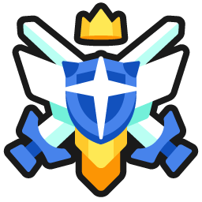

# 🏆️Anki leaderboard Wiki

<a href="http://patreon.com/Shigeyuki" target="_blank">
  
</a> <br>

* **<a href="https://ankiweb.net/shared/info/175794613" target="_blank">AnkiWeb Page</a> | Code : `175794613`**<br>

<!--


-->

* **<a href="https://shigeyuki.pythonanywhere.com/" target="_blank">🌐Anki Leaderboard Web </a>** : You can check the leaderboard on this website.<br>

<!--

src\images\Leaderboard\active_users\leadearboard_active_users.svg

 -->

 [](https://discord.gg/XUrGSX9UME) <br>

<!--  [](https://discord.gg/XUrGSX9UME)  -->


> *This add-on ranks all of its users by the number of cards reviewed today*

This add-on is a customized version (fork) of the shutdown <a href="https://github.com/ThoreBor/Anki_Leaderboard" target="_blank">Anki LeaderBoard</a>, originally created by <a href="https://github.com/ThoreBor" target="_blank">Thore Tyborski</a> and credit goes to him.

<iframe src="https://www.youtube.com/embed/nJvFxID874g" frameborder="0" allow="accelerometer; autoplay; clipboard-write; encrypted-media; gyroscope; picture-in-picture" allowfullscreen style="aspect-ratio: 16/9; width: 100%;"></iframe>


<!--  -->
<br>

 *I've enhanced graphics by adding countries, ranks, tooltips, etc. If you find it distracting you can disable it in the settings. (Config -> others tab -> add Pic country and league)*

<br>

<br>
*(This image is a sample so all user names are hidden.)*


<br>


- [🏆️Anki leaderboard Wiki](#️anki-leaderboard-wiki)
- [📖How to use](#how-to-use)
  - [🏆League](#league)
    - [📅Season (League)](#season-league)
  - [👥Group](#group)
  - [🤝Friends](#friends)
  - [🗝️Account](#️account)
  - [📈XP formula](#xp-formula)
  - [🌐Leaderboard Web](#leaderboard-web)
  - [📸Profile icon](#profile-icon)
  - [Rank icons](#rank-icons)
  - [Sync multiple devices](#sync-multiple-devices)
  - [🎮️Gamification Mode](#️gamification-mode)
    - [Online Status](#online-status)
    - [Review ProgressBar](#review-progressbar)
      - [Alert Emoji](#alert-emoji)
    - [Time Ranks](#time-ranks)
    - [Review Orb and Crystal](#review-orb-and-crystal)
    - [Streaks Tree](#streaks-tree)
      - [Cracker](#cracker)
    - [Retention Weather](#retention-weather)
    - [XP ProgressBars](#xp-progressbars)
      - [Level calculation formula](#level-calculation-formula)
  - [🔗Related Add-ons](#related-add-ons)
  - [💖Credit](#credit)
- [🚨Report problems or requests](#report-problems-or-requests)
- [💡Frequently Asked Questions](#frequently-asked-questions)
    - [Q. Can I show the leaderboard without opening the add-on window?](#q-can-i-show-the-leaderboard-without-opening-the-add-on-window)
    - [Q. How do I show the leaderboard after the review is finished?](#q-how-do-i-show-the-leaderboard-after-the-review-is-finished)
    - [Q. Login keeps failing and sync is not finished, what should I do?](#q-login-keeps-failing-and-sync-is-not-finished-what-should-i-do)
    - [Q. A user is cheating, what should I do?](#q-a-user-is-cheating-what-should-i-do)
    - [Q. How do I delete a group?](#q-how-do-i-delete-a-group)
    - [Q. Why doesn't my Anki Streaks match the leaderboard streaks?](#q-why-doesnt-my-anki-streaks-match-the-leaderboard-streaks)
    - [Q. When will the new league start?](#q-when-will-the-new-league-start)
    - [Q. Why doesn't my XP match when I calculate it manually?](#q-why-doesnt-my-xp-match-when-i-calculate-it-manually)
    - [Q. What is the reason for using the bonus instead of real retention?](#q-what-is-the-reason-for-using-the-bonus-instead-of-real-retention)
    - [Q. Why is not the leaderboard effective for my learning?](#q-why-is-not-the-leaderboard-effective-for-my-learning)
    - [About Cheating](#about-cheating)
      - [Q. Why are cheats permitted?](#q-why-are-cheats-permitted)
      - [Q. Why is it impossible to prevent cheating?](#q-why-is-it-impossible-to-prevent-cheating)
      - [Q. Why is discussion about cheating prohibited?](#q-why-is-discussion-about-cheating-prohibited)
      - [Q. Without anti cheat measures, won't the number of users on the leaderboard decrease?](#q-without-anti-cheat-measures-wont-the-number-of-users-on-the-leaderboard-decrease)
- [📥 How do I install this add-on?](#-how-do-i-install-this-add-on)

<br>


# 📖How to use

1. This add-on ranks all of its users by the number of cards reviewed today, time spend studying today, current streak, reviews in the past 31 days, and retention.
1. You can also compete against friends, join groups, and join a country leaderboard.
1. You'll only see users, that synced on the same day as you.
<br>

## 🏆League
1. In the league tab, you see everyone who synced at least once during the current season. There are four leagues. (Alpha, Beta, Gamma, and Delta)
   
3. The top 20% will be promoted, and the bottom 20% will be demoted. (Start -> Delta -> Gamma -> Beta -> Alpha)
<br>

### 📅Season (League)
1. A season lasts two weeks. You don't have to sync every day. For now I have it set to tally after 3 days and start a new league on the next Monday. (Because of time zone differences between countries and the time it takes mobile users to sync leagues on their PC)
<br>

## 👥Group

1.  Groups is the function to create private leaderboards. e.g. if you create a group with your schoolmates or friends only users who know the password can use the leaderboard. Anyone can freely create groups. If you want anyone to be able to join your group please include the password in the group name.
    
2.  By default, there are public groups for Medicine, Language, and Pokemon. (password 1234)<br>
3.  If you want to delete the group, please contact me.<br>
4.  If you do not set a password, an error will occur. <br>

## 🤝Friends
1. You can add users to friends and display them like a group. (If you add a user as a friend, they will not be notified or see your name.)
   
1. To add a user as a friend, double-click on the user's name and click the “Add friend” button or enter the name in Config.
<br>


## 🗝️Account

1. You can Sign-up, Log-in, Delete account, Log-out, Change user name, and Biography.

1. Click on the dropbox to toggle the account options.<br>


1. **🚨Note:** Do not use a name or biography that would offend other users, I often receive such reports and users who do not correct them will be banned.
<br>


## 📈XP formula
1. <code>XP = days studied percentage x ((6 x time) + (2 x reviews x retention)) </code>

1. You have to study at least 5 minutes per day. Otherwise, this day won't be counted as “studied”
(<i><a href="https://github.com/ThoreBor/Anki_Leaderboard/issues/122" target="_blank">See this issue for more info</a></i>).
1. [Q. Why doesn't my XP match when I calculate it manually?](#q-why-doesnt-my-xp-match-when-i-calculate-it-manually)

<br>


## 🌐Leaderboard Web
* **<a href="https://shigeyuki.pythonanywhere.com/" target="_blank">🌐Anki Leaderboard Web </a>** : You can check the leaderboard on this website. (past 24 hours)<br>
<br>

## 📸Profile icon

I added function to display profile icons (prototype). Icons are displayed on the leaderboard and tooltip. If you find it distracting you can disable it in the settings: Config -> others tab -> add Pic country and league.

1. **📤Upload Icon:**
   1. You can upload your pictures to the server from the new menu.
   2. Menu - > Leaderboard -> Upload profile image
   
   3. Uploaded images are automatically edited -> Height 64px Width 64px Circle
   4. Icons can be overwritten when uploaded again.

   5. **🚨Note:**
      1. Icons will be displayed on leaderboards, tooltips, website leaderboards, etc. and will be stored in add-on as a cache (binary). If you are concerned about your privacy do not use it.
      2. Do not use photos that would be offensive to other users, I often receive such reports and users who do not correct them will be banned.


2. **📁Profile Icons Cache :** 
   1. This function works by downloading icons from the server and storing them as a binary cache in the add-on's user_file folder.
   2. If there are a lot of icons on the server it may take a long time to download the cache. In this case the order of downloading is like this:
      1.  Friends -> Country -> Group -> Global -> League
   3. Downloading of the cache of icons from the server is done only while the leaderboard window is open. If you close the window it will be interrupted.
   4. The cache of icons deleted from the server is auto deleted from the icon cache user_file folder of add-on.
   5. These functions run a bit slowly in the background, so they should not affect Anki's operation and your review. (Anki23+ is required)
   6. **🚨Note:**
      1. Each icon is about 7-10KB so 1,000 user icons will require about 10MB of cache, thus if the number of users suddenly increases too much the cache may increase too much (e.g. 10,000users->100MB). I plan to develop workarounds for this once the server icons actually increase.


## Rank icons

1. I've enhanced graphics by adding countries, ranks, tooltips, etc.
2.  If you find it distracting you can disable it in the settings: Config -> others tab -> add Pic country and league.<br>
    

3. There are three types of rank icons on the leaderboard, each with 10 ranks in each of the leagues.

   1. **Color (User's current league) :**
      1.   Alpha (Gold)
      2.   Beta (Silver)
      3.   Gamma (Sapphire)
      4.   Delta (Wood)
   2. **Type (Each Leaderboard) :**
        1.  Global (Hexagon)
        2.  Friends/Country/Group (Diamond)
        3.  League (Shield)
   3. **Grades (Each Leaderboard):**
        1.  **A+** (Top 10%)
        2.  **A**  (Top 10-20%)
        3.  **B+** (Top 20-30%)
        4.  **B**  (Mid 30-40%)
        5.  **C+** (Mid 40-50%)
        6.  **C**  (Mid 50-60%)
        7.  **D+** (Lower 60-70%)
        8.  **D**  (Lower 70-80%)
        9.  **E**  (Bottom 80-90%)
        10.  **F**  (Bottom 90-100%)


E.g. if a user is B (Mid 30-40%) on the global leaderboard the rank icon will be  but if the user's current league is Gamma the color will change and the rank icon will be .


## Sync multiple devices

The default leaderboard does not allow multiple devices to log in at the same time. I added workaround for problem with multiple devices.<br>


1. Save data to AnkiWeb from your login device:
   * Config -> Others tab -> Sync multiple devices -> Auto save this device's config dat to AnkiWeb\[ON]
2. Sync Anki decks.
3. Sync Anki's deck on the second device.
4. Download the config data on the second device:
   * Sync multiple devices -> Download Config data from AnkiWeb

This saved data has nothing to do with the server's leaderboard data, so you can either delete it or not after a successful login. (Sync multiple devices -> Delete AnkiWeb config data)


## 🎮️Gamification Mode


Enhanced gamification with more icons and numerical feedback. If you don't like it, you can disable it at once in the options(Config -> Oters tab).
The code is not optimized yet, so there is a disadvantage for now that it increases the delay before the window is displayed.

### Online Status


Display of yesterday's users. Added a function to display the scores of users who logged in yesterday and not only today. Users who logged in today will see a green dot. If you do not like this yesterday, you can optionally disable it (Show only today's users).


### Review ProgressBar


This will reach 100% when the average number of reviews for the month is reached.

#### Alert Emoji


Added a function to display seconds in review. The 0-2 seconds/card is indicated by a patlamp. (Since the most common reason reported so far is that the review is too fast.) This function is only for display, so there is no penalty for now. If you are reviewing too fast for some reason, I recommend you to write the reason in Bio. (Because Bio will be displayed when someone reports a user.)

### Time Ranks


The rank changes by the learning time. Maximum 12 hours.

### Review Orb and Crystal


 Colorful orbs and crystals are displayed based on the average number of reviews in the last 31 days (or 2 weeks of league). The orb will change color and shape for every 100 reviews, counting in 10 steps until 3000 reviews. After that, the orb counts every 1000 reviews up to a maximum of 10,000 reviews.


### Streaks Tree


A tree grows after one week and can grow up a maximum of 3 years.

#### Cracker


Added a function that sometimes display cracker or cake by streaks.

### Retention Weather


The weather icon changes according to the retention rate.

### XP ProgressBars


Calculates and displays the level from the XP (League Only). The blue progress bar indicates the XP required for the next level.

#### Level calculation formula

Calculated to be level 100 at approximately the top of the Alpha League, for now. (EXP 20,000,000)

python: `math.floor(math.sqrt(exp / 2000))`


## 🔗Related Add-ons

1.  <a href="https://ankiweb.net/shared/info/978245457" target="_blank">📱Discord RP for Anki Leaderboard - study activity status </a>
1. <a href="https://ankiweb.net/shared/info/1797615099" target="_blank">📌Rearrange home addons </a><br>
2. <a href="https://ankiweb.net/shared/info/906950015" target="_blank">🐻TidyAnkiBear - Select and hide Anki menu bar items</a><br>


<br>

## 💖Credit
  * Original add-on : <a href="https://github.com/ThoreBor/Anki_Leaderboard" target="_blank"> Anki LeaderBoard </a> / Author : <a href="https://github.com/ThoreBor" target="_blank">Thore Tyborski</a><br>
     * Contributions :
  <a href="https://github.com/khonkhortisan" target="_blank"> khonkhortisan</a>,
  <a href="https://github.com/zjosua" target="_blank">zjosua</a>,
  <a href="https://www.reddit.com/user/SmallFluffyIPA/" target="_blank">SmallFluffyIPA</a>,
  <a href="https://github.com/AtilioA" target="_blank">Atílio Antônio Dadalto</a>,
  <a href="https://github.com/rodrigolanes" target="_blank">Rodrigo Lanes</a>,
  <a href="https://github.com/abdnh" target="_blank">Abdo</a>
  
  * Images: Crown icon /<a href="https://www.flaticon.com/de/autoren/freepik" title="Freepik" target="_blank">Freepik</a>, <a href="https://www.flaticon.com/de/" title="Flaticon" target="_blank">flaticon.com</a>, Person icon /<a href="https://www.flaticon.com/de/autoren/iconixar" title="iconixar" target="_blank">iconixar</a>, <a href="https://www.flaticon.com/de/" title="Flaticon" target="_blank">flaticon.com</a>, Settings icon/<a href="https://www.flaticon.com/free-icons/setting" title="setting icons" target="_blank">Phoenix Group, Flaticon</a>, Confetti gif/ <a href="https://giphy.com/stickers/giphycam-rainbow-WNJATm9pwnjpjI1i0g" target="_blank">Giphy</a>
  * <div>Rank icons : <a href="https://x.com/rhosgfx">Rhos @RhosGFX</a></div>
  * <div>Star icon : <a href="https://commons.wikimedia.org/wiki/File:Star_icon_stylized.svg">Clip Art Library </a></div>


<br><br>

# 🚨Report problems or requests

If you have any problems or requests feel free to send them to me.

  1. <a href="https://ankiweb.net/shared/review/175794613" target="_blank">AnkiWeb (Rate Comment)</a> : You can contact me anonymously, and AnkiWeb will send you an email when I reply, a high rating increases priority of development.
  2. <a href="https://forums.ankiweb.net/t/add-on-support-thread-anki-leaderboard-by-shige/51634" target="_blank">AnkiForums</a> : Official AnkiForums support thread, it's a good place for open discussion.
  4. <a href="https://www.reddit.com/r/Anki/comments/1b0eybn/simple_fix_of_broken_addons_for_the_latest_anki/" target="_blank">Reddit (Fixed add-ons, or DM)</a> : You can request me to repair broken Add-ons.
  5. <a href="https://github.com/shigeyukey/my_addons/issues" target="_blank">Github (Issues)</a> : Makes it easier to track problems. (I haven't created a repository yet.)
  6. <a href="https://www.patreon.com/Shigeyuki" target="_blank">Patreon (Direct Message)</a> : Response will be prioritized.

<br><br>

# 💡Frequently Asked Questions

---

### Q. Can I show the leaderboard without opening the add-on window?
* The leaderboard can be displayed in Anki's Home by Config. (Leaderboard Config -> Settings -> Home screen -> Show the home screen leaderboard)

---

### Q. How do I show the leaderboard after the review is finished?
* This feature is not yet available, you can sync when the review is finished by Config. (Leaderboard Config -> Settings -> General -> Sync when deck is finished)
* You can open the leaderboard with a shortcut key. (Shift + L)

---

### Q. Login keeps failing and sync is not finished, what should I do?

* Sometimes bad internet communication can prevent the connection, please try again later.
* It may work if you remove the add-on and reinstall it.

---

### Q. A user is cheating, what should I do?

My version of the leaderboard permits the use of cheats (except for server destruction or illegal activities), thus you can use any cheat you want (e.g. fix lost streaks), and all reports or discussions regarding cheating or criticism of other users are prohibited.

If you do not like other users, please address it with these ways.

1. You can optionally hide distracting users. (Double click on user name -> Hide user)
2. You can optionally hide all medals.(Config -> Settings tab -> Show league medals next to username)
3. Create a group and set rules with your trusted friends and compete.

<br>

Please note if you call other users' reviews cheating or criticize how other users review you will be banned, because those aren't cheats in the first place and you're the one violating the rules.

For a more detailed explanation about this, please read these.
* [Q. Why are cheats permitted?](#q-why-are-cheats-permitted)
* [Q. Why is it impossible to prevent cheating?](#q-why-is-it-impossible-to-prevent-cheating)


<!-- There are two ways to Hide or Report a user.

**1. Hide user**

Basically if you find such users distracting, please hide them.
* Double click on user name -> Hide user

**2. Report**

These are some of the most commonly reported examples of suspected cheats:

1. Review time is too fast
2. Retention is too high

However these may not be cheats because learner use Anki in different ways, these are possibilities:

  1. The learner may be reviewing a batch of cards before the exams.
  1. The learner reviews a lot of easy cards.
  1. The Learner is delayed review and trying to catch up.
  1. The learner may be using Anki's option to shorten the time to record.

In my opinion these learning methods are not malicious so they do not deserve a ban (perhaps the calculation method needs to be changed).<br>
In any way we lack development resources yet at the moment, so basically please address this problem with hide user. -->


----

### Q. How do I delete a group?
* The function to delete a group is not yet developed, please contact me.

----

### Q. Why doesn't my Anki Streaks match the leaderboard streaks?

If you customized “Next day starts at” you will need to set it manually. Please check if these settings match:

* Leadearboard: Config -> Settings -> General -> The next day starts \[...] hours past midnight
* Anki: Tools -> Preferences -> Review -> Scheduler -> Next day starts at \[...]


### Q. When will the new league start?
* For now I have it set to tally after 3 days and start a new league on the next Monday. Because of time zone differences between countries and the time it takes mobile users to sync leagues on their PC.

---

### Q. Why doesn't my XP match when I calculate it manually?

* The cause of this problem is that the XP formula is partially omitted.

    * **days studied percentage :** This value is calculated  as a number (0-100), not percentage (0%-100%).
    * **Retention :**
      * Retention is bonus is added, so it will be a little larger than the actual value. (e.g. 70% -> 85%, 40% -> 55% )
        ```text
        Retention Bonus:
        85%-100% -> 100%
        70%-84%  -> 85%
        55%-69%  -> 70%
        40%-54%  -> 55%
        25%-39%  -> 40%
        10%-24%  -> 25%
        0%-9%   -> 0%
        ```
      * This value is first calculated as a number (0-100) and then converted to a percentage (0%-100%).

---

### Q. What is the reason for using the bonus instead of real retention?

The reason for this is that retention is calculated by ranges.<br><br>
Basically the retention rate recommended by Anki is 80-90%, and dedicated learners may aim for 90-95% or so. It is possible to aim for 95%-100%, but this is not efficient because the learning workload increases significantly, like this:<br>

<!--  -->


 <br>
 This means that Anki retention rates are not recommended to be perfect or as high as possible, and possibly slightly lower is more efficient for learning.
 <br> <br>
So I think 85% would be a reasonable range to be in the same range as 100%, 85% users do not need to go higher, and 95%+ users can lower the retention rate to make learning more efficient and not affect XP. (If the retention rate is changed to the same value as it is, users may make learning inefficient by making the retention rate as high as possible.)

--------

### Q. Why is not the leaderboard effective for my learning?

That's very normal, the Leaderboard is an add-on for users who enjoy competition, so it is not for all Anki users. In gamification of learning users with high scores tend to be more motivated but those with low scores may become less motivated, this means learning efficiency may decrease for some users.

Also Anki is a learning app for studying so many Anki users dislike games in the first place, because they like studying more than games. Long time Anki users tend to prefer the simple version of Anki so there are often Anki users who don't use add-ons at all.

In short the leaderboard is an add-on for the relatively small minority of Anki users who enjoy competition or gamification, if you like such add-ons it's suitable for you but if not you don't need to force yourself to use it, I recommend choosing the method that best suits your learning style.


---


<!-- ### Q. Why doesn't the leaderboard sort order help my learning?

For now there are workarounds for these, try these settings if you haven't already:<br>

\[1] Sorting<br>
You can change the sort order of the leaderboards. (Today's Reviews, Today's Time, Streak, Reviews in the past 31 days, and Retention)
e.g. Sort by past31days to exclude all users who reviewed a lot just today. (Config -> Settings -> Genearl -> Sortby)

<!-- \[2] League<br>
Leagues are regularly scheduled for 2 weeks and are calculated by XP, not by reviews. It is a system that requires long term learning, so short term learners will not be able to get to the top. So far about half of the top rankers are medical students, and language learners seem to be a relatively small minority.<br>

\[3] Changing the default leaderboard<br>
You can change the default leaderboard to be displayed. (Global, Friends, Groups, and Leagues)<br>
Config -> Settings -> Genearl -> Default Leaderboard<br>
e.g. if you are only interested in groups of medical students you can set the group of medical students as your default leaderboard. The medical students group has the most active users 334. (Languages have 136 users, 2024-11-18). The number of active users is small for now but the total number of active users is increasing by about 1000 every few months, so I guess it will be solved in the long run.<br>

\[4] Hide users<br>
If there are users who are offensive to you, you can hide them by using the hide user option: Double-click on the user's name<br>

<!-- \[5] Report Users<br>
If you report a user you can contact me and I can ban the offending user, basically I do not reply to reports but I read all of them: Double click on the user's name<br> -->

<!-- But even if we use all of these functions I think it is still insufficient, so currently the functions under development are like these: -->

<!-- \[1] XP enhancements<br>
Use XP or score in global leaderboards.<br>

\[2] Display of past history<br>
e.g. Leaderboards for yesterday, this week, a month, all periods. Leagues for groups, history.<br>

\[3] Auto hide users in bulk<br>
e.g. Hide users who review too quickly in bulk, hide all users using offensive words, hide all users who have joined a particular group.<br> -->
<!--
\[4] Enhancement of ban function<br>
e.g. Make it impossible to avoid banning by re-registering, introduce stealth BANs.<br> -->

<!-- All of these functions are technically developable but will still take some time to develop, this free add-on is developed and maintained by me as an individual free volunteer(In short it's just a hobby when I get bored of it it's over), and basically fixing bugs and supporting the latest Anki is a high priority. -->

<!-- ----- -->


### About Cheating

Most people love gossip and rumors so reports about cheating are the most common on the leaderboard. (well people will do anything except study.)

#### Q. Why are cheats permitted?

TLDR: Because it's much cheaper. If you're a billionaire and want to tip me $200 million for anti cheat measures feel free to contact me, thanks in advance🙏


Long explanation:

The leaderboard is intended for competitive purposes add-on and fair competition is ideal, but since Anki is a self grading and freely customizable learning app, truly fair competition or cheating prevention is technically impossible to develop. (to do this would require a format like a school exam, not Anki.)

So in my version of the leaderboard scores are based on self grading and users are free to use any learning method they prefer, in other words cheats are explicitly permitted. Because there is no way to distinguish between cheating and noncheating learning methods, and all discussions and reports about cheating are unproductive.

Thus reports and discussions regarding cheating and misconduct will not be permitted going forward. Please note if you pursue specific users for cheating or misconduct you may be banned, because such criticism could mistakenly hinder serious users' learning.

If you dislike this system, instead of a report, please devise new features or rules to prevent cheating and request them to me. e.g. I'm in the process of developing these new features: Medals based on a new calculation method, the maximum value that can be sent, and leagues for groups. Suggestions that help improve learning efficiency for many users are welcome.

#### Q. Why is it impossible to prevent cheating?

The technical challenges are these for now:

* Anki is self grading so there's no way to verify whether users are being honest or not.
* Anki users have different learning methods, so there's no consensus or definition of what constitutes cheating.
* Anki is open source program so users can easily manipulate the numbers sent to the server.
* Anki decks are also open source and learning data is just numbers so users can easily generate dummy decks or cards.
* The Leaderboard is a free add-on that I develop personally as a hobby so I don't have the development resources to handle huge amount of reports like commercial apps do.
* Even though such anti cheat are costly to develop they have very little effect on streamlining user learning so their development priority is low.

To resolve all these challenges we need to base the scoring on the exam and encrypt the program, but such a program is not Anki add-on anymore.

----

#### Q. Why is discussion about cheating prohibited?

Because there are too many reports. The leaderboard continues to increase in reports with the growth of users, also many Anki users are exhausted from studying and sleep deprived. And they don't research or read past discussions or this Wiki, so these are almost equivalent to development obstruction. The leaderboard is an open-source and free add-on, not a commercial app, so there are no development resources to address these.

----

#### Q. Without anti cheat measures, won't the number of users on the leaderboard decrease?

The leaderboard is an open source and free add-on, not a commercial app, this means I'm developing it as a personal hobby, so user numbers increasing or decreasing will not affect its development. Rather, the current biggest issue is developing support to handle the server load caused by the excessive increase in users.

<!-- 
#### Q. Other questions about cheating -->


--------

<!--
なぜ保持率が100%のﾕｰｻﾞｰがいますか?
なぜ1秒以下のﾚﾋﾞｭｰをするﾕｰｻﾞｰがいますか?
なぜ数千枚のﾚﾋﾞｭｰをしているﾕｰｻﾞｰがいますか?
なぜ10時間以上ﾚﾋﾞｭｰするﾕｰｻﾞｰがいますか?
なぜﾁｰﾄに関する議論が禁止されていますか?
なぜﾁｰﾄに関する報告が禁止されていますか?
良いﾁｰﾄとは?
ﾁｰﾄを許可するとﾘｰﾀﾞｰﾎﾞｰﾄﾞの人気がなくなるのでは?

-->


<br><br>


# 📥 How do I install this add-on?
1. Copy and paste the add-on code ( `175794613` )  into Anki and you can install it. ( *Menu -> Tools -> Add-ons -> Get Add-ons -> Code \[ add-on code ]* )
2. When I develop bug fixes, create new features, or compatibility for New Anki, I will notify you and you can install it.
3. The leaderboard is a special add-on that uses the server, unless I manage it regularly it will be broken in a few months, so If you like this add-on please support my volunteer development by rating, sharing, and donating. Thank you! 

<a href="https://ankiweb.net/shared/review/175794613" target="_blank">Click here and please Rate this add-on, Thank you! :-) <br>
</a>