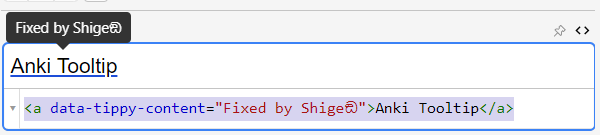

# 💬Anki Tooltip

💬Anki Tooltip - Quick add Tooltip in the Editor (Fixed by Shigeඞ)

<!-- **[AnkiWeb Page](https://ankiweb.net/shared/info/🟢) | Code : `🟢`** -->


<!-- Customized -->
[](https://www.reddit.com/user/Shige-yuki)

 Quick add Tooltip in the Editor (use tippy.js).

This add-on is a Fixed and Enhanced version for Anki25+ of the addon <a href="https://ankiweb.net/shared/info/1840818335" target="_blank">"Anki Tooltips"</a>, originally created by <a href="https://github.com/kleinerpirat" target="_blank">Matthias Metelka (kleinerpirat)</a> and credit goes to them.


## How to use


#### Tooltip-Editor in Editor


エディターボタン
エディターでテキストを選択してからこのボタンを押すとツールチップを追加できます.
追加したツールチップはエディターとレビュワーで表示されます.
デフォルトのショートカットキーは"Ctrl+t"です.

ツールチップエィデター
ツールチップを追加したテキストをクリックするとツールチップエディターを開くことができます.
この関数はEditorでのみ働きます.
このウィンドウをドラッグすると位置を移動できます.
このウィンドウの外側をクリックすると編集をキャンセルします.


チェックボタン(右下, 緑)

入力したテキストでツールチップのテキストを更新します.
テキストを空にしてから押すとツールチップを削除します.
ショートカットキーは"Alt+Enter"です.

バツボタン(右上, 赤)

ツールチップを削除してただのテキストにします.

リストアボタン(左上, 紫)

編集中のテキストを編集前のテキストに復元します.


#### NoteType manager


このadd-onはカードにツールチップを表示するためにノートタイプにCSSとJavaScriptを自動で追加します.

このオプションでそれらを一括で手動で無効化, 有効化, またはカスタマイズできます.

Enable Tooltip Notetype (Back)

これを有効化するとツールチップを有効化します.
無効化するとノートタイプに追加したツールチップのCSSとJavaScriptを削除します.


Front Tooltip
ツールチップはデフォルトでカードの答えのみに表示されます(Back).
カードの質問にツールチップを表示したいときはこれを有効化する必要があります (Front).

Prev-Shortcut, Next-Shortcut

もしツールチップが複数ある場合, ショートカットキーでそれらを表示できます.
このオプションでダブルクリックするとそのショートカットキーを変更できます.

コンテキストメニュー

これらのオプションは一括で変更できます.
複数選択 -> 右クリック -> コンテキストメニュー


#### Option


* Editor Shortcut key

エディターでツールチップを追加するためのショートカットキーを変更できます.
デフォルトは"Ctrl+t"です.

* Auto add tooltip to NoteType

エディターでツールチップを追加したとき, 自動的にノートタイプにツールチップを表示するためのCSSとJavaScriptを追加します.
このオプションはデフォルトで有効になっています.

* Use Javascript in Editor

このAdd-onはEditorでツールチップを表示して編集するためにいろいろなJavaScriptをエディターで実行しています.
このオプションを無効化するとそれらのJavaScriptをほぼすべて無効化し, ツールチップを追加するためだけのシンプルなモードに変更します.


#### Notes


このadd-onはノートタイプを編集します. もし心配な場合はこれを使う前にすべてのデッキをバックアップし, 正常に動作するか確認することをお勧めします.

ツールチップを追加したテキストは色や太字などのHTMLが削除されます.

高度な共有されたデッキを使用している場合は干渉により問題が発生するかもしれません.
もしその場合は調べてみるので私にカードテンプレートを送信してください.


#### 技術的な説明

TooltipのHTML




```
<a data-tippy-content="Fixed by Shigeඞ">Anki Tooltip</a>
```
ツールチップを追加するとこのようなコードが生成されます.
高度なユーザーの場合はこのHTMLを直接編集することでツールチップを追加や編集ができます.


* Front Template, or Back Template


これらがノートタイプ(カードテンプレート)に追加されるツールチップのコードです.

```
<script src="_anki-tooltips.js" data-prev-shortcut="Shift+Tab" data-next-shortcut="Tab"></script>
```
* Styling

```
@import url("_anki-tooltips.css");
```

簡単に言えばノートタイプのオプションと自動追加はこれらの1行のコードを追加または削除しています.
Addonのオプションはこれらのノートテンプレートから読み取って表示している.
なので高度なユーザーの場合は手動で直接これらのコードを追加または削除しても問題ありません.

JavaScript and CSS

_anki-tooltips.jsと_anki-tooltips.cssは自動的に生成されユーザーのメディアフォルダへ保存されます.
たぶんモバイルでも働くはずです.


