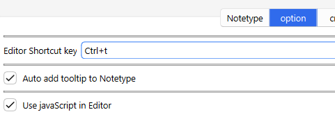

# 💬Anki Tooltip

💬Anki Tooltip -  (Fixed by Shigeඞ)

<!-- **[AnkiWeb Page](https://ankiweb.net/shared/info/🟢) | Code : `🟢`** -->

<!-- Customized -->

This add-on is a fixed version for Anki25+ of the addon <a href="https://ankiweb.net/shared/info/1840818335" target="_blank">"Anki Tooltips"</a>, originally created by <a href="https://github.com/kleinerpirat" target="_blank">Matthias Metelka (kleinerpirat)</a> and credit goes to them.

## How to use

#### Tooltip-Editor in Editor

