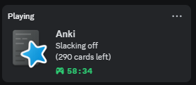

    

\>*An add-on that utilizes the pypresence library and updates your Discord status (Rich Presence) to display your Anki activity.*

This add-on is a customized version(fork) for Anki24+ of a discontinued development Ankicord, most of the code is credited to the author, STadas.

**Credit**
* Original: [Ankicord - Discord Rich Presence (discontinued)](https://github.com/STadas/Ankicord/) / Author : [STadas](https://github.com/STadas)
* Bundle: [pypresence (MIT License)](https://github.com/qwertyquerty/pypresence)
 

 **📖How to use :**  
 1. You only need to install the Add-on to use it, no initial setup is required. (Discord must be downloaded to your PC)
 1. You can customize it with Config: Tools -> Add-ons -> Select Ankicord -> Config

 

 **Note:** 
 1. The code has been partially updated but functionally it is the same as the original add-on for now. This add-on is similar to Leaderboard so I want to enhance it later.

 

 **Related add-ons**
 1. [📱Anki Discord Sidebar - Chat room within Anki (Created by Shige)](https://ankiweb.net/shared/info/33855257)
 1. [🏆Anki Leaderboard - Compete with friends to boost motivation (Fork by Shige)](https://ankiweb.net/shared/info/175794613)

 
 
 

#### \[ 📥 How do I install this add-on? ]
1. Copy and paste the add-on code ( `933207442` )  into Anki and you can install it. 
    ( *Menu -> Tools -> Add-ons -> Get Add-ons -> Code \[ add-on code ]* )
2. When I develop bug fixes, create new features, or compatibility for New Anki, 
 I will notify you and you can install it.
3. If you rate and recommend it, I will receive a notice and my tedious and sleepy 
 add-ons volunteer work will become more enjoyable and exciting.  
 (This add-on is developed by free volunteer work!👍️)

[Click here and please Rate this add-on, Thank you! :-)  
 ](https://ankiweb.net/shared/review/933207442)

