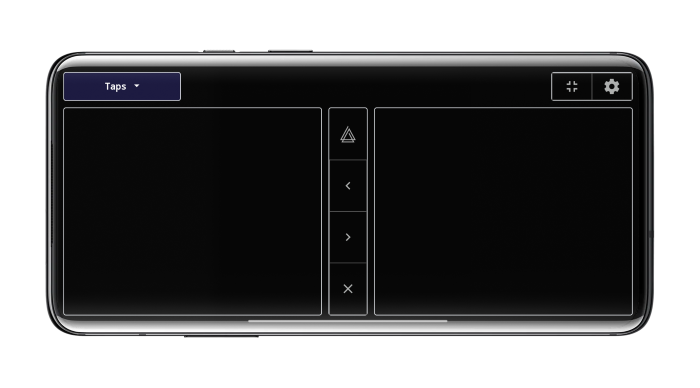
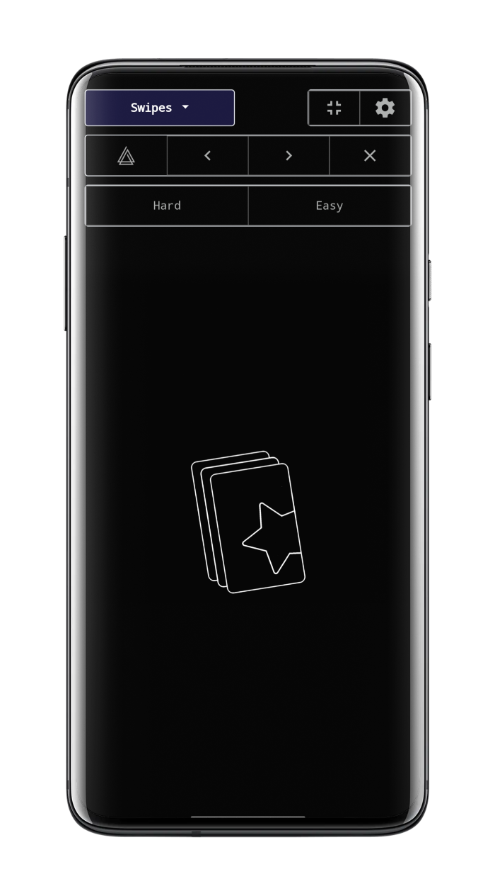
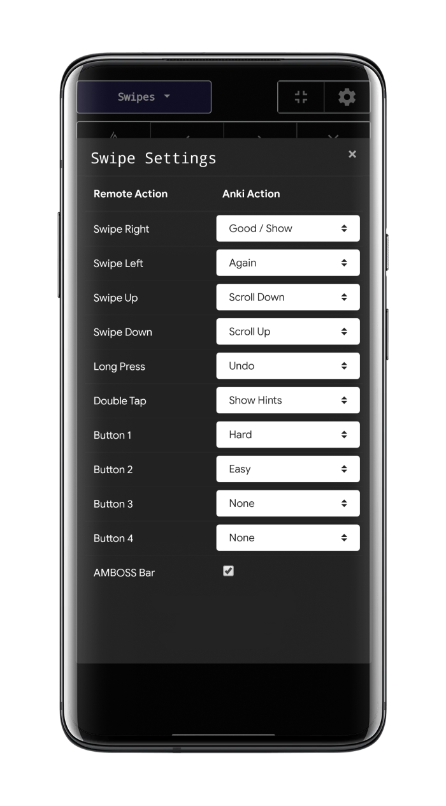
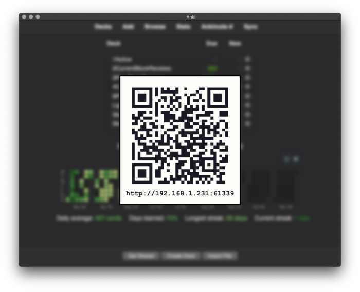
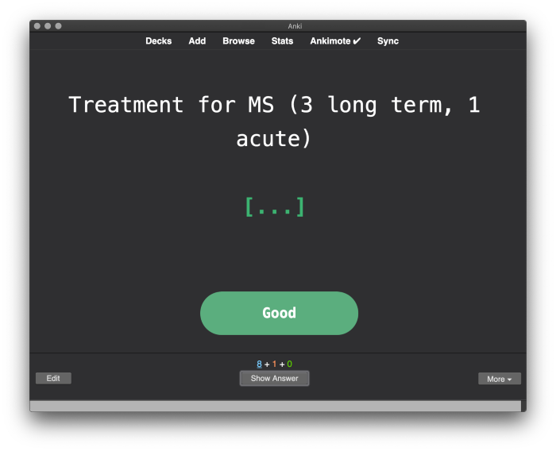
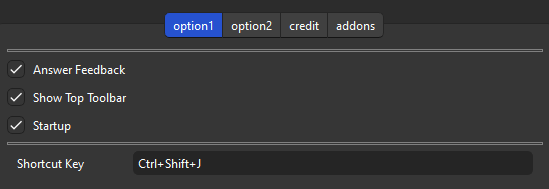
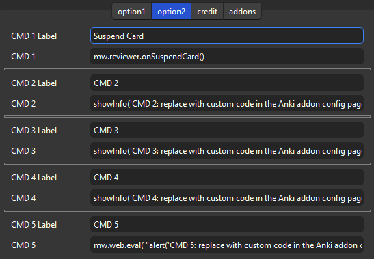

# 📱Ankimote

Ankimote - remote to control Anki from your phone

    

<!-- **[AnkiWeb Page](https://ankiweb.net/shared/info/🟢) | Code : `🟢`** -->

This add-on is Customized version of the addon <a href="https://github.com/TheDabblingDuck/ankimote" target="_blank">"Ankimote"</a>, originally created by <a href="https://github.com/TheDabblingDuck" target="_blank">TheDabblingDuck</a> and credit goes to them. This version fixed the bug in some devices not working, enhanced the user interface, added new options, and more.

# Ankimote

*(These descriptions and images are from the original add-on and partially edited.)*

**Ankimote** is an addon that adds remote control functionality to [Anki](https://apps.ankiweb.net/), the open source flashcards app.

After installing this addon, selecting 'Ankimote' from the Anki toolbar will start Ankimote and display a QR code and URL directing to the remote that can be accessed by any other device on the local network (usually your phone). Best used with the [Zoom for Anki](https://ankiweb.net/shared/info/1923741581) addon to make card text bigger. Then place your laptop far away (or plug into an external monitor or TV) and put your feet up!

## Screenshots

Tap mode (best in landscape)

Swipe mode and swipe settings

 

Connect by scanning a QR or visiting the URL from a phone or other device that is on the same local network.

Visual feedback in the desktop Anki app. (🚨This will not work on the Mac. Workaround is under development, please wait.)

## Features

* Answer cards (again, hard, good, easy) from the remote and get visual feedback on the desktop app

* Scroll up, scroll down, undo from the remote

* One-hand (Swipes) and two-hand (Taps) control interfaces

* Switch decks without touching your computer

* Works with the AMBOSS addon to flip through popups

* 'Show Hints' action reveals hidden portions of cards in common decks such as Anking and Pepper

Advanced features (see addon config in Anki):

* Custom actions to trigger execution of user-defined Python code (to interact with Anki) or Javascript (to interact with the current card)

* Custom hook support for integration with other addons

## Limitations

* Both devices must be on the same network (usually the same WiFi name)

* The network must allow local communication (public networks like coffee shops and some schools may not work)

* Workaround: when the above conditions cannot be met, try enabling Bluetooth tethering on your phone and connect your computer to your phone's Bluetooth. In your computer's Bluetooth settings, use "connect to network" or similar to create an internet connection over Bluetooth between the two devices. Then find your phone's IP address on the Bluetooth connection, and use that IP address instead of the one Ankimote displays. Use the same port displayed by Ankimote.

## Settings

### Anser Feedback

Enables or disables visual feedback. (🚨This will not work on the Mac. Workaround is under development, please wait.)

### Show top Toolbar

Hide the button for the QR code that is displayed on Anki's top toolbar. Need to restart Anki.

### Startup

Ankimote QR code is auto displayed when Anki is launched.

### Shortcut key

You can change the shortcut key for displaying the QR Code.
The default setting is `Ctrl+Shift+J`. Need to restart Anki.

### Custom Commands

These settings apply immediately.

* These 5 custom command slots can be used to run any Python command from the Ankimote remote, thus allowing access to far more Anki functions.

* Enter name of command in cmd{n}-label

* Example commands pulled from [the _shortcutKeys function in Anki's reviewer.py](https://github.com/ankitects/anki/blob/bc5b6dfb6363f588d2e8ad0291ea7f91100ad7a7/qt/aqt/reviewer.py#L266):

    * Suspend card: `mw.reviewer.onSuspendCard()`

    * Suspend note: `mw.reviewer.onSuspend()`

    * Mark card: `mw.reviewer.onMark()`

    * Flag card: `mw.reviewer.setFlag(1)`

        * Replace the number: red=1, orange=2, green=3, blue=4

    * Bury card: `mw.reviewer.onBuryCard()`

    * Bury note: `mw.reviewer.onBuryNote()`

    * Delete note: `mw.reviewer.onDelete()`

    * Replay audio: `mw.reviewer.replayAudio()`

    * Pause audio: `mw.reviewer.on_pause_audio()`

### Custom JavaScript

* To run JavaScript inside your card, use the above custom command slots with the Python function `mw.web.eval( \"[your JS code]\" )`

    * Example: `mw.web.eval( \"document.getElementById('io-revl-btn').onclick();\" )`

    * The above command will click the toggle button in an Image Occlusion card.

* Multi-line javascript should be converted to a single line with commands separated by semicolons.

    * Example: `mw.web.eval( \"var x=document.getElementsByClassName('hint'); for(i=0;i<x.length;i++) { if(x[i].tagName=='A') { x[i].onclick(); } };\" )`

    * The above command finds all link elements with class name 'hint' and clicks them, thus revealing extra information in some popular decks.

* Use the addon ['AnkiWebView Inspector'](https://ankiweb.net/shared/info/31746032) to look at a card's code and test the JS command before entering it here.

## Privacy

Sending data has been disabled in this customized version because it was causing a bug.

## License

The original Ankimote is MIT licensed but PyQt is AGPL so I added AGPL to the file that uses aqt. I think the code that has nothing to do with aqt is MIT.

## About Development Support

The original authors are inactive as of 2022-2024
(they are medical students so they are probably currently working in the medical field and could be busy) but they are accepting donations for development via paypal -> [The Original Ankimote add-on page](https://ankiweb.net/shared/info/149004221)

Please note that these are different developments, and donating to me will not support the original authors. (Anki add-ons are open source so developers are free to use them)

If the author restarts development this custom version will no longer be needed and development may be closed (cause I want to save development costs).

## Credit

* [The Original Ankimote add-on page](https://ankiweb.net/shared/info/149004221) / Author : [TheDabblingDuck](https://github.com/TheDabblingDuck)
* Contributors ([Short cutkey](https://github.com/TheDabblingDuck/ankimote/pull/45)) / [akavi1](https://github.com/akavi1)

## 🚨Report

If you have any problems or requests feel free to send them to me.

  <!-- 1. <a href="https://ankiweb.net/shared/review/🟢" target="_blank">👍️Rate Comment</a> : You can contact me anonymously, and AnkiWeb will send you an email when I reply, a high rating increases priority of development. -->
  2. <a href="https://www.reddit.com/r/Anki/comments/1b0eybn/simple_fix_of_broken_addons_for_the_latest_anki/" target="_blank">👩‍🚀Reddit</a> : You can request me to repair broken Add-ons.
  2. <a href="https://forums.ankiweb.net/t/simple-fix-of-broken-add-ons-for-the-latest-anki-by-shige/41650" target="_blank">🌟AnkiForums</a> : You can request me to repair broken Add-ons, and it is ideal for open discussions.
  3. <a href="https://github.com/shigeyukey/my_addons/issues" target="_blank">🐙Github </a> : Makes it easier to track problems.
  4. <a href="https://www.patreon.com/Shigeyuki" target="_blank">💖Patreon DM</a> : Response will be prioritized.

<!-- **[AnkiWeb Page](https://ankiweb.net/shared/info/🟢) | Code : `🟢`** -->