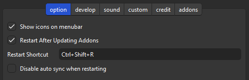
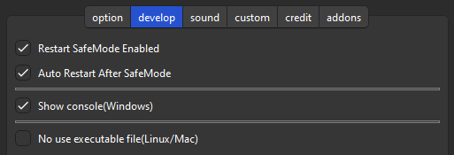
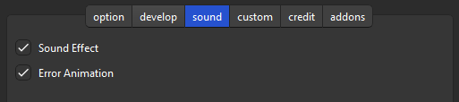

# 🔂AnkiRestart

**🔂AnkiRestart - Quick Aniki Rebooter, for Customize & Develop (Created by Shige)**

<h3>
    <a href="https://ankiweb.net/shared/info/237169833" target="_blank">AnkiWeb Page</a> | Code : <code>237169833</code>
</h3>

 

- [🔂AnkiRestart](#ankirestart)
  - [📺️Tutorial video](#️tutorial-video)
  - [📖Description](#description)
- [⚙️Options](#️options)
  - [⚙️Option tab](#️option-tab)
  - [🔧Develop tab](#develop-tab)
  - [🔊Sound effect tab](#sound-effect-tab)
  - [🛠️Custom tab](#️custom-tab)
  - [⚠️Attention](#️attention)
  - [🚨Report problems or requests](#report-problems-or-requests)
  - [💡Other tips](#other-tips)
  - [📥 How do I install this add-on?](#-how-do-i-install-this-add-on)

## 📺️Tutorial video

<iframe src="https://www.youtube.com/embed/q8c_POBOcMg?list=PLZhrgD6s-LFVsEhxRdEHf_OkGVe2YZfeo" frameborder="0" allow="accelerometer; autoplay; clipboard-write; encrypted-media; gyroscope; picture-in-picture" allowfullscreen style="aspect-ratio: 16/9; width: 100%;"></iframe>

[FixerMed](https://www.youtube.com/@FixerMed) explained how to use it on Youtube! Thank you!🙏

<iframe src="https://www.youtube.com/embed/8pDTV8sMNEI" frameborder="0" allow="accelerometer; autoplay; clipboard-write; encrypted-media; gyroscope; picture-in-picture" allowfullscreen style="aspect-ratio: 16/9; width: 100%;"></iframe>

## 📖Description

This add-on is for quickly restarting Anki. It can be used for add-ons that need to be restarted when settings are changed (e.g.
<a href="https://ankiweb.net/shared/info/1959668791" target="_blank">Anki Redesign</a>,
<a href="https://ankiweb.net/shared/info/1136455830" target="_blank">Advanced Review Bottom Bar</a>),
or for developing add-ons. 

Anki doesn't allow 2 Anki's to be started at the same time, so to restart Anki, you need to wait a little while until Anki is completely closed. This add-on watches for Anki to be completely terminated and automatically restarts it, thus ensuring a reliable restart with one click. 

When you press the restart button on the menu bar, it skips the sync, waits for Anki to close, and then runs a new Anki. 
You can also use the shortcut keys to restart (defaults to Ctrl+Shift+R). 

 

# ⚙️Options

## ⚙️Option tab

1. **show/hide icons on menu bar.**
    * Show or hide the restart icon displayed in Anki's menu bar.
2. **Restart After Updating Addons.**
    * After updating add-ons at Anki startup or by the addons manager, the AnkiRestart dialog pops up.
3. **Restart Shortcut key (Default is Ctrl+Shift+R)**
    * Shortcut keys can be set freely. If it does not work, the key may be wrong or it may interfere with other shortcut keys.
4. **Disable suto sync when restarting**
    * This add-on has a function to turn off auto-sync for faster restart.
Basically auto-sync is restored, but sometimes there is a problem that auto-sync is not restored and is turned off after repeated restarts.
This can be disabled with this setting.

## 🔧Develop tab

1. **Restart SafeMode Enabled**
    * Enables/disables the function to restart while holding down the Shift key (Safe mode, Start with all add-ons turned off). This restart can be accessed from the menu. Safe mode may be used in case of problems caused by add-ons.
2. **Auto Restart After SafeMode**
    * When in safe mode, add-ons are not available thus AnkiRestart is also not available. This option will auto restart Anki when you close Anki in safe mode.
3. **Show console(Windows,unstable)**
    * Show console after restarting Anki. (The console is used for add-on or Anki development.) This feature is required only on Windows. It is not necessary on Mac or Linux, as the console is show auto after restarting.
4. **No use executable file(Linux/Mac)**
    * On Mac and Linux it may be possible to restart without using the executable file(.exe, .app) for restarting (On Windows it is essential). If you cannot restart successfully, try turning this off.

## 🔊Sound effect tab

1. **Sound Effect**
    * Play sound when restarting. This useless function is embedded in the add-ons I developed for gamification.
2. **Error Animation**
    * Play animation when an error occurs. It is developed to display when an executable file (.exe, .app) has been deleted by Virus Buster. There have been no reports of this problem so far so it may not occur.

## 🛠️Custom tab

1. **Use Anki path Manually**
   * e.g. `C:\Program Files\Anki\anki.exe`. `""` is not necessary.
   * Specify directly anki.exe, anki-console.bat, etc.
   * Setting up anki-console.bat on Windows will almost certainly display the console after restarting Anki.
   * If you have multiple Anki installed and set the version, you can start and debug with the old Anki after restarting.
2. **Use custom base folder(-b)**
   * e.g. `C:\AnkiDataFolder`. `""` and `-b` are not necessary.
   * For booting Anki from portable USB, or another database.
   * If you use a different database, you can safely develop without using your study data, or change the add-ons to something else for debugging.
   * See AnkiManual for more information on these startup options: <a href="https://docs.ankiweb.net/files.html#startup-options" target="_blank">AnkiManual : startup-options</a>

## ⚠️Attention

This add-on is separated from Anki in purpose of restarting Anki, so there is a high possibility of mis-detection by antivirus software. This problem is solvable, but requires $200+ per year (Code Signing), so I'm not considering it at now.
- **1. \[ 🖥️Windows ]** If your antivirus software mis-detects add-on, the ".exe" will be quarantined. It's labeled Trojan but it's a mis-detection, so no danger. In this case, this add-on cannot be used without Allow on device. (Edit : So far there are no reports of this problem, so it may not happen that often?)
- **2. \[ 🍎Mac ]** I have fixed the bug so it will probably work.
- **3. \[ 🐧Linax ]** The executable file is created in Ubuntu and PyInstaller (AnkiRestart.py), so it may not work properly except in Ubuntu. You can enable "No use executable file (Linux/Mac)" to restart without using the executable file, but it may duplicate instances of Anki.

 

## 🚨Report problems or requests

If you have any problems or requests feel free to send them to me.

  1. <a href="https://ankiweb.net/shared/review/237169833" target="_blank">👍️Rate Comment</a> : Simple. You can contact me anonymously, and AnkiWeb will send you an email when I reply.
  2. <a href="https://forums.ankiweb.net/t/ankirestart-support-thread/34465" target="_blank">🌟AnkiForums</a> : You can send images. It is useful when you want to explain in detail or need a reply.
  3. <a href="https://github.com/shigeyukey/my_addons/issues" target="_blank">🐙Github</a> : For developers or advanced users. Track issues long term and discuss them in detail.
  4. <a href="https://www.reddit.com/r/Anki/comments/1b0eybn/simple_fix_of_broken_addons_for_the_latest_anki/" target="_blank">👩‍🚀Reddit </a> : You can request me to repair broken Add-ons.
  5. <a href="https://www.patreon.com/Shigeyuki" target="_blank">💖Patreon</a> : Response will be prioritized.

 

## 💡Other tips

    According to <a href="https://forums.ankiweb.net/t/ankirestart-support-thread/34465/15" target="_blank">basiskarten's post</a>, this code in AutoHotkey will restart Anki with a shortcut key.

> I use the following AutoHotkey (v2) script to quickly restart Anki by pressing Win+N when Anki’s main window is active. When I press Control+Win+N the script also toggles night mode on or off before restarting. (For languages other than German the script would have to be modified slightly for this to work.)

<pre>
<code>
#SingleInstance Force
#Requires AutoHotkey v2.0-

#HotIf WinActive("ahk_exe anki.exe")

#HotIf WinActive("- Anki")

#N:: ; Restart Anki with the same profile by pressing Win+N when the Anki-window is active.
{
profile := RegExReplace(WinGetTitle("A"), " - Anki$")
path := WinGetProcessPath("A")
Send "!{F4}"
ProcessWaitClose("anki.exe")
Run path ' -p "' profile '"'
}

^#N:: ; Restart Anki with the same profile by pressing Win+N when the Anki-window is active - but also toggle nightmode
{
profile := RegExReplace(WinGetTitle("A"), " - Anki$")
path := WinGetProcessPath("A")
Send "^p"
WinWaitActive("Einstellungen")
MouseClick("Left", 47, 74)
Send "{Tab 7}{Space}{Esc}"
WinWaitActive("Anki")
Send "{Enter}"
WinWaitActive(profile)
Send "!{F4}"
ProcessWaitClose("anki.exe")
Run path ' -p "' profile '"'
}

#HotIf

#HotIf
</code>
</pre>

 

 

## 📥 How do I install this add-on?
1. Copy and paste the add-on code ( `237169833` )  into Anki and you can install it. 
    ( *Menu -> Tools -> Add-ons -> Get Add-ons -> Code \[ add-on code ]* )
2. When I develop bug fixes, create new features, or compatibility for New Anki, 
 I will notify you and you can install it.
3. If you rate and recommend it, I will receive a notice and my tedious and sleepy 
 add-ons volunteer work will become more enjoyable and exciting.  
 (This add-on is developed by free volunteer work!👍️)

<a href="https://ankiweb.net/shared/review/237169833" target="_blank">
    Click here and please Rate this add-on, Thank you! :-)  
    
</a>

