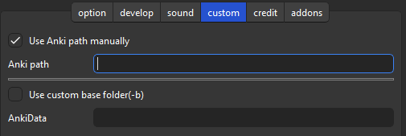

# 🔂AnkiRestart

**🔂AnkiRestart - Quick Aniki Rebooter, for Customize & Develop (Created by Shige)**

### [AnkiWeb Page](https://ankiweb.net/shared/info/237169833) | Code : `237169833`

 

- [🔂AnkiRestart](#ankirestart)
    - [AnkiWeb Page | Code : `237169833`](#ankiweb-page--code--237169833)
  - [📺️Tutorial video](#️tutorial-video)
  - [📖Description](#description)
- [⚙️Options](#️options)
  - [⚙️Option tab](#️option-tab)
  - [🔧Develop tab](#develop-tab)
  - [🔊Sound effect tab](#sound-effect-tab)
  - [🛠️Custom tab](#️custom-tab)
  - [⚠️Attention](#️attention)
  - [🚨Report problems or requests](#report-problems-or-requests)
      - [\[ 📥 How do I install this add-on? \]](#--how-do-i-install-this-add-on-)

## 📺️Tutorial video

<iframe src="https://www.youtube.com/embed/q8c_POBOcMg?list=PLZhrgD6s-LFVsEhxRdEHf_OkGVe2YZfeo" frameborder="0" allow="accelerometer; autoplay; clipboard-write; encrypted-media; gyroscope; picture-in-picture" allowfullscreen style="aspect-ratio: 16/9; width: 100%;"></iframe>

[FixerMed](https://www.youtube.com/@FixerMed) explained how to use it on Youtube! Thank you!🙏

<iframe src="https://www.youtube.com/embed/8pDTV8sMNEI" frameborder="0" allow="accelerometer; autoplay; clipboard-write; encrypted-media; gyroscope; picture-in-picture" allowfullscreen style="aspect-ratio: 16/9; width: 100%;"></iframe>

## 📖Description

This add-on is for quickly restarting Anki. 

Anki doesn't allow 2 Anki's to be started at the same time, so to restart Anki, you need to wait a little while until Anki is completely closed. 
This add-on watches for Anki to be completely terminated and automatically restarts it, thus ensuring a reliable restart with one click. 

It can be used for add-ons that need to be restarted when settings are changed, or for developing add-ons. 
When you press the restart button on the menu bar, it skips the sync, waits for Anki to close, and then runs a new Anki. 
You can also use the shortcut keys to restart ( defaults to Ctrl+Shift+R). 
Incidentally, the restart sound will be played. 

# ⚙️Options

## ⚙️Option tab

- show/hide icons on menu bar.
- Restart After Updating Addons.
- Restart Shortcut key (Default is Ctrl+Shift+R)
- Disable suto sync when restarting

## 🔧Develop tab

- Restart SafeMode Enabled
- Auto Restart After SafeMode
- Show console(Windows,unstable)
- No use executable file(Linux/Mac)

## 🔊Sound effect tab

- Sound Effect... Play sound when restarting
- Error Animation... Play animation when an error occurs

## 🛠️Custom tab

- Use Anki path Manually... Specify directly anki.exe, anki-console.bat, etc.
- Use custom base folder(-b)... for booting Anki from portable USB.

## ⚠️Attention

This add-on is separated from Anki in purpose of restarting Anki, so there is a high possibility of mis-detection by antivirus software. This problem is solvable, but requires $200+ per year (Code Signing), so I'm not considering it at now.
- **1. \[ 🖥️Windows ]** If your antivirus software mis-detects add-on, the ".exe" will be quarantined. It's labeled Trojan but it's a mis-detection, so no danger. In this case, this add-on cannot be used without Allow on device. (Edit : So far there are no reports of this problem, so it may not happen that often?)
- **2. \[ 🍎Mac ]** I have fixed the bug so it will probably work.
- **3. \[ 🐧Linax ]** The executable file is created in Ubuntu and PyInstaller (AnkiRestart.py), so it may not work properly except in Ubuntu. You can enable "No use executable file (Linux/Mac)" to restart without using the executable file, but it may duplicate instances of Anki.

 

## 🚨Report problems or requests

If you have any problems or requests feel free to send them to me.

  1. <a href="https://ankiweb.net/shared/review/237169833" target="_blank">👍️Rate Comment</a> : Simple. You can contact me anonymously, and AnkiWeb will send you an email when I reply.
  2. <a href="https://forums.ankiweb.net/t/ankirestart-support-thread/34465" target="_blank">🌟AnkiForums</a> : You can send images. It is useful when you want to explain in detail or need a reply.
  3. <a href="https://github.com/shigeyukey/my_addons/issues" target="_blank">🐙Github</a> : For developers or advanced users. Track issues long term and discuss them in detail.
  4. <a href="https://www.reddit.com/r/Anki/comments/1b0eybn/simple_fix_of_broken_addons_for_the_latest_anki/" target="_blank">👩‍🚀Reddit </a> : You can request me to repair broken Add-ons.
  5. <a href="https://www.patreon.com/Shigeyuki" target="_blank">💖Patreon</a> : Response will be prioritized.

   

#### \[ 📥 How do I install this add-on? ]
1. Copy and paste the add-on code ( `237169833` )  into Anki and you can install it. 
    ( *Menu -> Tools -> Add-ons -> Get Add-ons -> Code \[ add-on code ]* )
2. When I develop bug fixes, create new features, or compatibility for New Anki, 
 I will notify you and you can install it.
3. If you rate and recommend it, I will receive a notice and my tedious and sleepy 
 add-ons volunteer work will become more enjoyable and exciting.  
 (This add-on is developed by free volunteer work!👍️)

[Click here and please Rate this add-on, Thank you! :-)  
 ](https://ankiweb.net/shared/review/237169833)

