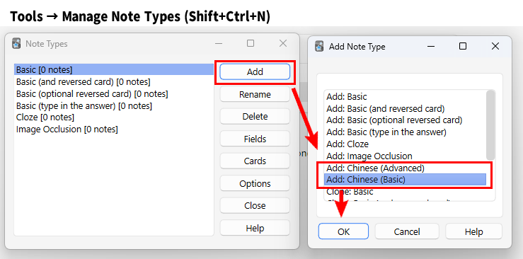

# Chinese Support V4

🐼Chinese Support V4 - auto fill Chinese cards (Fixed by Shigeඞ)

<!-- **[AnkiWeb Page](https://ankiweb.net/shared/info/🟢) | Code : `🟢`** -->

<!-- Customized -->

Auto fill fields from Chinese.

This add-on is a fixed version for Anki25.07+ of the addon <a href="https://ankiweb.net/shared/info/1752008591" target="_blank">"Chinese Support 3"</a>, originally created by <a href="https://github.com/Gustaf-C" target="_blank">Gustaf Carefall</a> and credit goes to them. *Credit: [Other Copyright and Contributors (AGPL)](#credit)*

 

*(These images are edited and re-uploaded from the original add-on images.)*

## How to use

このAdd-onを使用するためには中国語のノートタイプを使用する必要があります.
Add-onをダウンロードするとManage Note Typesに新しいノートタイプが追加されます.
なのでそれをAddで追加してください.

## Features

*(These are edited and re-uploaded from the original add-on page.)*

- The templates can be found under 'Choose Note Type' -> 'Manage' -> 'Add'
- If you find that a field is not filling at all, please check [config.json](https://github.com/luoliyan/chinese-support-redux/blob/master/chinese/config.json) for the complete list of valid field names.

- Automatic field filling
  - Translation (from built-in dictionary; supports English, German and French)
  - Romanisation (supports [Pīnyīn (拼音)](https://en.wikipedia.org/wiki/Pinyin) and Cantonese [Jyutping (粵拼)](https://en.wikipedia.org/wiki/Jyutping))
  - Mandarin Audio (fetched from Google or Baidu)
  - Traditional (繁體字) and simplified (簡體字) characters
  - [Bopomofo (ㄅㄆㄇㄈ)](https://en.wikipedia.org/wiki/Bopomofo), also known as Zhuyin (注音)
  - [Rubies](https://www.w3schools.com/tags/tag_ruby.asp) (small-print transcription placed above characters)
  - Frequency (from “very basic” to “obscure”) - based on [anki-chinese-word-frequency](https://github.com/ernop/anki-chinese-word-frequency)
  - Usage Sentence Examples - Chinese/English sentence pairs from [Tatoeba](https://tatoeba.org/)
- Automatic tone change of auto filled pinyin (hanzi field must be populated)
  - E.g. fen1kai1 -> *Tab* -> fēnkāi (won't replace existing tones)
- Tone colours (applied to characters, romanisation and Bopomofo)
- Built-in note types (Basic and Advanced)

## Usage

The core feature of the add-on is the automatic field filling. To take advantage of this, you need to have an Anki note type with the appropriate fields (e.g., `Hanzi`, `English`, `Pinyin`, `Sound`). See `config.json` for a list of valid field names.

If you don't already have such a note type, the easiest approach is to use one of the built-in models. Two types are installed automatically: Basic and Advanced. The only important difference is that the Advanced model shows more information.

To use the field-filling features:

1. Add a new note to Anki (press *a*)
2. Create (manage -> add) and select `Chinese (Basic)` or `Chinese (Advanced)` as the note type
3. Enable Chinese Support 3 for this note type (click `汉字`)
4. Enter a word (e.g., 電話) into the `Hanzi` field (sentences will also work)
5. Press *Tab*
6. The remaining fields should then be populated automatically

## Credit

Copyright and Contributors:

* 2012-2015 Thomas TEMPÉ <thomas.tempe@alysse.org>
* 2012 Roland Sieker <ospalh@gmail.com>
* 2013 Chris Hatch <foonugget@gmail.com>
* 2014 Alex Griffin <alex@alexjgriffin.com>
* 2017-2021 Joseph Lorimer <joseph@lorimer.me>
* 2020 Joe Minicucci <https://joeminicucci.com>
* 2023-2024 Gustaf Carefall <https://github.com/Gustaf-C>
* 2023-2025 Kieran Black <https://github.com/kieranlblack>
* 2025 fetsorn <https://github.com/fetsorn>
* 2025 Shigeyuki <http://patreon.com/Shigeyuki>

other contributors, see: [chinese-support-3/contributors](https://github.com/Gustaf-C/anki-chinese-support-3/graphs/contributors)
#

* V1. [chinese-support-addon](https://github.com/ttempe/chinese-support-addon)
  * Author: [Thomas TEMPÉ](https://github.com/ttempe)
  * Wiki: [Chinese Support Wiki](https://github.com/ttempe/chinese-support-addon/wiki)
* V2. [Chinese Support Redux v0.14.2](https://github.com/luoliyan/chinese-support-redux)
  * AnkiWeb: [AddonPage](https://ankiweb.net/shared/info/1128979221)
  * Author: [JD Lorimer](https://github.com/jdlorimer)
* V3. [Chinese Support 3](https://github.com/jdlorimer/chinese-support-redux)
  * AnkiWeb: [AddonPage](https://ankiweb.net/shared/info/1752008591)
  * Author: [Gustaf-C](https://github.com/Gustaf-C)
  * Contributors: [Kieran Black](ttps://github.com/kieranlblack)

## Related addon
  *  [Korean Support](https://github.com/scottgigante/korean-support)
     * AnkiWeb: [AddonPage](https://ankiweb.net/shared/info/1336389630)
     * Author: [Scott Gigante](https://github.com/scottgigante)

