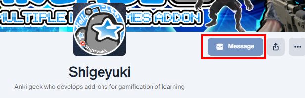

# 📨Report and Request

- [📨Report and Request](#report-and-request)
  - [💖Patreon](#patreon)
  - [🌐AnkiWeb](#ankiweb)
  - [👨‍🚀Reddit](#reddit)
  - [🌟AnkiForums](#ankiforums)
  - [🐙Github](#github)

 

## 💖Patreon

[💖Patreon Direct Message](https://www.patreon.com/Shigeyuki)

1. If you become a paid Patron you can send direct messages to me.
2. You can still use direct messages after you cancel the paid subscription.
3. If you join for free you cannot use this function.

## 🌐AnkiWeb

[🌐AnkiWeb Addons : by Shige](https://ankiweb.net/shared/addons?search=Please%20Support%20Shige%27s%20Anki%20add-ons%20development)

1. For free add-ons released on AnkiWeb you can easily contact me via rating comments. (Add-on page -> Rate This)
2. AnkiWeb will send you an email when I reply.
3. High rating increases priority of development.

##  👨‍🚀Reddit
[👨‍🚀Reddit Direct Message: Shige-yuki](https://www.reddit.com/user/Shige-yuki)

1. I have answered on Reddit about the use of Anki and add-ons.
1. You can upload images.
1. If you want to mention me -> `u/shige-yuki`

##  🌟AnkiForums
[🌟AnkiForums Direct Message: Shigeyuki](https://forums.ankiweb.net/u/shigeyuki/summary)
1. Official AnkiForums, it's a good place for open discussion.
1. Images and codes can be used.
2. If you want to mention me -> `@Shigeyuki`

##  🐙Github

Free addons : [🐙Github : my_addons/issues](https://github.com/shigeyukey/my_addons/issues) 
Patreon addons : [🐙Github : AnkiArcade/issues](https://github.com/shigeyukey/AnkiArcade/issues)

1. Images and codes can be used.
1. Long term issues and requests are eventually posted to Github to manage tasks.

<!-- ## 💡Frequently Asked Questions

**Q. How do I contact Shigeyuki?**

If you can send it to me it doesn't matter where you contact me from. If you have error reports please send them to me.

### Q. Do you accept work requests for Anki add-ons development?

A. My development is a hobby so I am not accepting work requests. Requests for free ideas are always accepted. -->

<!-- ### Q. Can I hire you for my project?

A. Not accepted. I'm more like an employer than an employee so if you want to hire me for your project I also want to hire you for my game addons project.

### Q. How can I get my request developed as quickly as you can?

A. I do not know until I develop it. If it is easy it can be done within a few days, if it is difficult it can take about 6 months or more. Basically it is common for development to take several months or more even for simple tasks. -->