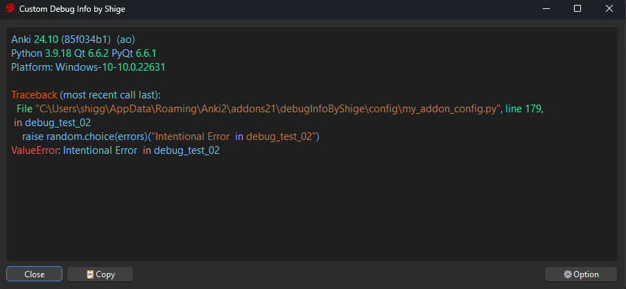
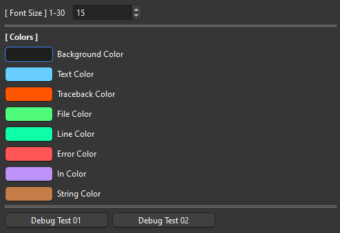
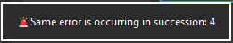
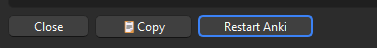

# 🐞Custom Debug Info

 

[Add-on page (Ankiweb)](https://ankiweb.net/shared/info/1616945135)

This add-on is for add-on developers, not for general learners. It displays debug info directly and makes errors easier to read. (It does nothing unless an error occurs.)

## 📖How to Use
1. Default debug info is not displayed.
1. Add-ons info is not displayed.
1. Font size and colors can be customized in Config.
1. When you resize the window the size is auto saved.

## Avoid Anki freeze
1. If the same error occurs continuously due to an infinite loop, etc., the popup is stopped and a tooltip is displayed.
2. If there are three or more error windows a new window will not be created. 

## Note
1. 🚨If a problem occurs with this add-on all errors may not be displayed correctly. It uses monkey patches and is fragile, only tested on Windows, Anki24.10.

## Related Add-on

[🔂AnkiRestart - Quick Aniki Rebooter, for Customize & Develop](ankirestart.md)

If AnkiRestart is installed, add a button to restart Anki:

 

## 🚨Report problems or requests

If you have any problems or requests feel free to send them to me.

  1. <a href="https://ankiweb.net/shared/review/1616945135" target="_blank">AnkiWeb (Rate Comment)</a> : You can contact me anonymously, and AnkiWeb will send you an email when I reply, a high rating increases priority of development.
  <!-- 2. <a href="https://forums.ankiweb.net/t/add-on-support-thread-anki-leaderboard-by-shige/51634" target="_blank">AnkiForums</a> : Official AnkiForums support thread, it's a good place for open discussion. -->
  1. <a href="https://www.reddit.com/r/Anki/comments/1b0eybn/simple_fix_of_broken_addons_for_the_latest_anki/" target="_blank">Reddit (Fixed add-ons, or DM)</a> : You can request me to repair broken Add-ons.
  1. <a href="https://github.com/shigeyukey/my_addons/issues" target="_blank">Github (Issues)</a> : Makes it easier to track problems. (I haven't created a repository yet.)
  1. <a href="https://www.patreon.com/Shigeyuki" target="_blank">Patreon (Direct Message)</a> : Response will be prioritized.
