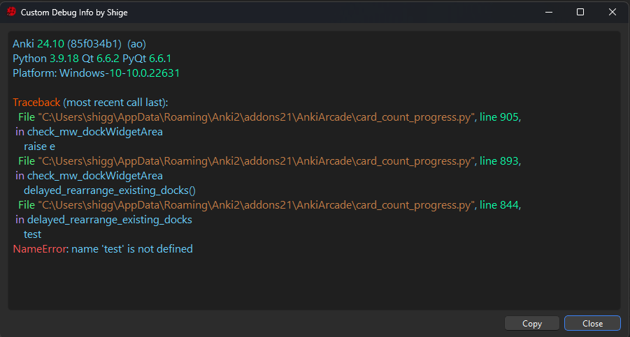
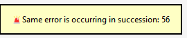

# 🐞Custom Debug Info

 

This add-on is for add-on developers, not for general learners. It displays debug info directly and makes errors easier to read. (It does nothing unless an error occurs.)

## 📖How to Use
1. Default debug info is not displayed.
1. Add-ons info is not displayed.
1. Font size and colors can be customized in Config.
1. When you resize the window the size is auto saved.

## Avoid Anki freeze
1. If the same error occurs continuously due to an infinite loop, etc., the popup is stopped and a tooltip is displayed.
2. If there are three or more error windows a new window will not be created. 

## Note
1. 🚨If a problem occurs with this add-on all errors may not be displayed correctly.
1. It uses monkey patches and is fragile.
1. Only tested on Windows, Anki24.10.

## Related Add-on

1. [🔂AnkiRestart - Quick Aniki Rebooter, for Customize & Develop](ankirestart.md)

