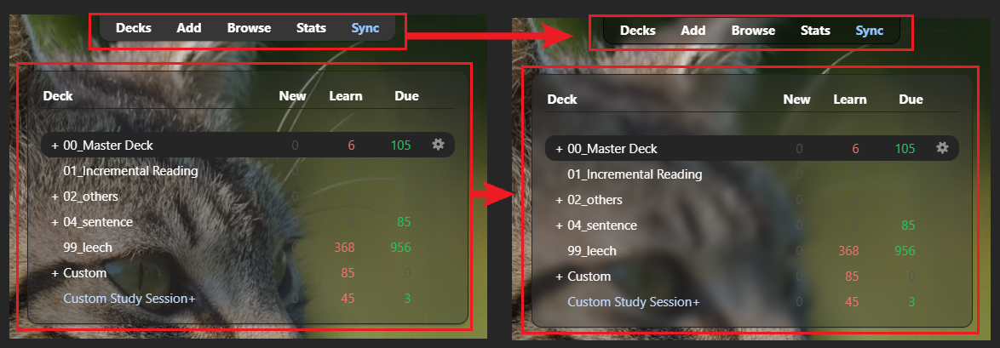
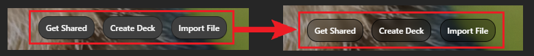

# 🧊Deck Blur

<!-- 
contact
https://shigeyukey.github.io/shige-addons-wiki/contact.html
 -->

<!--
https://shigeyukey.github.io/shige-addons-wiki/images/
-->

<!-- **[AnkiWeb Page](https://ankiweb.net/shared/info/🟢) | Code : `🟢`** -->

<!-- 

🧊Deck Blur - add blur to the deck table and top toolbar (Created by Shigeඞ)

Hi I'm add-ons developer Shige, I fixed this add-on and uploaded it to AnkiWeb.
🟢 (Fixed by Shigeඞ)
https://ankiweb.net/shared/info/🟢
 -->

<!-- Customized -->

Add a blur effect to the background of the deck table on Anki's home screen. (also make the top toolbar transparent.) e.g.

## How to use

After download the add-on and restart Anki it will be auto enabled.

There is a feature to make buttons transparent using the same method, but this feature is likely to interfere with other button add-ons so it is disabled by default. You can enable it in the config.

## Config

* `is_addon_enable` Toggle the add-on on and off. value: `true` or `false`
* `is_enable_button`: Toggle button blur on and off. value: `true` or `false`
* `is_enable_top_toolbar` Toggle top toolbar blur on and off. value: `true` or `false`
* `is_enable_deck_blur` Toggle Anki Home deck table blur on and off. value: `true` or `false`

## Note

* This add-on does not have a wallpaper feature.
* On some devices blur may cause flickering or performance degradation, this is why the official Anki developers haven't added it.

