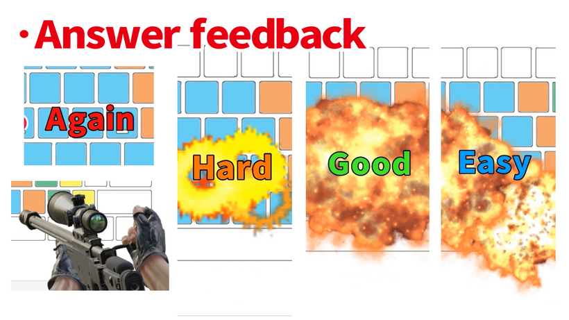
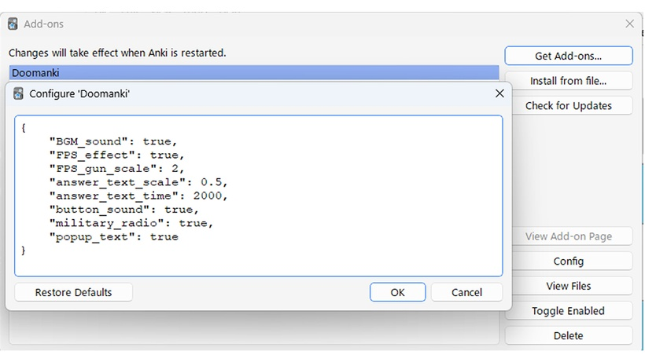
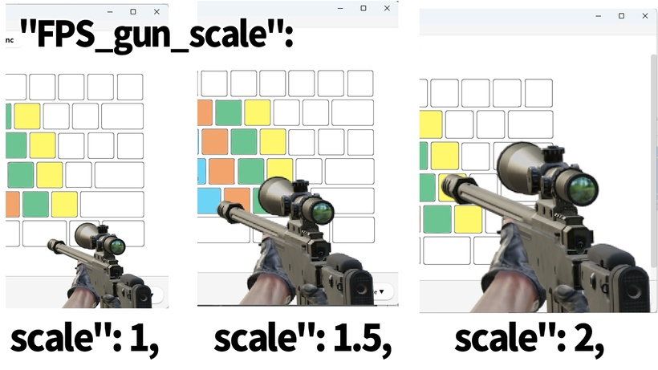
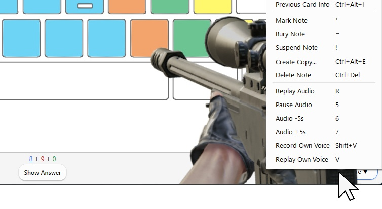
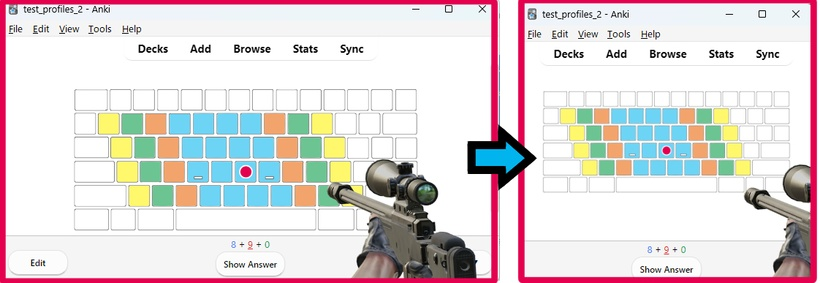

# Doomanki
#### Doomanki - Beta Anki addon ,like FPS Game, gunshot sound and text feedback, Ambient BGM, button sound effect, Military radio.

<iframe src="https://www.youtube.com/embed/e3vOxR9WGKY?list=PLZhrgD6s-LFVsEhxRdEHf_OkGVe2YZfeo" frameborder="0" allow="accelerometer; autoplay; clipboard-write; encrypted-media; gyroscope; picture-in-picture" allowfullscreen style="aspect-ratio: 16/9; width: 100%;"></iframe>

### ---! Attention ! & Introduction---
This addon is still in development and in beta. When you become a Patreon, you will have early access to the beta version. Download from this download page.

(My paid addon will be released for free in the future. I will develop add-ons exclusively for Patreon first, and then release the free version. If you want it for free, please follow me and wait.)

This add-on is in early access beta and is not guaranteed to work. I think it should probably work on Mac, Linux, Anki 2.1.43?~Anki 2.1.61, and Qt6 & Qt5. But I haven't checked others yet. It works on my PC Windows, Anki 2.1.61, Qt6.

(Anki add-ons only work on PC. It does not work on smartphones Anki Mobile or AnkiDroid.)

# Doomanki - Beta Anki addon

## === Description ===
Anki addon like FPS game(first person shooter, like Doom + Anki). When you answer, gun animations, gunshot sounds, explosions, and text feedback , Military radio voices are played, will occur.

In addition, ambient sounds are automatically played randomly (wind, bonfire, rain, blizzard, thunderstorm).

## === Answer feedback ===

* Again ... gun reload
* Hard ... submachine gun
* Good ... Sniper Rifle
* Easy ... Rocket Launcher

Undo .... health point recovery (No text, only V3 scheduler)

## === Option ===

Each feedback can be turned on/off in the add-on configuration. (Anki menu - tools - Add-ons - Config) Please restart Anki after setting.

* "BGM_sound": true,   ... Ambient sounds on/off. true or false.
* "FPS_effect": true,    ....Explosion on/off.true or false.
* "answer_text_scale": 0.5,    ....Text scaling. For example 0.5, ~1, ~ 2.
* "answer_text_time": 2000,    ....The number of seconds the text is displayed. 2000 = 2 seconds.
* "button_sound": true,    ....Anki button sounds on/off. true or false.
* "military_radio": true,    ....Military radio voice on/off. true or false.
* "popup_text": true    ....Answer feedback text (Good, Again, Hard, Easy) on/off. true or false.
* "FPS_gun_scale": 2,    ....Scale the gun image. For example, 1 ,~ 1.5, ~2. If the gun animation overlaps your answer, set the scale to 1 ~ 1.5 to make the image smaller.

Anything below the image is clickable. Like this.

If your Anki window is too narrow, the animation will be choppy. Like this.

## === Others & Problems ===
* It supports dark mode and light mode.
* Currently, undo sounds are only compatible with the V3 scheduler.
* The undo sound is very rare and misbehaves. It's not actually undoing, so it doesn't affect your learning.
* Very rarely, there is a bug that freezes. I'm still looking into the cause.
* It may slow down if you use it for a lot of time. Please restart Anki.
* Basically, there should be almost no interference with other addons. however, When used together with the add-on Anki Habitica, the animation will be slightly delayed. This may be because Anki Habitica is communicating when it responds.There is no problem in operation.
* Possibly, depending on the performance of the personal computer, the operation of the add-on may be slow. I have not checked it yet.

## === When a bug occurs ===

 * If a fatal bug occurs in Anki add-ons, Anki may not be able to start. In this case, please start Anki while holding down the Shift key. You can start Anki without loading add-ons. Then disable the add-on in settings.

* Also, if a fatal bug occurs, you may not be able to close Anki. In this case, restart your PC , or start Task Manager and end Anki.

## === Maybe future development ? ===
* FPS button (About half completed)
* Other gun animations (after code refactoring)
* Volume adjustment (currently not adjustable yet)
* Add settings window
===↓↓↓Download ↓↓↓===
### [Download from this download page.](https://www.patreon.com/posts/doomanki-page-81970712?utm_medium=clipboard_copy&utm_source=copyLink&utm_campaign=postshare_creator&utm_content=join_link)

Thank you for reading! If you like this add-on, please hit the heart button. Enjoy Anki!