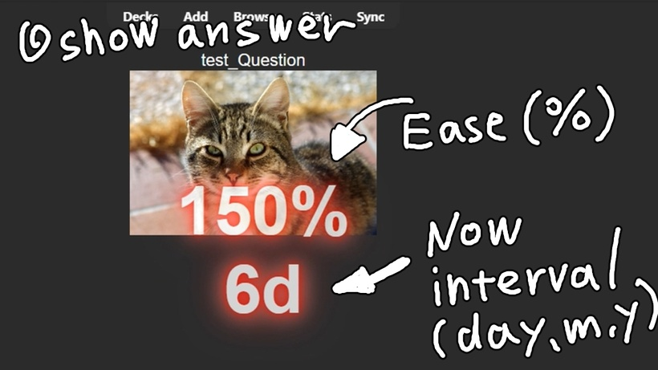
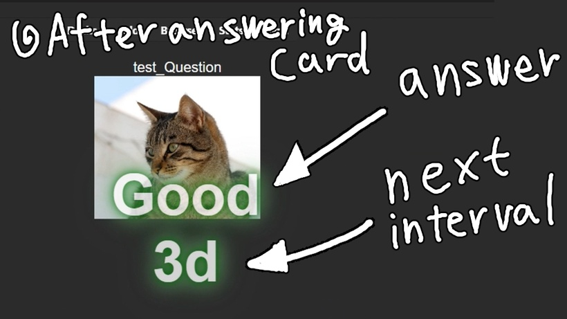
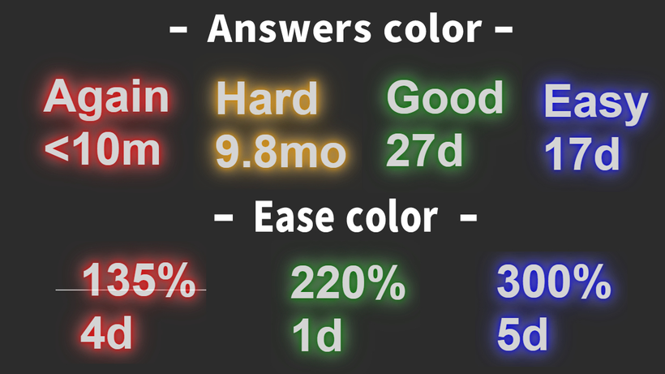
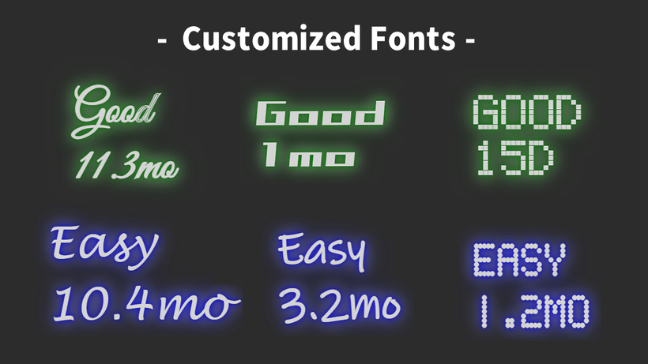
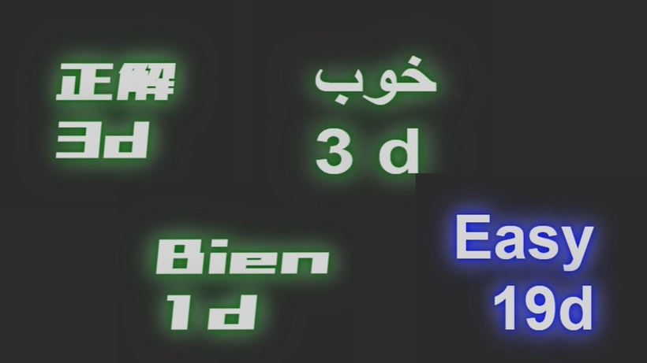
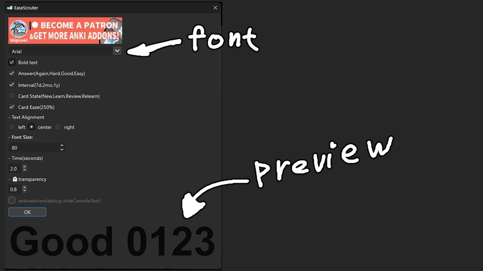
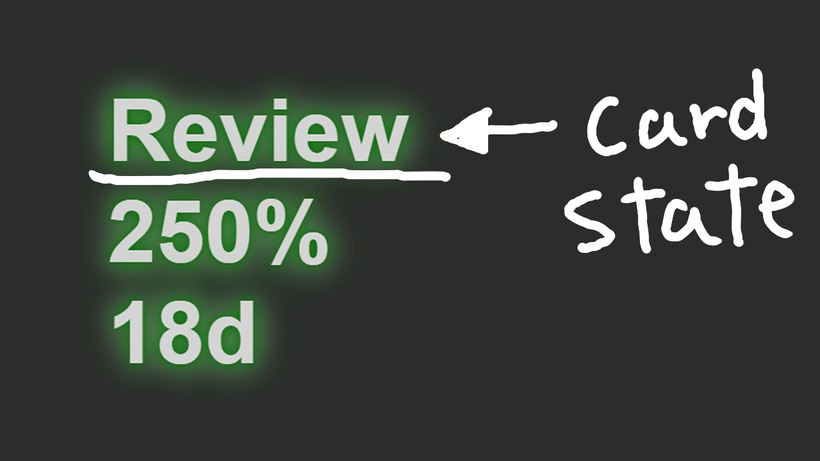

# 🕶️EaseScouter

#### This add-on is a bit outdated, there is a new enhanced version available -> [🚦Answer text feedback](https://shigeyukey.github.io/shige-addons-wiki/answer-text-feedback.html)

EaseScouter (Ankiaddon Prototype Patreon)Visual feedback Ease Answer Interval multilingual text

<iframe src="https://www.youtube.com/embed/rB9JgY0JHHQ" frameborder="0" allow="accelerometer; autoplay; clipboard-write; encrypted-media; gyroscope; picture-in-picture" allowfullscreen style="aspect-ratio: 16/9; width: 100%;"></iframe>

 *This add-on is still in development and not yet complete, so it is not published on Anki Web. If you become a Patreon, you will get early access to beta versions that are in development(Operation is not guaranteed).  I have only made prototype add-ons yet, But in the future these add-ons will be released for free.* 

## [Download from this download page.](https://www.patreon.com/posts/easescouter-add-84313838?utm_medium=clipboard_copy&utm_source=copyLink&utm_campaign=postshare_creator&utm_content=join_link)

## === Description ===
This add-on is a prototype. Visual feedback on Ease, Answer and Interval with multilingual text. May help identify Ease Hell early.

## === How to use ===
- Show answer
When the answer is displayed, "Ease" and the current interval are shown.

- After answering card
When you answer, an answer button and the next interval will be displayed.

- Text color
The color of the text changes depending on the answer and the value of Ease.

- Customized Fonts
Font can be changed in "Tools>EaseScouter.

I think you can use any font that is installed on your computer.

If you want to add fonts, installing free fonts on your computer will probably work. (The font must support the display of numbers.)

- Supports multiple languages
The displayed text is multilingual. The text displayed will change depending on the language Anki is set to. Some translations may not work with older versions of Anki

- Configuration
Some settings will take effect after Anki is restarted.

The configuration screen is also available in most of the languages. The word "transparent" didn't translate, so it has a ghost emoji.

Answer button, interval, and Ease text can be hidden in the settings. You can also reduce and simplify the display.
Text position can be changed to left, center, or right.
Font size setting
Set the number of seconds to display and the transparency level.
- Card state
Card status can also be displayed.  (New, Learn, Review, Relearn)

I thought it was too much information so the default is hidden.

- issues
This add-on has been debugged a lot, so I think it is more stable than previous add-ons. (Also, I'm getting a little more familiar with how to make an add-on) I have also tested it with Anki 2.1.49, so I think it will work. However, it has not been tested on Mac and Linux.
When used with the button add-on I released (Superfluous Button Bros), there is a bug where the text does not appear the first time you answer. after that, it appears fine.
(For non-developers, this issue is irrelevant) There is no problem, but an error message appears in the console. If you edit config.json directly and switch to AnkiWebView, the error message is hidden, but there is a bug that the screen goes dark when switching to night mode.
- Future development
This add-on was developed to implement gamification into Anki. For example, it can pop up the number of consecutive correct answers like a combo.

The structure is somewhat complex because it is intended to display text and images stacked as a layered structure.

Currently, there is only one type of neon, but by changing HTML and CSS, you can add many variations of design. It can also display CSS and javascript animations can also be displayed, but I discarded them due to a bug that causes very high CPU usage on PC. This problem is caused by PyQt that Anki uses, so there is no solution.

Without using CSS or HTML, the animations can be rebuilt from scratch with Rebuilding with PyQt would keep the CPU usage low.

## === Other ===
- If you like this add-on and need more development, and free version, press the heart button or high rating. Enjoy Anki!

Created by : Shigeyuki

## ===↓↓↓Download↓↓↓===

## [Download from this download page.](https://www.patreon.com/posts/easescouter-add-84313838?utm_medium=clipboard_copy&utm_source=copyLink&utm_campaign=postshare_creator&utm_content=join_link)