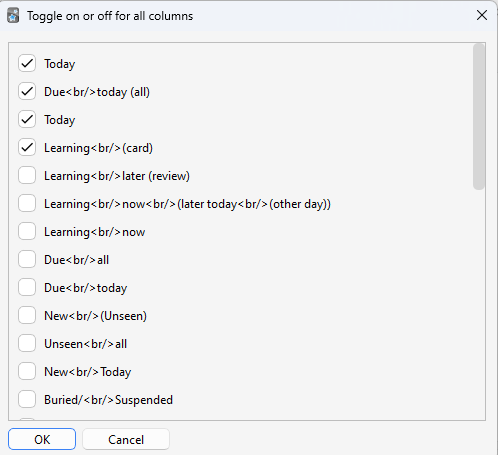

# 📊Enhance main window

  

This add-on is a fixed and customized version of the "Enhance main window" for Anki24+ (Fork), most parts of the code are credited to the author Arthur Milchior. This version fixed a bug and enhanced the user interface. 

Original Add-on: [Enhance main window](https://ankiweb.net/shared/info/877182321) / Author : [Arthur Milchior](https://github.com/Arthur-Milchior)
 

*(This image is re-uploaded from the original add-on image.)* 

## Basic how to use

These descriptions are based on the original Enhance main Window description.

### Drag and drop

1. Columns can be rearranged by drag and drop.

### Click Menu

Click on a Column to open a menu.
1. Open the options for the currently selected Column.
2. Delete Column
     1. Columns that have been deleted can be redisplayed from the options.
     2. Custom -> Global 1 -> Toggle on off all columns

### Config

1. If you want to edit the json directly or reset the settings, open Config from Tools.
     1. Tools -> Add-ons -> Enhance main window -> Config

# Options

### Name of selected column
The name of the currently selected Column is displayed. Options 1-3 allow you to customize only this currently selected column. If you want to customize another column, close the window and select it again.

## Option 1

### Show this column
If turned off, the column will not be displayed (It is the same as delete click menu). If you want to display it again, use “Toggle on off all columns” in the Global tab.

### Header
You can customize the column header text. If you want to break lines, use ` `. If empty, the default text is used.

## Option 2

## Tooltip

### Show tooltip
You can show or hide the text shown on mouse hover.

### Description
You can customize the text shown on mouse hover.

### Color
You can set the color of the numbers in this column.

## Option 3

### Show percent
Displays percentages. Some columns will always be 100%.

### Show absolute numbers
It displays absolute values, not percentages.

### Subdecks
When you consider a deck which has subdecks, a true value considers cards in its subdecks; a false value ignores cards in its child subdecks.
<!-- ｻﾌﾞﾃﾞｯｷを持つﾃﾞｯｷを考慮する場合､trueの値はｻﾌﾞﾃﾞｯｷ内のｶｰﾄﾞを考慮し､falseの値は子ｻﾌﾞﾃﾞｯｷ内のｶｰﾄﾞを無視します｡ -->

## Global 1

### Toggle on or off all columns
Clicki the button open a window and you can change to show or hide all the columns.

### hide values of parent decks

<!-- 親ﾃﾞｯｷの値を非表示にする -->
If a deck has children, its number are not shown.
<!-- ﾃﾞｯｷに子ﾃﾞｯｷがある場合､その数値は表示されません｡ -->

### hide values of parent decks when subdecks are shown
<!-- ｻﾌﾞﾃﾞｯｷが表示されている場合に親ﾃﾞｯｷの値を非表示にする -->
Similar to last option, but it hides number only if the subdecks are shown.
<!-- 前のｵﾌﾟｼｮﾝと似ていますが､ｻﾌﾞﾃﾞｯｷが表示されている場合にのみ数値を非表示にします｡ -->

### Show name of deck option
<!-- ｵﾌﾟｼｮﾝ -->
Whether you want to display the deck option's name at the end of its line.
<!-- ﾃﾞｯｷｵﾌﾟｼｮﾝの名前をその行の最後に表示するかどうか｡ -->

## Color

#### Default column color
<!-- ﾃﾞﾌｫﾙﾄの列の色 -->
The color of the content of a deck, if no other color is specified.
<!-- 他の色が指定されていない場合のﾃﾞｯｷの内容の色 -->

#### Color empty
<!-- 空の色 -->
The color of the names of decks without new cards.
<!-- 新しいｶｰﾄﾞがないﾃﾞｯｷの名前の色 -->

#### Color empty descendant
<!-- 空の子孫の色 -->
The color of the names of decks with a descendant without new cards.
<!-- 新しいｶｰﾄﾞがない子孫を持つﾃﾞｯｷの名前の色 -->

#### Marked background color
<!-- ﾏｰｸ付きﾃﾞｯｷの背景色 -->
The color of decks who have marked cards but none of its descendants are both ended and have marked cards.
<!-- ﾏｰｸされたｶｰﾄﾞを持つが､その子孫のいずれも終了しておらず､ﾏｰｸされたｶｰﾄﾞを持たないﾃﾞｯｷの色｡ -->

#### ended marked background color
<!-- 終了したﾏｰｸ付きﾃﾞｯｷの背景色 -->
The color of the decks which have an ended deck with marked cards.
<!-- ﾏｰｸされたｶｰﾄﾞを持つ終了したﾃﾞｯｷの色｡終了したﾃﾞｯｷの概念は､このﾄﾞｷｭﾒﾝﾄの次のｾｸｼｮﾝで説明されます｡ -->

### color zero

The color to use for the zero. If it's a string, use always this color. By default in Anki, it's a kind of grey. If you set it to false (default in this add-on), then the zero is not shown at all.

## Global 2

### Do color marked and Do color empty
This add-on changes the background color of the names of empty decks, decks with empty descendants, and decks with marked cards. You can turn them off with this option.

### Dot in numbers
Whether you want a thousand separator for big numbers, such as 34968, to be shown as "34.968" or as "34968". 

### cap value
<!-- 上限値 -->
By default, without an add-on, Anki never shows numbers greater than a thousand. Instead, it shows 1000+. You can decide to change the thousand to an arbitrary number, or leave this value to null which always show the real value.
<!-- ﾃﾞﾌｫﾙﾄでは､ｱﾄﾞｵﾝなしでAnkiは1000を超える数字を表示しません｡代わりに1000+と表示されます｡千を任意の数値に変更するか､この値をnullにして常に実際の値を表示するかを決定できます｡ -->

#### End symbol
<!-- 終了記号 -->
By default, this symbol is ";". It means that the deck is definitively done, and no new card may ever be added to it. When a deck has this symbol, neither itself nor its descendants will ever be colored.
<!-- ﾃﾞﾌｫﾙﾄでは､この記号は｢;｣です｡これはﾃﾞｯｷが完全に終了し､新しいｶｰﾄﾞが追加されることはないことを意味します｡この記号があるﾃﾞｯｷは､それ自体もその子孫も色付けされることはありません｡ -->

#### Given up symbol
<!-- 放棄記号 -->
By default, this symbol is "/". To the author, it means that no new card will be added because this deck is either too hard, or not interesting enough.
<!-- ﾃﾞﾌｫﾙﾄでは､この記号は｢/｣です｡作者にとって､これはこのﾃﾞｯｷが難しすぎるか､十分に興味深くないため､新しいｶｰﾄﾞが追加されないことを意味します｡ -->

#### Pause symbol
<!-- 一時停止記号 -->
By default, this symbol is "=". To the author, it means that more new cards will be added later, but right now it does not want Anki to change the color of the deck's name. In a future version, there may be an option to change the color of these decks.
<!-- ﾃﾞﾌｫﾙﾄでは､この記号は｢=｣です｡作者にとって､これは後で新しいｶｰﾄﾞが追加されるが､今はAnkiにﾃﾞｯｷ名の色を変更してほしくないことを意味します｡将来のﾊﾞｰｼﾞｮﾝでは､これらのﾃﾞｯｷの色を変更するｵﾌﾟｼｮﾝが追加されるかもしれません｡ -->

## 🚨Report

If you have any problems or requests feel free to send them to me.

  1. <a href="https://ankiweb.net/shared/review/🟢" target="_blank">Rate Comment</a> : You can contact me anonymously, and AnkiWeb will send you an email when I reply.
  2. <a href="https://www.reddit.com/r/Anki/comments/1b0eybn/simple_fix_of_broken_addons_for_the_latest_anki/" target="_blank">Reddit</a> : You can request me to repair broken Add-ons.
  3. <a href="https://github.com/shigeyukey/my_addons/issues" target="_blank">Github </a> : Makes it easier to track problems. (I haven't created a repository yet.)
  4. <a href="https://www.patreon.com/Shigeyuki" target="_blank">Patreon DM</a> : Response will be prioritized.

<!-- # Configuration of Anki's addon Enhanced Main -->
<!-- AnkiのｱﾄﾞｵﾝEnhanced Mainの設定 -->

<!-- 1. We first discuss the various small configurations related to the whole add-on. -->
<!-- まず､ｱﾄﾞｵﾝ全体に関連するさまざまな小さな設定について説明します｡ -->
<!-- 1. We then explain how to configure each column. -->
<!-- 次に､各列の設定方法について説明します｡ -->
<!-- 1. We then explain how to configure coloring related to empty decks. -->
<!-- 次に､空のﾃﾞｯｷに関連する色の設定方法について説明します｡ -->
<!-- 1. We finally explain how to configure coloring related to marked cards. -->
<!-- 最後に､ﾏｰｸされたｶｰﾄﾞに関連する色の設定方法について説明します｡ -->

<!-- ## Miscelaneous -->
<!-- その他 -->
<!-- In this section, we describe various small configurations related to the whole add-on. -->
<!-- このｾｸｼｮﾝでは､ｱﾄﾞｵﾝ全体に関連するさまざまな小さな設定について説明します｡ -->

<!-- Note that capping to a thousand does not usually make the rendering quicker. -->
<!-- 千に制限しても､通常はﾚﾝﾀﾞﾘﾝｸﾞが速くなるわけではありません｡ -->

<!-- ### Dot in number -->
<!-- 数字の区切り記号 -->
<!-- Whether you want a thousand separator for big numbers, such as 34968, to be shown as "34.968" or as "34968". -->
<!-- 大きな数字（例：34968）に対して千の区切り記号を使用して｢34.968｣と表示するか､｢34968｣と表示するかを選択します｡ -->

<!-- #### Default color -->
<!-- ﾃﾞﾌｫﾙﾄの色 -->
<!-- The color of a deck which every descendant has new cards. -->
<!-- すべての子孫が新しいｶｰﾄﾞを持つﾃﾞｯｷの色 -->

<!-- ## Columns -->
<!-- 列 -->

<!-- Each column should occur after the line "columns" :[, and before the line with a closing bracket ]. The order of the lines is important, since it's the order in which columns will be displayed by Anki. This means that you can reorder columns in Anki by reordering the lines in the configuration. You can copy a line to display a column multiple times (for example, once using percent, and another time using absolute number). -->
<!-- 各列は "columns" :[ の行の後､閉じ括弧 ] の行の前に配置する必要があります｡行の順序は重要であり､これはAnkiが列を表示する順序です｡つまり､設定内の行を並べ替えることで､Anki内の列を並べ替えることができます｡行をｺﾋﾟｰして､列を複数回表示することもできます（例えば､一度はﾊﾟｰｾﾝﾄを使用し､もう一度は絶対数を使用するなど）｡ -->

<!-- Each column is represented between an opening curly bracket {, and a closing curly bracket }. Each column uses 8 parameters, each represented as a pair. -->
<!-- 各列は開き中括弧 { と閉じ中括弧 } の間に表されます｡各列は8つのﾊﾟﾗﾒｰﾀを使用し､それぞれがﾍﾟｱとして表されます｡ -->
<!-- >>key:value -->

<!-- We'll tell you the meaning of each key, whether you can change its value, and what this change will do. -->
<!-- 各ｷｰの意味､その値を変更できるかどうか､およびその変更が何をするかを説明します｡ -->

<!-- ### Name -->
<!-- 名前 -->
<!-- The first value is a description, which will tell you what the column represents. Do NOT alter this value, or the add-on will raise an error. -->
<!-- 最初の値は列が何を表しているかを示す説明です｡この値を変更しないでください｡変更するとｱﾄﾞｵﾝがｴﾗｰを発生させます｡ -->

<!-- ### Subdecks -->
<!-- ｻﾌﾞﾃﾞｯｷ -->
<!-- When you consider a deck which has subdecks, a true value considers cards in its subdecks; a false value ignores cards in its child subdecks. -->
<!-- ｻﾌﾞﾃﾞｯｷを持つﾃﾞｯｷを考慮する場合､trueの値はｻﾌﾞﾃﾞｯｷ内のｶｰﾄﾞを考慮し､falseの値は子ｻﾌﾞﾃﾞｯｷ内のｶｰﾄﾞを無視します｡ -->

<!-- ## Coloring decks -->
<!-- ﾃﾞｯｷの色付け -->
<!-- The author of this add-on wants to know when a deck is empty. This is very important to him, because he wants to add new cards in them as soon as possible. Thus, this add-on changes the color of the names of empty decks, and of the names of decks with an empty descendant. -->
<!-- このｱﾄﾞｵﾝの作者は､ﾃﾞｯｷが空であることを知りたいと考えています｡これは彼にとって非常に重要であり､できるだけ早く新しいｶｰﾄﾞを追加したいからです｡したがって､このｱﾄﾞｵﾝは空のﾃﾞｯｷの名前と､空の子孫を持つﾃﾞｯｷの名前の色を変更します｡ -->

<!-- The author also wants to know which deck has marked cards. Thus, the background of the deck's name having marked cards changes color. -->
<!-- 作者はどのﾃﾞｯｷにﾏｰｸされたｶｰﾄﾞがあるかも知りたいと考えています｡そのため､ﾏｰｸされたｶｰﾄﾞを持つﾃﾞｯｷの名前の背景色が変わります｡ -->

<!-- Both of these configurations can be changed as explained in this section. In particular, you can turn one or both of these options off by setting "color empty" and "color marked" to false. -->
<!-- これらの設定は､このｾｸｼｮﾝで説明されているように変更できます｡特に､｢color empty｣と｢color marked｣をfalseに設定することで､これらのｵﾌﾟｼｮﾝの一方または両方をｵﾌにすることができます｡ -->

<!-- ### Choice of color -->
<!-- 色の選択 -->

<!-- ### Deck modifier -->
<!-- ﾃﾞｯｷ修飾子 -->
<!-- A deck modifier is a symbol (or a word, etc.) whose presence in a deck name changes the meaning of the deck. When the meaning is changed, the coloration is also changed. It's not clear to the author of this add-on whether anyone apart from himself will need those, but if you want to use them, here is the explanation. -->
<!-- ﾃﾞｯｷ修飾子は､ﾃﾞｯｷ名に存在することでﾃﾞｯｷの意味を変更する記号（または単語など）です｡意味が変更されると､色付けも変更されます｡このｱﾄﾞｵﾝの作者以外にこれを必要とする人がいるかどうかは不明ですが､使用したい場合は以下の説明を参照してください｡ -->

<!-- The first three symbols currently have the same effect, but one day this effect may change, according to what the author wants to do. -->
<!-- 最初の3つの記号は現在同じ効果を持っていますが､作者の意図により将来的にこの効果が変更される可能性があります｡ -->
