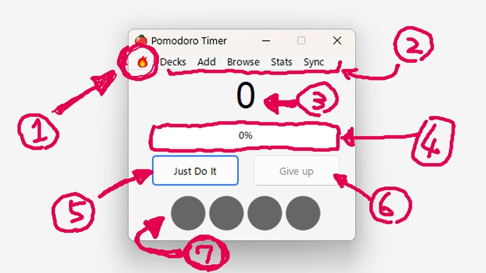
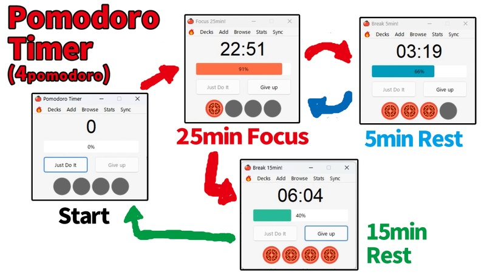
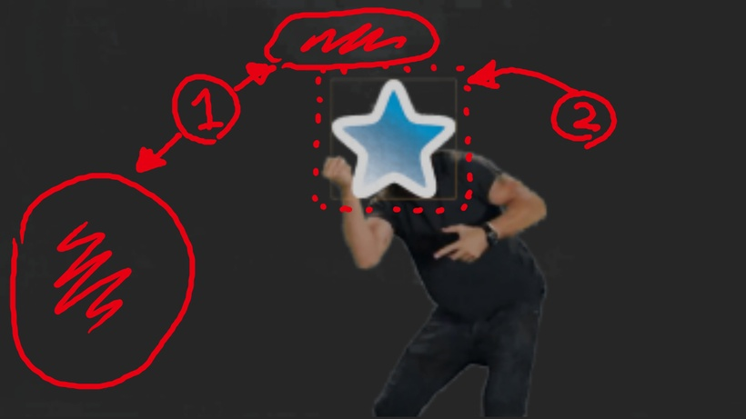
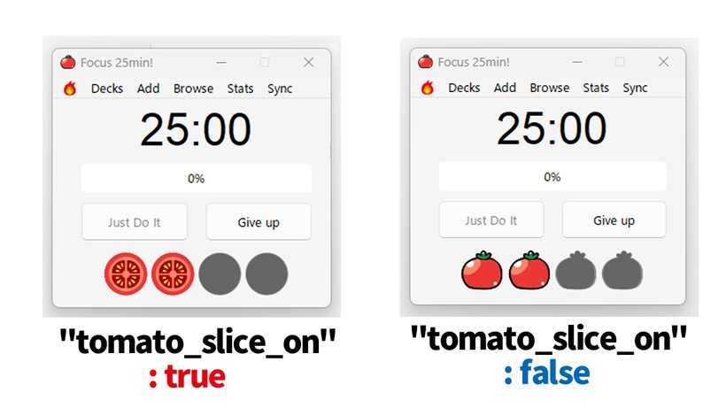

# 🍅Just do it Anki Timer

#### (How to use)Just Do Anki Timer - Beta, Pomodoro timer, tomato count, Just do it sound and animation, 13.4 MB

<iframe src="https://www.youtube.com/embed/ggi2_goRFoU?list=PLZhrgD6s-LFVsEhxRdEHf_OkGVe2YZfeo" frameborder="0" allow="accelerometer; autoplay; clipboard-write; encrypted-media; gyroscope; picture-in-picture" allowfullscreen style="aspect-ratio: 16/9; width: 100%;"></iframe>

### ---! Attention ! & Introduction---
This add-on is still in development and not yet complete, so it is not published on Anki Web. If you become a Patreon, you will get early access to beta versions that are in development. (Operation is not guaranteed)

### [Download from this download page.](https://www.patreon.com/posts/just-do-anki-82046761?utm_medium=clipboard_copy&utm_source=copyLink&utm_campaign=postshare_creator&utm_content=join_link)

(My patreon add-ons will be released for free in the future. I will develop add-ons exclusively for Patreon first, and then release the free version. If you want it for free, please follow me and wait.)

I think it should probably work on Mac, Linux, Anki 2.1.43?~Anki 2.1.61, and Qt6 & Qt5. But I haven't checked others yet. It works on my PC Windows, Anki 2.1.61, Qt6.

(Anki add-ons only work on PC. It does not work on smartphones Anki Mobile or AnkiDroid.)

# Just Do Anki Timer - \[Beta Anki addon]

## === Description ===
Timer to automatically do Pomodoro in Anki. 

Tomato streak, progress bar to keep you motivated, and regular short breaks to prevent burnout from over-learning.

If you get tired, press the fire icon to encourage JUST DO IT!

## === Pomodoro Timer window ===

1. Fire icon : Play Just do it sound & Animation
2. Mini Anki button :Decks, Add, browse, stats, Sync
3. Timer count : 25min,15min, 5min (Count up)
4. Progress bar : 0% ~ 100 %
5. Just Do it button : Start timer (Pomodoro 25min~)
6. Give up button : End timer (Reset all counts)
7. Tomato streak slot : 25min × 4,

## === Pomodoro cycle ===

One Pomodoro is 25 minutes. Next, take a 5 -minute break. After 4pomodoro, take a 15 minute break and then reset.

There is no pause function. Pomodoro rules ・ One Pomodoro cannot be interrupted. If you interrupt it, it will fail. If you have time, do another work.

## === Animation Issue (still debugging) ===

1. Noise : Dirt in the image has not been removed.
2. Yellow border : Yellow border not removed.
3. The resolution of the image is low.
4. It is uncomfortable because the animation and the sound do not match.
5. It may be better to use the Anki desktop icon version, not a blue star.

## === Option ===
---- !! warning !! ----

Optional features are still under development. Changing values that are not modifiable may cause bugs.

------------------------

## === Can change ===

These settings cannot be changed without ending the timer (Give up button).

1. \["tomato_slice_on": true]  You can change the design of the tomato to slice or circle. true/false
1. \["start_up" : true,]  Set to true to automatically start the timer when Anki starts. Default is true.
1. \["just_do_it_scale" : 3 ] animation scale. Default is x3.
1. \["pomo_timer_interval" : 1000,] The speed of the timer. 1000 = 1 second. If you set it to 10 ~ 100, you can fast forward the timer and check the operation.

## === !!Cannot be changed !!(still debugging) ===

under development.(Unconfirmed operation)

1. \["pomo_25" : 25,] under development.
1. \["pomo_15" : 15,] under development.
1. \["pomo_5" : 5,] under development.
1. \["total_pomo_count" : 0,] under development.
1. \["now_pomo_count" : 0 ,] Current Pomodoro Streak
1. \["pomomin" : 25 ,]  under development.
1. \["pomo_count_up" : 0 ,] Current number of seconds. 1500 = 25min.
1. \["all_total_pomo_count" : 0 ,] under development.

## === Others & Issues (still debugging) ===

1. Pomodoro window is always on top. There is currently no option to turn it off.
1. If you close Anki while the timer is running, it will auto restart when you reopen Anki. However, the timer will be delayed by the time Anki is closed.
1. Mini menu bar function. For example, you can minimize Anki and add cards while reading e-books.
1. If an error occurs when the timer auto-starts, Anki may crash and become unable to start.
1. The timer will not stop even if you press x. It works even when the window is closed, and a notification will be displayed when the time is up.(Press give up to end)

## === When a bug occurs ===

If a fatal bug occurs in Anki add-ons, Anki may not be able to start. In this case, please start Anki while holding down the Shift key. You can start Anki without loading add-ons. Then disable the add-on in settings.

Also, if a fatal bug occurs, you may not be able to close Anki. In this case, restart your PC , or start Task Manager and end Anki.

## ===↓↓↓Download ↓↓↓===

### [Download from this download page.](https://www.patreon.com/posts/just-do-anki-82046761?utm_medium=clipboard_copy&utm_source=copyLink&utm_campaign=postshare_creator&utm_content=join_link)

Thank you for reading! If you like this add-on and need more development, and free version, press the heart button or high rating. Or, if this is boring, give a low rating, I will bury this add-on in the backyard and develop something different. Enjoy Anki!