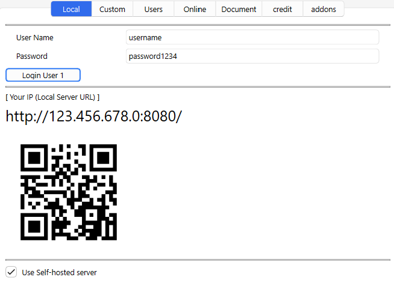
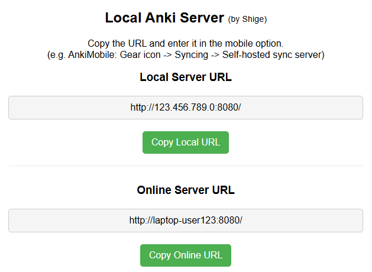
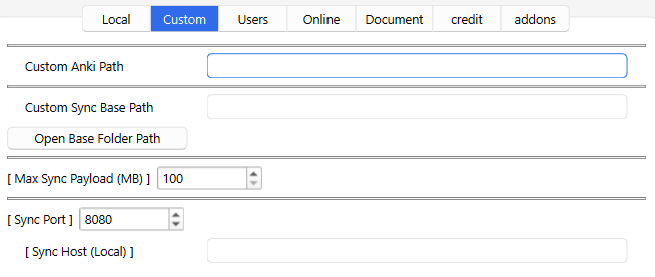
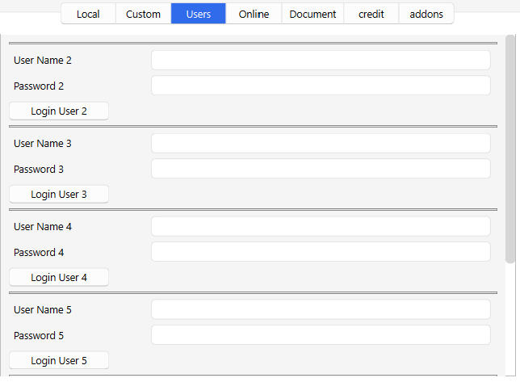
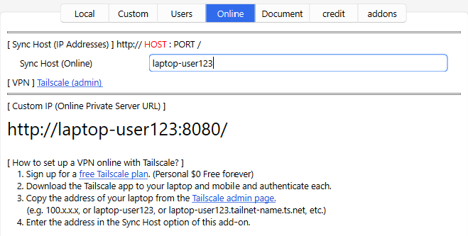

# 🌐Local Anki Server
Use self-hosted server with Wifi

<!-- 🌐Local Anki Server - Use self-hosted server with Wifi (Created by Shigeඞ) -->

<!-- **[AnkiWeb Page](https://ankiweb.net/shared/info/🟢) | Code : `🟢`** -->

<!-- Created -->

### What is this Add-on?

This is an add-on to use a local server instead of AnkiWeb server. The latest version of Anki for desktop has a built-in <a href="https://docs.ankiweb.net/sync-server.html">Self-Hosted Sync Server</a></a> for advanced Anki users, this add-on makes that server easier to use for beginner Anki users, so you can easily use the local server by just logging in with very little setup.

- [🌐Local Anki Server](#local-anki-server)
    - [What is this Add-on?](#what-is-this-add-on)
  - [Introduction](#introduction)
    - [How the add-on basically works](#how-the-add-on-basically-works)
    - [Why use a local server instead of AnkiWeb?](#why-use-a-local-server-instead-of-ankiweb)
    - [What are the disadvantages and risks of a local server?](#what-are-the-disadvantages-and-risks-of-a-local-server)
      - [Notes](#notes)
    - [How to terminate the server?](#how-to-terminate-the-server)
  - [How to use](#how-to-use)
    - [Settings](#settings)
    - [Local tab](#local-tab)
      - [User Setting](#user-setting)
      - [Local Server URL](#local-server-url)
      - [OR code](#or-code)
      - [User Self-hosted server](#user-self-hosted-server)
    - [Custom tab](#custom-tab)
      - [Custom Anki Path](#custom-anki-path)
      - [Custom Sync Base Path](#custom-sync-base-path)
        - [How to change username and password?](#how-to-change-username-and-password)
      - [Max Sync Payload](#max-sync-payload)
      - [Sync Port](#sync-port)
      - [Sync Host (Local)](#sync-host-local)
    - [Users tab](#users-tab)
    - [Online Tab](#online-tab)
      - [Why Tailscale?](#why-tailscale)
      - [How to set up a VPN online with Tailscale?](#how-to-set-up-a-vpn-online-with-tailscale)
      - [Notes](#notes-1)
    - [Documents](#documents)
  - [🚨Report](#report)

## Introduction

### How the add-on basically works

When you start Anki the local server is auto started. The default username and password is `username`, `password1234` (You can optionally change them.) On the desktop it auto sets the self-hosted server to Preferences when you log in from the add-on settings. In AnkiMobile and AnkiDroid you can connect from the same wifi after entering the self-hosted server in the mobile app option. When you close Anki the local server is auto closed.

### Why use a local server instead of AnkiWeb?

1. Synchronization is fast because it is local wifi, so even if you have a lot of audio and images, synchronization will be completed almost instantly. (Syncing all decks for the first time takes a little longer.) You can optionally remove the deck size limit. Forced synchronization is also relatively fast, so changing fields is easy.

2. Laptop and mobile syncing is easy when AnkiWeb is not available for some reason. (e.g. Communication is too slow because the deck is too large. Cannot sync because the limit is exceeded. There is a temporary communication problem. Unable to connect to the Internet.)

3. Basically it works with local wifi, but with additional settings you can connect to your home wifi from outside and sync.

### What are the disadvantages and risks of a local server?

1. Since the data is stored locally there is no way to recover it if the decks are lost due to some problem (Official AnkiWeb they may be able to recover the data from their server), so if you are worried about it please back up your decks regularly by yourself.

2. To access the server Anki and your laptop must be running at all times. If Anki closes for some reason or if your laptop closes the server will also close.

3. You will need storage for the decks. This means that storing sync data on a laptop doubles the file size. (e.g. decks for review + decks for sync)

4. The server built into Anki is intended for personal use so it is simple. It's not possible to review only with a browser like AnkiWeb.

4. Basically the self-hosted server is a feature for advanced Anki users so there is no official Anki support. This add-on is developed by me and is not related to the official Anki, and there is no warranty for any problems or damages that may occur (because this Free add-on is developed by me as a personal hobby volunteer, not for work or business).

#### Notes

1. Anki 2.1.57+ is required. Older Anki cannot be used because they do not have a server built in.

1. When you log in to a new account on the local server, you are automatically logged out of the current AnkiWeb account. If you have forgotten your AnkiWeb email and password you may not be able to log in again, so please be careful. Your current AnkiWeb username can be found in Preferences. (Tools -> Preferences -> Syncing -> AnkiWeb Account)

1. If you do not log in for about 6 months, your AnkiWeb account will be deleted by the official Anki. So if you want to keep your AnkiWeb account, I recommend you to sync with AnkiWeb from time to time to back up your decks.

1. The local server depends on the server built into Anki. In other words this add-on does not create a server it only controls the server built into Anki. So a major update to the latest Anki may cause errors and problems just like normal add-ons.

5. The server communicates via wifi, so if your antivirus software or firewall blocks access to the server and Anki, you may not be able to connect even if you setup this add-on correctly (of, Wifi at school or company prohibits access). If so, the solution is different for each device and software so I cannot support it.

### How to terminate the server?

The local sync server will continue to run automatically in the background, and basically the server will automatically terminate when Anki is closed. If for some reason the server does not close automatically, you will need to close it from the Task Manager. (Or restart your laptop.)

1. Windows: Task Manager
2. Mac: Activity Monitor
3. Linux: System Monitor

Also if the server freezes for some reason, it may prevent Anki from starting. In such a case, exit Anki and the server as described above, and start Anki with Shift key pressed to disable the add-ons.

## How to use

### Settings

When you press Save, or when you log in a new user, the server will exit and restart.

### Local tab

You can open this add-on option from Tools. If you want to use the server only with local Wifi then the options in this tab should work well enough. (Just login and use the server URL.)

#### User Setting

When you press the “Login User 1” button, the username, password, and local server will be set automatically. If you can synchronize by pressing the “Sync” button on Anki it is successful. The default settings are `username` and `password1234`.

#### Local Server URL

Enter this URL into the AnkiMobile or AnkiDroid options to access the local server from your mobile. Laptop and mobile must be connected to the same Wifi. The server will be restarted to reflect the latest options.

#### OR code

Instead of manually typing the URL into your mobile device, you can use the QR code to display and copy the URL. Laptop and mobile must be connected to the same Wifi. If you want to use an online server URL additional setup is required (VPN).

#### User Self-hosted server

Enabling this will automatically set the URL of the new local server to your Anki for desktop. If turned off, it will disable the self-hosted server setup for this Anki for desktop and return it to AnkiWeb. (But the local server will continue to run even if it is turned off.)

Or if you want to enter manually instead of automatically:
 1. Disable this option
 1. Tools -> Preferences -> Sync -> Self hosted Sync Server

### Custom tab

The options on this tab are set automatically, so basically you don't need to change them unless you want to.

#### Custom Anki Path
You can specify the path to the Anki executable. If the auto-detected path is wrong, you can set the correct path. e.g. `C:\Users\UserName\AppData\Local\Programs\Anki\anki.exe`

Or if you have downloaded multiple versions of Anki, you can use the Anki executable to fix the version of Anki to use on the server.

#### Custom Sync Base Path

This is the path to the folder where the server data is stored. The default path is `~.syncserver`. (e.g. `C:\Users\UserName\.syncserver`) You can change the path where decks are stored by setting a new path. This path cannot be the same as the path where Anki's decks are stored. (In other words, the server data must be stored in a different location from where Anki and your decks are stored.)

If you press the button it will open the location of the path where you have saved the decks on the server. If you want to delete the server data, delete those folders, anb be careful not to delete the account you need by mistake.

##### How to change username and password?
The username is used to name the folder. So if you want to change your username, you can open this path and change the folder name directly. Changing the name while the server is running may cause some problems, so I recommend that you close Anki and then change the name. (The server will run automatically until you close Anki.)

To change the password, simply change the password in this add-on option. If you change the username in the add-on option a new user folder will be created in this path.

#### Max Sync Payload

AnkiWeb and the built-in server limit the maximum size of uploads by default, you can change that limit with this option. Please set it in MB, the default setting is 100MB. If your upload limit is not reached you do not need to set this option.

#### Sync Port

You can change the Port number of the server you use locally. Port is like a local wifi room number, e.g. If other applications use the same 8080 number, you cannot use it because it is duplicated, so you need to change it to another number.

#### Sync Host (Local)

You can change the number of the server host to be used locally. This is needed to enter the correct IP address if the auto-detected IP address is wrong. If you set the wrong IP address, you will not be able to access the server, so do not enter anything unless you want to. (Do NOT enter the Tailscale host here.)

### Users tab

You can add users to be used on the server.

 It is needed if you want to use multiple profiles and accounts, at the moment up to 7 users can be added. When you add a user, a new folder will be created in the Sync Base Path. To change the username and password, please read [Custom Sync Base Path](#custom-sync-base-path).

### Online Tab

This option is for accessing your home wifi from outsid, if you want to use it only with local Wifi you don't need to setup it. If the server is not working locally yet this option will not work so please make sure the server is working with your local wifi first. I recommend Tailscale because it is very easy to get a host.

#### Why Tailscale?

Basically to access your home wifi from outside safely and securely you need to configure various advanced settings (VPN, Virtual Private Network). Because if you simply open your wifi to the public as it is there is a risk of unauthorized access.

Tailscale is a popular service that automatically sets up almost all of these configurations and makes it easy to securely connect to your home wifi (Free). This service is mentioned briefly in the AnkiManual and occasionally in the Anki subreddit. If you want to know more about how it works and how secure it is please search for it on Google.

#### How to set up a VPN online with Tailscale?
   1. Sign up for a <a href="https://tailscale.com/pricing/">free Tailscale plan</a>. (Personal $0 Free forever)
   2. Download the Tailscale app to your laptop and mobile and authenticate each.
   3. Copy the address of your laptop from the <a href="https://login.tailscale.com/admin/">Tailscale admin page.</a>
       (e.g. 100.x.x.x, or laptop-user123, or laptop-user123.tailnet-name.ts.net, etc.)
   4. Enter the address in the Sync Host option of this add-on.

#### Notes

1. I cannot provide support on how to use Tailscale. Please contact them directly or search the Tailscale community and ask them.
1. This option is there to make the server URL easier to read, so if you already know the exact URL you can use the server without entering this option, because the laptop already has access to the local wifi.
1. Tailscale uses the free and open source WireGuard, so maybe advanced users can connect using WireGuard instead of Tailscale.

### Documents

AnkiManual explains how to use the server built into Anki. If you want to use the server without this add-on, or if you want to know more about it and what to expect when using it, please read them.

1. <a href="https://docs.ankiweb.net/sync-server.html">(AnkiManual)  Self-Hosted Sync Server</a></a>
1. <a href="https://faqs.ankiweb.net/are-there-limits-on-file-sizes-on-ankiweb.html">
    (Anki FAQ) Are there limits on file sizes on AnkiWeb?</a>
2. <a href="https://github.com/ankitects/anki/tree/main/docs/syncserver">(For Developers) Building and running Anki sync server in Docker</a>

  

## 🚨Report

If you have any problems or requests feel free to send them to me.

  <!-- 1. <a href="https://ankiweb.net/shared/review/🟢" target="_blank">👍️Rate Comment</a> : You can contact me anonymously, and AnkiWeb will send you an email when I reply, a high rating increases priority of development. -->
  2. <a href="https://www.reddit.com/r/Anki/comments/1b0eybn/simple_fix_of_broken_addons_for_the_latest_anki/" target="_blank">👩‍🚀Reddit</a> : You can request me to repair broken Add-ons.
  2. <a href="https://forums.ankiweb.net/t/simple-fix-of-broken-add-ons-for-the-latest-anki-by-shige/41650" target="_blank">🌟AnkiForums</a> : You can request me to repair broken Add-ons, and it is ideal for open discussions.
  3. <a href="https://github.com/shigeyukey/my_addons/issues" target="_blank">🐙Github </a> : Makes it easier to track problems.
  4. <a href="https://www.patreon.com/Shigeyuki" target="_blank">💖Patreon DM</a> : Response will be prioritized.

   

<h4><a href="http://patreon.com/Shigeyuki">💖Please Support Shige's Anki add-ons development!</a></h4>

Hi thank you for using this add-on, I'm Shigeඞ! I'm looking for supporters for my add-ons development, because I like Anki! So far I fixed and customized 60+ discontinued add-ons and created 30+ new add-ons. If you support my volunteer development you will get 14 add-ons for patrons only and 15 game themes included in AnkiArcade ($5/month). If you have any ideas or requests feel free to send them to me, thanks! :D

 
[Get Patrons only addons](https://www.patreon.com/Shigeyuki) | [Patrons Q and A](https://shigeyukey.github.io/shige-addons-wiki/patrons_q_and_a.html) | [Contact](https://shigeyukey.github.io/shige-addons-wiki/contact.html)  

**\[ Special Thanks ]**  
 So far I received donations from 354 patrons and without their support I never could develop this and release for free, thank you very much!🙏  
  **Patrons:** *Arthur Bookstein, Haruka, Luis Alberto, Letona Quispe, 07951350313540, Lily, Ernest Chan, Daniel Kohl-Fink, GP O'Byrne, Tim, Kyle Mondlak, Jesse Asiedu, Tobias Klös, NamelessGO, ElAnki, Jake Stucki, KM, Abhi S, Kurt Grabow, Jonathan Contreras, Keeler Kime, ellie, Matthew Hartford, Fahim Shaik, Augusto Stein, Tae Lee, Ashok Rajpurohit, NoirHassassin, Morgan Torres, Isabel Guan, tarek, adam Katz, K, iuventius, Patrick ellis, Gabriel Vinicio Guedes, findus161, Douglas Beeman, Ketan Pal, mootcourt, Tyler Schulte, Aurora Dzurko, Juan Salgado, sab hoque, Haley Schwarz, Jk, Cole Krueger, K, Robert Malone, Wei, Sean Voiers, Stellate ggl, Aayush Bhatawadekar, Jeanna, J P, qiting zeng, Temi Jide, Azfar Hussain, Ansel Ng, Victor Evangelista, Adrine, Oleksandr Pashchenko, Lis Y., Ythalo Vlogs, Alba Grecia Suárez Recuay, 龍星 武田, Alex D, oiuhroiehg, Aaron Buckley, Osasere Osula, Izz Aryan, Elisabeth Barber, Yaeerrrrrr, Christopher Lam, Steven Banner, Kaitlyn Bowler, Alex Kaiser, Svel1989, Jordan Brown, Lincoln Jacobs, Heidi, Gabriel Farrugia, Matheus Chagas, Renoaldo Costa Silva Junior, Felipe Dias, Simeon, Tina Weingarten, Benjamin Tarnowski, Stephen Ankoma, David C, Jordan Garnier, Tarek Bouamoud, Robert Wiebalck, Raffaele Russo, Corentin, Yitzhak Bar Geva, Muneeb Khan, Jason Liu, Hikori, Lê Hoàng Phúc, anonymous* [...full list](https://shigeyukey.github.io/shige-addons-wiki/patrons_credit.html#patrons)

<!-- ## 📥 How do I install this add-on?
1. Copy and paste the add-on code ( `🟢` )  into Anki and you can install it. ( *Menu -> Tools -> Add-ons -> Get Add-ons -> Code \[ add-on code ]* )
2. When I develop bug fixes, create new features, or compatibility for New Anki, I will notify you and you can install it.
3. Add-ons will be broken when the official Anki gets a major update, so if you like this add-on please support my volunteer development by rating, sharing, and donating. Thank you!

[Click here and please Rate this add-on, Thank you! :-)  
 ](https://ankiweb.net/shared/review/🟢) -->

