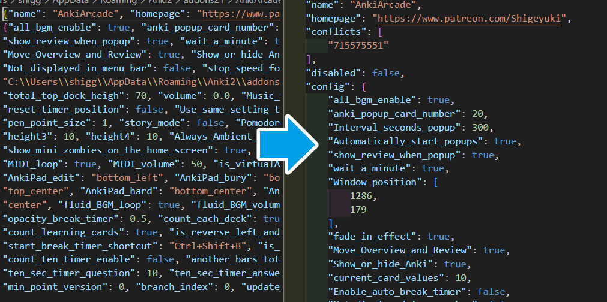

# ⚙️Meta json Formatter

This add-on is for add-on developers, not for general learners. When "meta.json (add-ons config)" is saved it is automatically formatted to make the code easier to read.

## Note
* This add-on has only been tested with Anki24.11. If a problem occurs config may not be able to be saved.

## Related Add-on for Development

1. [🔂AnkiRestart - Quick Aniki Rebooter, for Customize & Develop](https://shigeyukey.github.io/shige-addons-wiki/ankirestart.html)
1. [🐞Custom Debug Info](debug_info.md)
