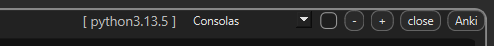

# Mini Console

🔧Mini Console - for quick add-on debug (Created by Shigeඞ)

<!-- **[AnkiWeb Page](https://ankiweb.net/shared/info/🟢) | Code : `🟢`** -->

<!-- Created -->

Pops up a mini console for displaying debug info. It's for add-ons development so not for general learners. It includes a prototype feature that utilizes part of Anki's new launcher (uv).

## How to use

Install the add-on and restart Anki to auto display the console.

## Top Toolbar

1. In Python mode displays the Python version.
1. Changes the font.
1. Enable the checkbox to keep it always on top.
1. Change the font size with the minus and plus buttons.
1. Close the window to exit.
1. Press Anki to open Anki.

## Mini Mode

You can reduce the size by dragging the bottom right corner of the window. Size and Position are auto saved and restored.

## Option1

### Option

* Run at Start up
  * _
* Disable word wrap
  * _
* Open shortcut
  * _
* Maximum number of lines
  * _
* Reset size and position
  * _

## Option2

### Anki button

Ankiを起動します.

### Python mode

This console has 2 modes, one for running within Anki and one for using Python with Anki's new launcher, this option can be switched.

* Anki Mode

* Python Mode

## Notes

* I only checked it on Windows, not on MacOS and Linux yet.

## FAQ

### Q. What is a console?
* It is a tool used by developers to read feedback from Anki and add-ons. e.g. Check that the function is working properly. Look into the detailed cause of an error.
*  The console can only be displayed with the default Anki. *Writing Anki Add-ons: [Console Output](https://addon-docs.ankiweb.net/console-output.html)*

