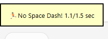

# 🏃No Space Dash

🏃🏻No Space Dash-Prevents answer for 1.5 seconds (Fixed by Shigeඞ)

<!--
https://shigeyukey.github.io/shige-addons-wiki/images/
-->

<!--
Hi I'm add-ons developer Shige, I fixed this add-on and uploaded it to AnkiWeb.
🏃🏻No Space Dash-Prevents answer for 1.5 seconds (Fixed by Shigeඞ)
https://ankiweb.net/shared/info/1573867049
 -->

**[AnkiWeb Page](https://ankiweb.net/shared/info/1573867049) | Code : `1573867049`**

<!-- Customized -->

The Show Answer button and Answer buttons are each blocked for 1.5 seconds to prevent accidental double clicks or too quick answers.

This add-on is a fixed and Enhanced version for Anki25+ of the addon <a href="https://ankiweb.net/shared/info/1409134430" target="_blank">"No Space Dash"</a>, originally created by <a href="https://github.com/phu54321" target="_blank">Hyun Woo Park (phu54321, trgk_anki)</a> and credit goes to them.

## 📖How to use

