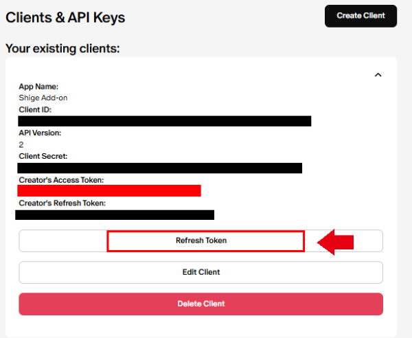

# Patreon Card Generator
<!-- 
💖Patreon Card Generator - Memorize all names of patrons (Created by Shigeඞ)
 -->

<!-- Created -->

<!-- **[AnkiWeb Page](https://ankiweb.net/shared/info/🟢) | Code : `🟢`** -->

This is a free [Anki](https://apps.ankiweb.net/) add-on to generate Anki cards from Patreon to memorize all the patrons' names and icons, etc. Retrieves patrons data using the [Patreon API](https://docs.patreon.com/#introduction). This add-on is for Patreon creators, not for general Anki users or Patreon members, and it's not related to official Patreon or official Anki.

*Example of a generated card (night mode):*

- [Patreon Card Generator](#patreon-card-generator)
    - [How to use](#how-to-use)
    - [Purpose of use](#purpose-of-use)
    - [How to get Patreon API](#how-to-get-patreon-api)
    - [Options](#options)
    - [Card Template](#card-template)
    - [Notes](#notes)
    - [License and Credit](#license-and-credit)
  - [🚨Report](#report)

### How to use

1. Provide something then recruit patrons on [Patreon](https://www.patreon.com/). (e.g. volunteer work)
2. Get API from Patreon, and generate patron cards using this add-on. (Tools -> Patreon card generator)
4. Memorize your patrons names, icons, notes, etc.
5. Running the Add-on again will update the data for all cards. Optionally the update can be automated.

### Purpose of use

When the number of patrons increases a lot the creator does not know who is supporting (at least for me). Though members' info can be managed by Patreon functions so there is no need to memorize it, [Anki](https://apps.ankiweb.net/) is a popular app for learners who can easily manage tens of thousands of flashcards, so memorizing all patrons is easy. In my case this helps me to memorize requests from patrons and motivates me to develop.

### How to get Patreon API

To use this add-on, you need a **“Creator's Access Token”** from the Patreon API.

(Tools -> Patreon card generator) 

 Click on “Create Clients” to register your new API. **[Patreon: Register your Client](https://www.patreon.com/portal/registration/register-clients)**

The following four inputs are required.

1. **App Name, Description:** This name and description can be anything.
2. **Redirect URL:** This add-on does not use a URL and can be anything. (I use my Patreon URL).
3. **Clients API:** This should be set to 2. (default).

If the registration is successful, the new API will be displayed as follows, click the arrow to display.

Copy this **"Creator's Access Token"** and use it in add-on.
(Other tokens and the ID are not used.)

For more info on the meaning of these tokens and notes, please read Patreon's reference.  **[Reference: clients-and-api-keys](https://docs.patreon.com/#clients-and-api-keys)**

* After successful card generation, press "Refresh Token" to update the Creator's Access Token and disable the old token.
* You can delete the API completely by pressing "Delete Client" and entering "Client Sercret".

### Options

1. Max Cards
   * Limit the maximum number of cards to be generated. The default setting is 30,000 cards. A typical shared Anki deck is about 20,000 cards for a single language or medical student deck so I think about 30,000 is the limit for a typical learner.
2. Only paid patrons
   * If enabled excludes free patrons. It is enabled by default.
3. Support dollar threshold ($)
   * Exclude patrons whose support amount is below the threshold. Dollars, not cents. This option can be used to reduce the number of cards generated when there are too many cards and cannot be memorized. 
     * (Anki can memorize a large number of flashcards over a long period of time, but the maximum number of new cards it can memorize per day is 20 to 100. e.g. new cards 30/per day -> cards 10,950/per year)

4. Save Access token
   * The Token (Creator's Access Token) is not saved by default. If this option is enabled, the Token will be saved in the Add-on and the input will be skipped. The stored Token is not encrypted so do not use it if you are concerned about security.
5. Auto update when Anki is started
   * When starting Anki it auto runs the add-on and updates Patreon cards.

### Card Template

Running the add-on will generate a deck, a card template, and a tag named "Patreon". The generated cards have these fields. (Renaming a deck, tag, or template may cause the cards to not update properly.)

1. **PatreonID**
   * This ID is used to identify the patron.
3. **supporterName**
   * The name of the patron. It will appear only on the Back of the card.
4. **ExtraInfo**
   * This field is not overwritten when the card is updated, so if you want to write additional info, enter it here. (Other fields are overwritten so they cannot be saved.)
5. **Data**
   * All data such as images, history, etc. are stored here. When you run the add-on it will be overwritten with the latest info.
   * Patreon's Audience feature allows you to write a Note for each patron (e.g., write a request from them).  This Note can be retrieved via API so if there is data in the Note it will be displayed in the card. So I recommend writing the info in Patreon Note instead of writing it in ExtraInfo.
6. **supportDollars**
    * Record the support amount. If you want to sort by support amount I recommend using the popular add-on [Advanced Browser](https://ankiweb.net/shared/info/874215009).

### Notes

1. Basically this add-on was developed as a hobby for my own use, so it does not have very advanced features. If you find any problem please contact me.

2. If you're worried about security do not use it. I can't guarantee anything or take responsibility if tokens or patron info get leaked. Anki and Add-ons are open source, so codes and cards are not encrypted. (to do this maybe I need to develop a web tool or own app instead of Anki add-on.)

3. Patreon API is basically mostly read-only and does not allow for posting or password retrieval. Even if a token is leaked I think maybe there is no risk of tampering or unauthorized login (there are risks [described in Clients and API Keys](https://docs.patreon.com/#clients-and-api-keys)). But I do not know the details of Patreon API and the exact info about it. (This is my first time to use the API.) So if you have technical questions about the API or want to know about security risks please contact the Patreon community.
   1. [Patreon: developers community](https://www.patreondevelopers.com/)
   2. [Reddit: r/Patreon](https://www.reddit.com/r/patreon/)

### License and Credit

The license for this add-on is AGPL3, and this add-on uses the [patreon-python](https://github.com/Patreon/patreon-python) library. (patreon-python is licensed under the Apache License 2.0.)

 

## 🚨Report

If you have any problems or requests feel free to send them to me.

  <!-- 1. <a href="https://ankiweb.net/shared/review/🟢" target="_blank">👍️Rate Comment</a> : You can contact me anonymously, and AnkiWeb will send you an email when I reply, a high rating increases priority of development. -->
  2. <a href="https://www.reddit.com/r/Anki/comments/1b0eybn/simple_fix_of_broken_addons_for_the_latest_anki/" target="_blank">👩‍🚀Reddit</a> : You can request me to repair broken Add-ons.
  2. <a href="https://forums.ankiweb.net/t/simple-fix-of-broken-add-ons-for-the-latest-anki-by-shige/41650" target="_blank">🌟AnkiForums</a> : You can request me to repair broken Add-ons, and it is ideal for open discussions.
  3. <a href="https://github.com/shigeyukey/my_addons/issues" target="_blank">🐙Github </a> : Makes it easier to track problems.
  4. <a href="https://www.patreon.com/Shigeyuki" target="_blank">💖Patreon DM</a> : Response will be prioritized.

 

<h4><a href="http://patreon.com/Shigeyuki">💖Please Support Shige's Anki add-ons development!</a></h4>

Hi thank you for using this add-on, I'm Shigeඞ! I'm looking for patrons for my add-ons development, because I like Anki! So far I fixed and customized 60+ discontinued add-ons and created 30+ new add-ons. If you support my volunteer development you will get 14 add-ons for patrons only and 15 game themes included in AnkiArcade ($5/month). If you have any ideas or requests feel free to send them to me, thanks! :D

 
[Get Patrons only addons](https://www.patreon.com/Shigeyuki) | [Patrons Q and A](https://shigeyukey.github.io/shige-addons-wiki/patrons_q_and_a.html) | [Contact](https://shigeyukey.github.io/shige-addons-wiki/contact.html)  

**\[ Special Thanks ]**  
 So far I received donations from 406 patrons and without their support I never could develop this and release for free, thank you very much!🙏  
  **Patrons:** *Arthur Bookstein, Haruka, Luis Alberto, Letona Quispe, 07951350313540, Tim, Daniel Kohl-Fink, Lily, Kyle Mondlak, NamelessGO, Ernest Chan, ElAnki, GP O'Byrne, Jesse Asiedu, KM, Tobias Klös, Abhi S, Jonathan Contreras, Matthew Hartford, Jake Stucki, Isabel Guan, findus161, ellie, Patrick ellis, Kurt Grabow, Keeler Kime, tarek, Peasant of Anki, K, iuventius, Juan Salgado, Fahim Shaik, Augusto Stein, Tae Lee, Ashok Rajpurohit, NoirHassassin, mootcourt, Morgan Torres, Gabriel Vinicio Guedes, sab hoque, Ythalo Vlogs, Matheus Chagas, Douglas Beeman, Ketan Pal, Tyler Schulte, Aurora Dzurko, qiting zeng, Elisabeth Barber, Yaeerrrrrr, Christopher Lam, Steven Banner, Temi Jide, Ansel Ng, David C, Lis Y., Haley Schwarz, Jk, Cole Krueger, K, Robert Malone, Wei, Sean Voiers, Stellate ggl, Aayush Bhatawadekar, Jeanna, J P, Kaitlyn Bowler, Svel1989, Kolorophyll, Heidi, Gabriel Farrugia, Leonora Lomoki Akporyoe, Andrew Yang, Mac, Tina Weingarten, Bryn Price, Azfar Hussain, Victor Evangelista, Adrine, Oleksandr Pashchenko, Alba Grecia Suárez Recuay, 龍星 武田, Alex D, oiuhroiehg, Aaron Buckley, Osasere Osula, Ujwal Chadha, Izz Aryan, Alex Kaiser, Jordan Brown, Lincoln Jacobs, Kylie, pie_is_good, gus forester, Woody, Sebastian Bellotti, Hoang Hung, Mia, Cubli, Renoaldo Costa Silva Junior, Felipe Dias* [...full list](https://shigeyukey.github.io/shige-addons-wiki/patrons_credit.html#patrons)

<!-- ## 📥 How do I install this add-on?
1. Copy and paste the add-on code ( `🟢` )  into Anki and you can install it. ( *Menu -> Tools -> Add-ons -> Get Add-ons -> Code \[ add-on code ]* )
2. When I develop bug fixes, create new features, or compatibility for New Anki, I will notify you and you can install it.
3. Add-ons will be broken when the official Anki gets a major update, so if you like this add-on please support my volunteer development by rating, sharing, and donating. Thank you!

[Click here and please Rate this add-on, Thank you! :-)  
 ](https://ankiweb.net/shared/review/🟢) -->

 <!-- **[AnkiWeb Page](https://ankiweb.net/shared/info/🟢) | Code : `🟢`** -->