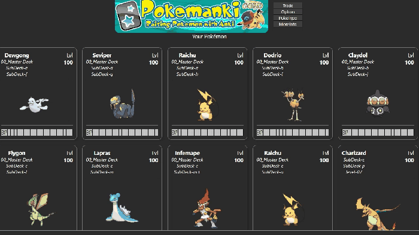
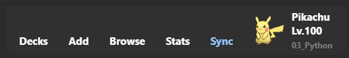
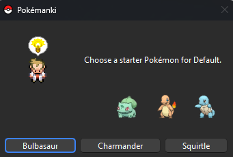
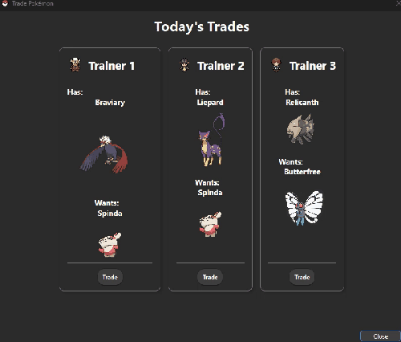

# Pokemanki Gold

Raising Pokemon with Anki (Customized by Shige)<br>


**[AnkiWeb Page](https://ankiweb.net/shared/info/1677779223) | Code : `1677779223`**

[](https://www.patreon.com/Shigeyuki)   <br>




>*Pokemanki is an add-on that keeps you motivated to keep doing Anki by allowing you to catch and train Pokemon!*<br>

Hello Pokemon Trainer! The Pokemanki Gold is customized version of the [Pokemanki](#credit) (fork), most parts of the code are credited to the authors [sivenchinniah](https://github.com/sivenchinniah), [BlueGreenMagick](https://ko-fi.com/bluegreenmagick), [Zjosua](https://github.com/zjosua), and other contributors.  Pokemanki is a fan game for gamification learning developed by volunteers, not related to official Anki or official Pokemon.<br>

<br>
[💡New ] Added function to show the current card deck or tag Pokemon in the toolbar during review. If distracting, you can optionally hide it.



<br>

- [Pokemanki Gold](#pokemanki-gold)
- [📖How to use](#how-to-use)
  - [📊Show your Pokemon](#show-your-pokemon)
    - [🤝Today's Trades](#todays-trades)
  - [Options](#options)
    - [📁Decks vs. Tags](#decks-vs-tags)
    - [Nicknames](#nicknames)
    - [Prestige Menu](#prestige-menu)
    - [🪨Everstone](#everstone)
    - [💎Mega Stone](#mega-stone)
    - [🌴Alolan Passport](#alolan-passport)
    - [🤝Trade](#trade)
    - [Reset](#reset)
    - [🤝Open trade when Anki start up](#open-trade-when-anki-start-up)
    - [📊Show Pokemon in Home and Overview](#show-pokemon-in-home-and-overview)
    - [🎥PokeType](#poketype)
    - [🖱️Click Action](#️click-action)
    - [Advanced Settings](#advanced-settings)
  - [🌐Related add-ons](#related-add-ons)
  - [💖Credit](#credit)
  - [🚨Report](#report)
- [💡Frequently Asked Questions](#frequently-asked-questions)
    - [Q. When I start Anki it is still loading and I cannot operate Anki.](#q-when-i-start-anki-it-is-still-loading-and-i-cannot-operate-anki)
- [📥 How do I install this add-on?](#-how-do-i-install-this-add-on)


<br>


# 📖How to use
*(Some of these descriptions are based on the original Pokemanki description.)*

* Pokemanki gives you a Pokemon (or an egg which will hatch into a Pokemon) for each lowest-level deck (deck without sub-decks) in your collection that you have started learning. As you learn and review the cards in that deck, your Pokemon will level up and may even evolve!
* For larger decks, it takes longer until the first Pokemon hatches.




<br>

## 📊Show your Pokemon

1. **📊Stats** 
   1. Open Anki's Statistics (Stats) to see the Pokemon in the current deck. Select "Collection" and you should see the Pokemon for all decks.
2. **🏠️Home and OverView**
   1.  Show Pokemon in Anki's home and Overview, this function can be optionally disabled. (e.g. if your deck takes a long time to load turn it off.)
   2. The recalculation will be triggered at these times.
        1. When finished the review.
        2. When sync the decks (for reflecting the mobile data)

<br>

### 🤝Today's Trades
<!-- ﾎﾟｹﾓﾝの交換 -->
1.  You can randomly trade 3 Pokemon every day.
1.  Option to auto open the trade window when Anki is launched.



<br>

<!-- ## Options -->
<!-- Pokemankiのﾒﾆｭｰ -->
## Options

### 📁Decks vs. Tags
1.  You can choose whether Pokemon is calculated based on decks or tags.
1.  Tag mode does not have all features, e.g. trade is not available in tag mode.

### Nicknames
1. Make your Pokemon yours by giving them a nickname!
<!-- ﾆｯｸﾈｰﾑ: ﾎﾟｹﾓﾝにﾆｯｸﾈｰﾑを付けて自分のものにしましょう！ -->

### Prestige Menu
1. Lower the level of a Pokemon that has reached its maximum level of 100 by 50 so they can keep growing.
<!-- ﾌﾟﾚｽﾃｰｼﾞﾒﾆｭｰ: ﾎﾟｹﾓﾝのﾚﾍﾞﾙを50下げて､成長を続けられるようにします｡ -->

### 🪨Everstone
1. Keep a Pokemon in their current evolution form, regardless of level.
<!-- かわらずのいし: ﾎﾟｹﾓﾝをﾚﾍﾞﾙに関係なく現在の進化形態に保ちます｡ -->

### 💎Mega Stone
1. Make a Pokemon undergo a mega evolution.
<!-- ﾒｶﾞｽﾄｰﾝ: ﾎﾟｹﾓﾝをﾒｶﾞ進化させます｡ -->

### 🌴Alolan Passport
1. Change a Pokemon to their Alolan variant.
<!-- ｱﾛｰﾗﾊﾟｽﾎﾟｰﾄ: ﾎﾟｹﾓﾝをｱﾛｰﾗのﾊﾞﾘｱﾝﾄに変更します｡ -->

### 🤝Trade
1. Open the Trade window to exchange your Pokemon.
<!-- 交換: ﾎﾟｹﾓﾝを交換するための交換ｳｨﾝﾄﾞｳを開きます｡ -->

### Reset
1. Reset your Pokemon and all of the add-on's configuration.
1. Pokemon levels are calculated based on your deck's learning data, so resetting the data will not reset the levels.
<!-- ﾘｾｯﾄ: ﾎﾟｹﾓﾝとｱﾄﾞｵﾝのすべての設定をﾘｾｯﾄします｡ -->

### 🤝Open trade when Anki start up
1. Option to auto open the trade window when Anki is launched.

### 📊Show Pokemon in Home and Overview
1. Show Pokemon in Anki's home and Overview, this function can be optionally disabled. (e.g. if your deck takes a long time to load turn it off.)

### 🎥PokeType
1. You can switch between animated and non-animated Pokemon images.


### 🖱️Click Action
1. Click on the name of the Pokemon<br>
     2. Search for Pokemon on the Web and open Pokédex.
1. Click on Pokemon<br>
     2. The Pokemon will jump and make a squealing sound.


### Advanced Settings
1. From Anki's add-on menu you can access Pokemanki's config settings, which allows you to choose whether your Pokemon get X or Y mega evolutions, and what generation of Pokemon are available to be caught.
2. Changing Pokemon generation settings may reset data.
3. Pokemon is available from the first to the fifth generation.
<!-- AnkiのｱﾄﾞｵﾝﾒﾆｭｰからPokemankiの設定にｱｸｾｽでき､ﾎﾟｹﾓﾝがXまたはYのﾒｶﾞ進化をするかどうか､および捕まえることができるﾎﾟｹﾓﾝの世代を選択できます｡ -->


<br>


## 🌐Related add-ons
1. [ Ankimon ](https://ankiweb.net/shared/info/1908235722) / Author : [Unlucky-Life](https://github.com/Unlucky-Life)  
    1. It's a new Pokemon add-on with a different mechanism, I recommend this for Pokemon fans.
1. [🔂AnkiRestart - Quick Aniki Rebooter, for Customize & Develop](https://ankiweb.net/shared/info/237169833) / Author : me  
    1. Pokemanki requires Anki to be restarted when a profile is changed, this add-on allows for a quick restart.
1. [📌Rearrange home addons ](https://ankiweb.net/shared/info/1797615099) / Author : me  
    1. You can rearrange the add-ons shown in Anki's Home.
1. [🔍️Zoom for Anki24 - Keep zoom level after reboot ](https://ankiweb.net/shared/info/1923741581) / Author : me  
   1. You can keep the zoom value of the statistics window.


<br>

## 💖Credit

The Pokemanki Gold is customized version of the Pokemanki (fork), most parts of the code are credited to the authors [sivenchinniah](https://github.com/sivenchinniah), [BlueGreenMagick](https://ko-fi.com/bluegreenmagick), [Zjosua](https://github.com/zjosua), and other contributors.  Pokemanki is a fan game for gamification learning developed by volunteers, not related to official Anki or official Pokemon.

 1. Original Pokemanki : [Pokemanki ](https://ankiweb.net/shared/info/633922407) / Author : [sivenchinniah](https://github.com/sivenchinniah), [BlueGreenMagick](https://ko-fi.com/bluegreenmagick)  
 2. Fork Pokemanki : [Pokemanki](https://ankiweb.net/shared/info/1041307953) / Author : [Zjosua](https://github.com/zjosua)
 3. Pokemanki uses [Libaddon](https://github.com/glutanimate/anki-libaddon/) by [Glutanimate](https://glutanimate.com/tip-jar/).  


<br>

## 🚨Report

If you have any problems or requests feel free to send them to me.

  1. <a href="https://ankiweb.net/shared/review/1677779223" target="_blank">👍️Rate Comment</a> : You can contact me anonymously, and AnkiWeb will send you an email when I reply, a high rating increases priority of development.
  3. <a href="https://github.com/shigeyukey/Pokemanki-Gold/issues" target="_blank">🐙Github </a> : Makes it easier to track problems.
  2. <a href="https://www.reddit.com/r/Anki/comments/1b0eybn/simple_fix_of_broken_addons_for_the_latest_anki/" target="_blank">👩‍🚀Reddit</a> : You can request me to repair broken Add-ons.
  4. <a href="https://www.patreon.com/Shigeyuki" target="_blank">💖Patreon DM</a> : Response will be prioritized.


<br>
<br>

# 💡Frequently Asked Questions

---

### Q. When I start Anki it is still loading and I cannot operate Anki.

New version has been added to show Pokemon in Home when Anki is launched, so if your deck is too large this may be causing an error (so far this problem seems to be very rare). In this case I think you can turn off all the functions to display in Home from Config.

please try this:

1. Start Anki while holding down the Shift key (all add-ons will be disabled).
2. With Anki in safe mode open the Config of the add-ons
	* Tools -> Add-ons -> Select Pokemanki Gold -> Config
3. Overwrite Config with this text and save it:

```
{
    "Number of deck name splits": 3,
    "PokeType": true,
    "X_or_Y_mega_evolutions": "X",
    "align_cards": "scrollbox",
    "auto_open_trade": false,
    "gen2": true,
    "gen3": true,
    "gen4": true,
    "gen4_evolutions": true,
    "gen5": true,
    "is_change_log_2024_03_26": true,
    "is_rate_this": true,
    "max_height_px": "500",

    "show_pokemon_in_reviewer": false,
    "hide_pokeball_in_toolbar": true,
    "Show Pokemon in Home and overview": false,
    "auto_open_trade": false
}
```
4. Restart Anki.
5. All Pokemanki options that run when Anki starts will be turned off.


---


<br><br><br>


# 📥 How do I install this add-on?
1. Copy and paste the add-on code ( `1677779223` )  into Anki and you can install it. ( *Menu -> Tools -> Add-ons -> Get Add-ons -> Code \[ add-on code ]* )
2. When I develop bug fixes, create new features, or compatibility for New Anki, I will notify you and you can install it.
3. Add-ons will be broken when the official Anki gets a major update, so if you like this add-on please support my volunteer development by rating, sharing, and donating. Thank you!

[Click here and please Rate this add-on, Thank you! :-) <br>
 ](https://ankiweb.net/shared/review/1677779223)

