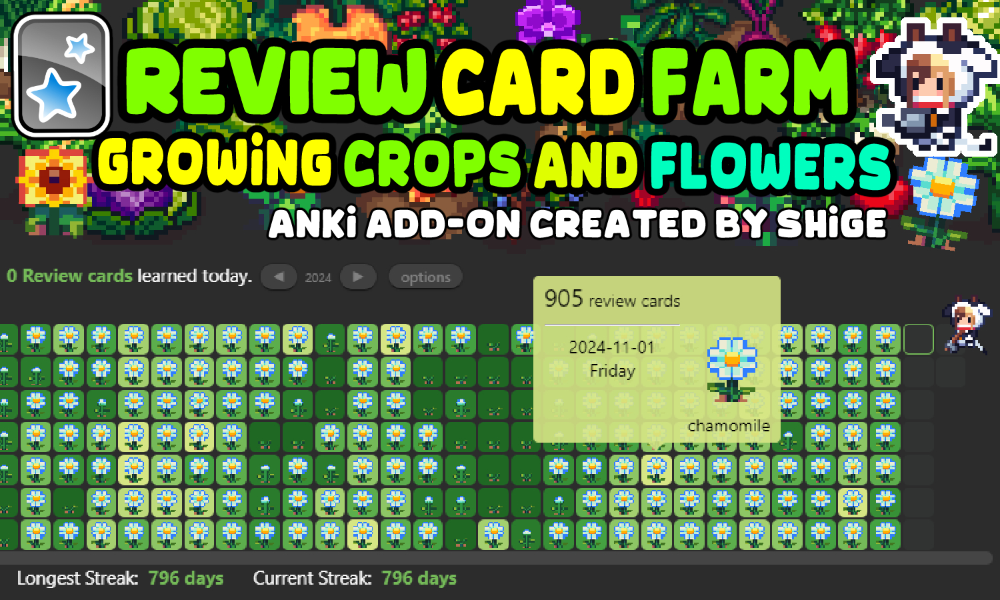
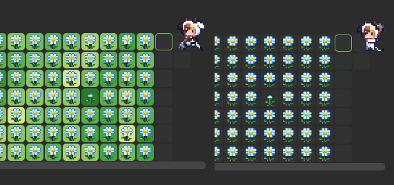
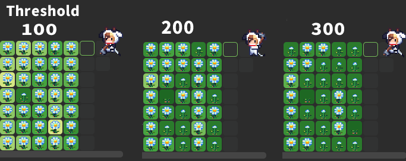

# 🌽Review Card Farm

#### Download page: [🌽Review Card Farm  (Anki add-on, for Patrons Only)](https://www.patreon.com/posts/review-card-farm-118533602?utm_medium=clipboard_copy&utm_source=copyLink&utm_campaign=postshare_creator&utm_content=join_link)

Basic usage is the same as for [🌱New Card Farm](new-card-farm/new-card-farm-02.md), basic usage is the same, some new features have been added.

You can grow crops and flowers with the review cards you have learned. Crops 79, Color tooltip, Farmer animation, Random Crops, Replanting Crops, etc.

## New Functions

These new features will be added to New Card Farm later. (Under development)

### Heatmap Color

Displays the color of the heatmap, which can optionally be enabled or disabled.

### Threshold

Change the threshold to change the difficulty level of crop growth. The default is 100, so the crop grows for every 100 review cards.

### Others

Other options are almost the same as New Card Farm, so please read the New Card Farm Wiki:

[🌱New Card Farm Wiki](new-card-farm/new-card-farm-02.md)

 
 
 

## \[ 📥Download ]
Download the .ankiaddon file and open it with a double-click, or install it from the "Install from file" menu in the Anki add-ons management screen. (Please note that you cannot install the file by dragging and dropping it into Anki) If you have any problems, questions or requests feel free to send them to me.

#### Download page: [🌽Review Card Farm  (Anki add-on, for Patrons Only)](https://www.patreon.com/posts/review-card-farm-118533602?utm_medium=clipboard_copy&utm_source=copyLink&utm_campaign=postshare_creator&utm_content=join_link)