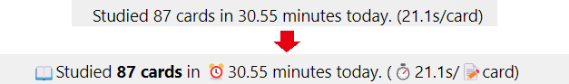
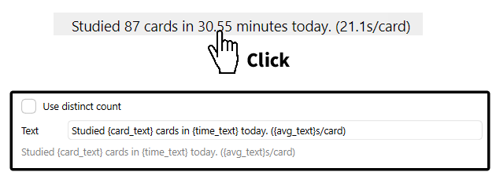
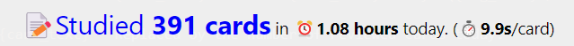

# Rewrite text of study cards in anki home

[](https://www.reddit.com/user/Shige-yuki)

This is a small add-on to rewrite the text of Anki's Home. You can use HTML.





## How to use
Click on the text to display the options.



### Rewrite text

Default: `Studied {card_text} cards in {time_text} today. ({avg_text}s/card)`

1. `{card_text}`  Replaced by the number of reviewed cards today.
2. `{time_text}` Replaced by the reviewed time today.
3. `{avg_text}` Replaced by the average seconds of the card.

### HTML

If you use HTML you can make the text larger and change the colors. (If you don't know how to write HTML you can use AI like ChatGPT to generate it.) e.g.



```html
<span style="font-size: 24px; color: blue;">📝Studied <b>{card_text} cards</span></b> in <b>⏰️{time_text}</b> today. (<b>⏱️{avg_text}s</b>/card)
```

###  Use Distinct count

If enabled it will count cards without duplicates. Anki's default is to show 100 cards after reviewing 50 cards twice each, this option will show it as 50 cards. (This add-on uses the add-on Humble pie, so the same feature is built in.)

### Credit

This add-on uses <a href="https://ankiweb.net/shared/info/2133933791" target="_blank">HUMBLE PIE</a> code, originally created by <a href="https://github.com/Joseph-Y" target="_blank">Joseph Yasmeh</a> and credit goes to them.