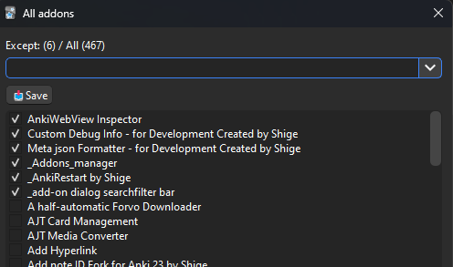

# 📥Addon Bug Detector - Save and Load Enable Add-ons

This add-on saves and restores currently enabled add-ons (Enable or Disabled). And it has a feature to semi-automatically detect an add-on that is causing the problem.

## How to use

You can use it from Tools.
* Tools -> 📥Save and Load Enable Add-ons

### 📥Save and Load

You can save and load currently enabled add-ons.

1. **📤Load:** Load a saved data. Restart is required to activate add-ons.
1. **📥Save:** Save the currently enabled add-ons.
2. **🖌️Rename:** Rename the saved data. The default name is date + number of enabled add-ons.
3. **📝EditData:** You can manually edit the saved data. Checked add-ons are saved add-ons. After editing, press the Save button.
     
4. **🗑️Delete:** Delete selected saved data.

 

### Addon Bug Detector Mode

It has a feature to semi-automatically detect an add-on that is causing the problem.

This feature can be used for these purposes:

1. Identify an add-on that is causing a bug
1. Identify an add-on that is causing Anki delays
1. Identify an add-on of unknown name

Here's the procedure

1. Half of the Add-ons will be automatically disabled.
1. Restart Anki.
1. Check if the problem is reproduced.
1. Press the button on the pop-up that shows up automatically (Reproducible or Not Reproducible)
1. Half of the remaining add-ons will be automatically disabled. Restart Anki.
1. Repeat these steps until the problem add-on is identified. (about 6-8 times)

Click on "Addon Bug Detector Mode" to start.

Press Yes to disable half of the add-ons and restart Anki. A popup will show up automatically, check if you can reproduce the problem. If you can reproduce the problem, press Reproducible. If you cannot reproduce the problem, press Not Reproducible.

Press the button to disable half of the add-ons again and restart Anki.

If AnkiRestart is installed, a popup will be shown for restarting Anki automatically. (If not, restart Anki manually)  Add-on: [🔂AnkiRestart](https://ankiweb.net/shared/info/237169833)

Repeat this 6-8 times to detect the add-on that is causing the problem. When detection is complete the name of the add-on is displayed.

Finally, restarting Anki will restore the add-ons pre-detection state.

If Cancel is pressed during the process, the detection is terminated and add-ons is restored to the state below.

**🚨Note:** In these cases the problem may not be detected.
1. The reproducible button is pressed incorrectly.
2. There are two or more add-ons causing the problem.
3. The problem is caused by the interference of multiple add-ons.

 

### Exception add-ons

Add-ons needed for debugging are excluded from the save list and always enabled. (Otherwise it would be impossible to restart, restore the add-ons state, or identify the problem.)

 By default these add-ons are included (Even if these are not installed the add-on will work.):

1. This add-on (Addon Bug Detector)
2. [🔂AnkiRestart](https://ankiweb.net/shared/info/237169833)
3. [🐞Custom Debug Info](https://ankiweb.net/shared/info/1616945135)
4. [⚙️Meta json Formatter](https://ankiweb.net/shared/info/1984416286)
5. [AnkiWebView Inspector](https://ankiweb.net/shared/info/31746032)
6. [add-on dialog search/filter bar](https://ankiweb.net/shared/info/561945101)

#### ⛔Add Except

This exception list can be edited manually. After editing, press the Save button.

### Bottom buttons

1. **⚙️Add-ons:** Open the native Anki Add-ons dialog. (Tools -> Add-ons)
2. **🔁Restart:** If AnkiRestart is installed, restart Anki.
3. **❌️Close:** Close the window.

