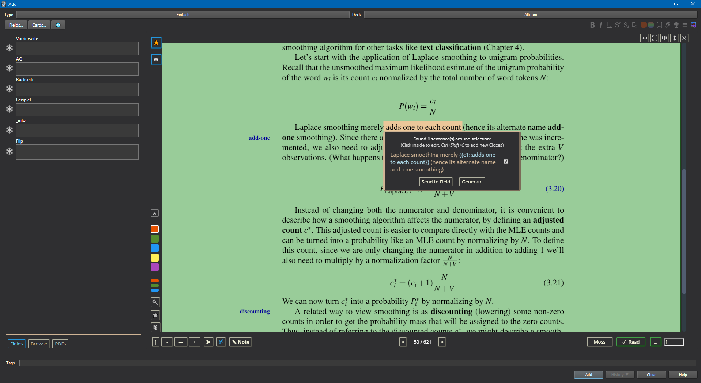
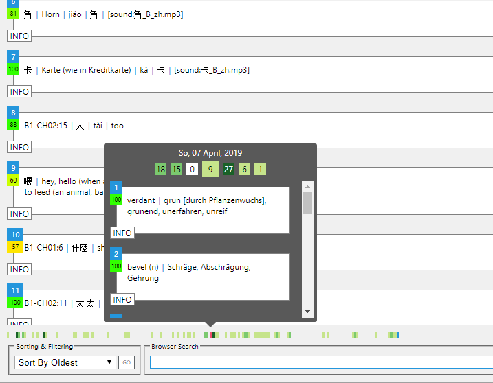
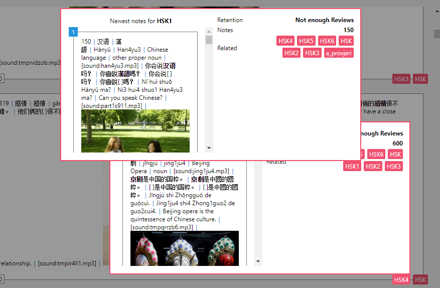
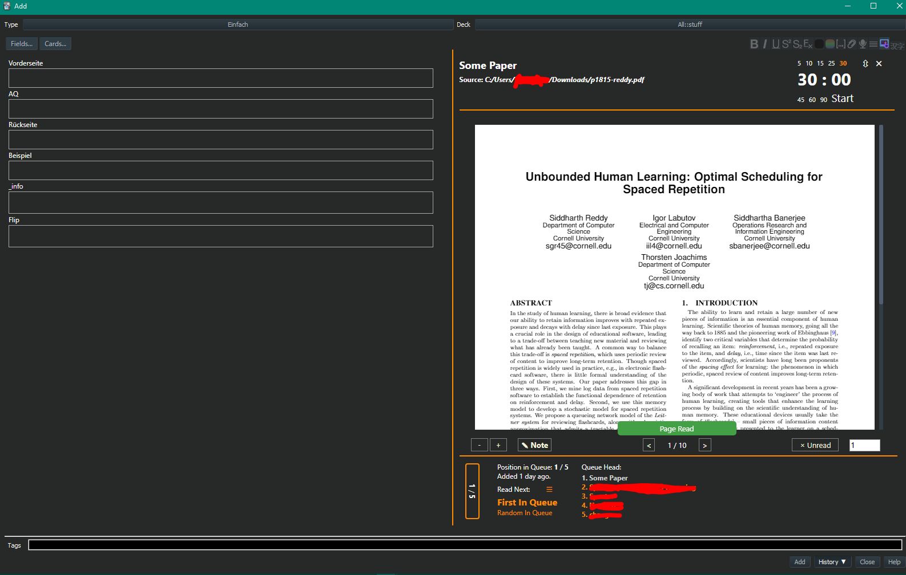
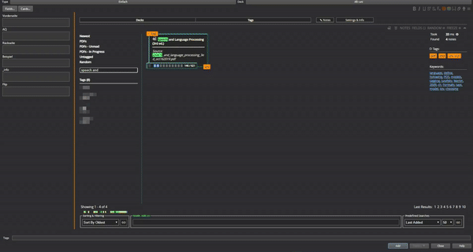

# Searching PDF Reading and Note-Taking in Add Dialog

<!-- Customized -->

### ⚠Oops this add-on is still under repair and does not work with the latest Anki! The last version that works is Anki25.02 -> [Anki25.02 download page](https://github.com/ankitects/anki/releases/tag/25.02)

Q. How can I use this with the latest Anki?
* I'm still repairing it and will release it when the repair is finished. This add-on does nothing with Anki25.04+ (it works in Anki25.02) so if you download this add-on, you will be notified when I upload it, please wait.

### Credit

This add-on is a frok version for Anki25.02 of the addon <a href="https://github.com/fonol/anki-search-inside-add-card" target="_blank">"Searching PDF Reading and Note-Taking in Add Dialog"</a>, originally created by <a href="https://github.com/fonol" target="_blank">Tom Z</a> and credit goes to them. (AGPL License)

### How to use (For Anki 25.02 and lower versions)

*(Almost all of these descriptions and images are partially edited and re-uploaded from the original add-on page.)*

This add-on adds a second pane to the Add dialog, which provides a lot of handy functionality. My main uses for it are:

 * Having a managed priority queue for stuff I want to read/watch and which supports me in adding notes from this material.
 * Searching through my collection while adding notes to find related information

<!-- **Some of the following information might be out-dated. At some point, there will be a documentation page hosted on Github or something similar, but as the add-on features and UI are subject to frequent changes at the moment, I prefer to postpone the documentation part until the feature-set/UI is "stable". My advice to learn how stuff works would be to just slowly try things out, you don't have to use all the features, just pick what is useful to you.** -->

**Some of the following information might be out-dated. My advice to learn how stuff works would be to just slowly try things out, you don't have to use all the features, just pick what is useful to you.**

Features atm include:

- Selecting text inside a field or inside a displayed note allows to search for it
- Automated searching if you type, or if you input tags
- Edit another note (e.g. from the search results) in the add window
- Timeline to see how productive you have been in the current year (CTRL + hovering will show you the cards added on that day)
- Predefined searches (e.g. last added, lowest pass rate, ...)
- Info dialog for displayed notes (Note properties + stats)
- Browser search mask that works exactly like the search you know from the browser window
- Defining synonyms/related terms to include when searching
- Defining stopwords to ignore when searching
- Defining fields to ignore when searching or to hide in the results
- Unsuspending found cards/notes
- Browsing/searching for tags
- Browsing related tags and their notes by hovering over a tag
- Toggling between normal add dialog view and the add-on (by default CTRL-F)
- Notetaking with taggable and searchable notes
- Watching Youtube videos 
- Reading PDFs inside the add window, with
    - progress tracking, i.e. marking pages as read
    - extracting images
    - finding related notes on select
    - scheduling notes to read in a priority queue
    - defining special scheduling dates for notes in the priority queue
    - highlighting text and adding comments
    - creating extracts (e.g. chapters) from pdf notes, to have them as independent items in the queue
- Importing PDF notes from Zotero CSV exports or directly from folders

What the search part of the add-on does is to build a search index out of your decks, which can then be queried. When you type, it tries to find the note whose text is the most similar to what you have typed or selected. Because naturally, many common words are present in a lot of notes, there is a list of words that should be ignored (so called stop words). Examples in english would be "the", "a", "I", "for", etc. I cannot know what languages you write your notes in, so you have to build it by yourself. The default configuration contains an english stop word list for starters.

**The stop word list is defined in the config file, and you should fit it to your language(s) before using this add-on. Your searching will take longer and be less precise if you don't use stop words.**

All UI concerning the search is displayed on the right side of the dialog (it is only displayed above a certain window width and height, so don't be confused if it may not be there when you start). The index is built everytime you start Anki, and by default uses your whole collection.
At the moment, notes you delete are not deleted from the search index until you restart. Same goes for notes you edit during review or in the browser.
Notes you edit through the edit button in the Add Card dialog are updated immediately.

**Please note that some of the following screenshots might be outdated (UI often changes)**

Switching (when the Add window is small, shortcut is CTRL-F):

Editing:  

"Timeline" (CTRL + hover to see the info):  

Tag info (a little wonky atm):  

Night mode styling:  

Reader in night mode styling:  

Making Clozes:  

Tomato Timer:  

"Full Screen"  

"Pages Read"  

"Stats"  

"Review before continuing to read"  

The search results are updated when a field on the left is changed, if a query is entered through the bottom search mask, or if text is selected on the left. Results are notes, not cards, where fields are separated by a | character. Clicking on a note will show some (very basic) evaluation on how you performed on card(s) of the note. 
Clicking on a tag of the note will add the tag to the currently edited note. Results can be pinned / removed (this will only remove the displayed result, NOT delete anything!).

Support for synonyms / query expansion (24-03-19) 

If you enter "What is Anki?" on the left side of the dialog, your search results will only contain notes with "anki" in them. But you might want to retrieve related notes too, that do not contain the term "anki", but maybe something like "spaced repetition". Another use case would be word inflection, because currently, stemming is not activated in the index (that would be language dependent), which means searching for "space" and "spacing" will get different results.
If you click on Settings & Info -> Synonyms, you will see a dialog that allows for the input of synonym sets. These are used when searching, but only for the searches done through the add-on, not for the browser search (when the bottom search bar is in Mode: Browser).

Old image, but you get the idea:

Terms are separated by ",". If you click inside a set, you can edit it and confirm by pressing enter.
If you use synonyms, searching works like follows:
- Suppose you typed "What is Anki?"
- Your stopword list contains "what" and "is", so these are removed
- One of your synonym sets contains "anki", so the query gets expanded by all the terms in the set
- End query: "anki srs spaced repetition"

You should maybe use this conservatively, since you might see too many results for simple queries otherwise.

IR / Notetaking / PDF reading

The idea is that you can create notes that are independent of Anki's notes, which are saved in a sqlite database in a folder you can specify. You can create/edit/delete these notes in the add note dialog. If you type or select text, these notes are included in the search results. They can be tagged, and that way, one can access them over the tag dropdown.
The dialog for creating these notes allows them to be put in a "queue", the idea behind that is to have something like a reading list, so you can simply take the first (or a random) item from the queue, read a part, and create (regular Anki) notes while reading. When you are done, you can move the item to the end of the queue (or somewhere else).
I currently use the feature for reading my uni textbooks and slides, pasting articles from the web to read later, to quickly create notes containing links or questions, e.g. for anything that could be converted to Anki notes later.

Update (09-03-20):
The queue system now works by assigning priorities to items (1-100, where 100 is the highest). I am testing around with scheduling the notes according to their priority in a smart way. 
A note is placed higher in the queue the higher its priority is and the longer it has been since it was last done.

That means items with a high priority will land at the end of the queue initially just like low prio items, but climb the queue faster in the following hours/days. Because the prio is capped at 100, but the time difference grows infinitely, it is guaranteed to see low priority items eventually.
I am quite sure there are smarter ways to schedule and maybe testing will prove the current system to be flawed, so I am totally open to improvement suggestions.

There is also the possiblity to schedule notes to be shown at certain times. At the moment, this happens mainly in the Create/Update note dialog. When a note is scheduled for a given day, it will be placed in front of the queue on that day. If multiple notes are scheduled on that day, they are all placed in front, and internally sorted by their priority and time last seen just like normal.

My current workflow goes like this: 
1. Add my textbooks, lecture slides etc. as PDF notes
2. At the start of a session, I open the queue with the book icon, or by clicking Notes > Read Next, read the first item in the queue for some time (I use 30 min pomodoro slices or or if I feel my workload is high, 15 mins to see more different items), make notes, mark difficult pages or pages I need to revisit again
3. Click Done or if I feel I want to see the item more/less often, adjust the priority.
4. 5/15 min break, then read the next item which has now been moved at the top of the queue.

If you just want to open pdfs without the queue, you could use the sidebar and organize your PDFs by tags, or simply use the "In Progress" search.
This is not very practicable if you are the pdf viewer (e.g. would require closing the current pdf first), so from there, you currently have three options to quickly open another PDF:
1. Ctrl+O hotkey.
2. Queue Manager (from the icon on the pdf viewer bottom bar)
3. Click 'Browse' or 'PDFs' on the bottom of the fields area

Highlighting and Comments

Just a short explanation how they currently work: 
You can select one of the buttons on the pdf's left side, either a color or the Text ("A") symbol. If you then select text while holding down CTRL, it will be highlighted in the currently selected color. 
The comment ("A") button works a bit differently, here you click somewhere, with CTRL pressed. A comment text area should appear at the given location. 
Highlights can be deleted by simply clicking on them, comments by clicking on them with CTRL pressed.

Some notes: 

1. Cards edited through the browser or deleted in the current session are not in the index/removed from the index until you restart the program.

2. The background color in the pdf viewer is the same as the background color from the built-in nightmode (requires Anki >= 2.1.20), so in my opinion, it looks best with night mode enabled

3. No warranties about compatibility with other add-ons. I personally don't use that many, and it would be exhausting to test all possible combinations, so you have to find out by yourself. 

<!-- BUGS: I can't respond to bug reports here, so either post an issue here: https://github.com/fonol/anki-search-inside-add-card or, in case you have a reddit account, please send me a message (or comment in this thread: https://www.reddit.com/r/Anki/comments/axpvjf/search_collection_inside_add_cards_dialog/). Username is Brunzus.
I will try to look after all bugs as soon as I have time. -->

FAQ

Does the add-on need an internet connection?
-> It works completely offline, with the small exception that Youtube videos can be opened only with a working internet connection.

My screen is too small for the add-on
-> There are some settings you could try out: First, you could increase the right column's size by modifying Left Side Width,
if that's not enough, you could modify the Zoom setting to some value < 1.0, which will simply scale everything on the right side down a bit.

When I open the add dialog for the first time, index creation takes too long. 
-> There is not much I can do about that, performance depends on your machine and the size of your collection. You can always exclude decks in the config file to reduce the index size.

My searches take too long
-> As stated elsewhere, search time depends on lots of factors, but the most determining one's are: Collection size, type of index used.  
I always get the fastest results with SQLite FTS version 5. You can check your version in the Info dialog. If you are using FTS 3, queries are much slower. I suggest trying to update your system's SQLite installation with one that comes compiled with FTS 5 support if possible. As for collection size, you can choose to limit the decks that go into the index, see the decks config option. And make sure you use a stopwords list for your language, as explained in the second paragraph.

A note in the results seems to be displayed incorrectly (text flows out of the card).
-> Some notes might contain html that breaks the container into which they are rendered. I try to catch these cases, but if you stumble upon such a note, please open an issue in the github repo with the note text.

Sometimes a search is not triggered when selecting
-> The search is triggered when the mouse up happens inside (!) the note (or field input). So if you mark some text, and leave the note area before 
releasing the mouse, nothing happens.

Some part of the add-on layout is cut-off
-> The layout tries to make everything visible on every screen size, but if you have problems (typical ex. would be that the add-on UI covers some part of the editor buttons), it could be that its another add-on modifying the editor UI, e.g. an add-on adding an additional row below the editor buttons or stuff like that.

I have a note with lots of text, and typing seems to lag at some point
-> Typing typically lags when the results are rendered. My advice would be to either increase the delayWhileTyping config value, which determines how long to wait after the user has stopped typing (I am a slow typer and have mine set to 1500ms atm), so searches aren't triggered too soon while typing, or to uncheck search while typing and use only the FIELDS button to search for your current input. 

What is this Performance stat?
-> I wanted to have a stat that includes not only the pass rate of a note's cards, but also how long I took on average to answer these cards.
So I simply came up with a crude formula that calculates a score (1-100) out of the pass rate and avg. time taken. I am open to suggestions about better stats to display there instead, so if you have any ideas, let me know.

How are the keywords determined?
-> The keywords are not really determined in a sophisticated way, it's just the words that appear most often in the top n results (n = 20 atm) , minus any stopwords.

How do I add a PDF?
-> Click on Notes -> Create -> PDF. Or use Ctrl+Shift+N. In general, all notes are treated as PDF if their Source is a path to a file ending with .pdf.

How do I add a Youtube video?
Open the Create Note dialog and paste the URL of the video into the source field. It will be opened as an embedded video then. Please note that not all Youtube uploaders allow embedding their videos on other sites, so in some cases, it might not work.

What if I move a PDF file while a note is linked to it?
-> If you moved the file, nothing really should happen except you cannot open the PDF anymore (because the path in source is now incorrect).
Reading progress and marks are linked with the ID of the note, so if you change the source of the note to again contain the correct path, everything should be fine.

What is the "Queue"?
-> The queue can be used to kind of schedule your reading, by taking the first item out of it (typically a pdf note or a note containing some pasted article from the web), reading some part, creating notes while doing so, then moving it somewhere back in the queue. This might not be fitting for everyone's workflow, but I am quite happy with it.

Pasted Text from a PDF looks weird
-> Since some of the latest versions, Anki keeps formatting in pasted text. So your pasted text might contain the dark background of the PDF viewer and similar stuff. I don't exactly know about Mac/Linux, but on Windows, you can paste with Ctrl+Shift+V, which pastes the plain text.

Can I port the add-on data to another PC?
-> The relevant data is in the file siac-notes.db, whose location you can find under Info & Settings -> Info > Path to Notes DB. My advice would be to copy the add-on's folder (1781298089) to your new Anki installation's add-on folder, copy siac-notes.db to some safe location and set Path to Note DB to that location.

*(The explanation of the original add-on page ends here)*

### Others

