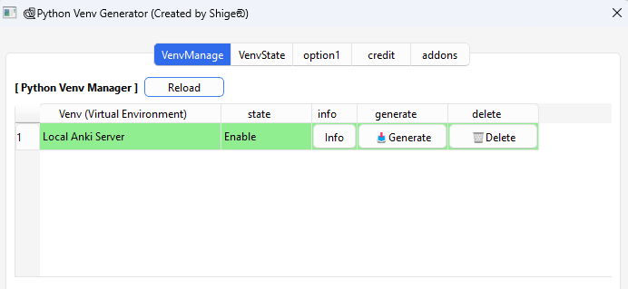
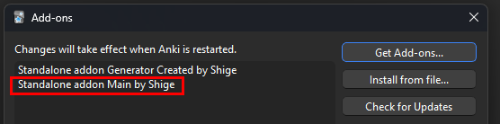
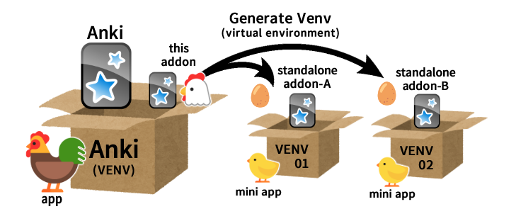

# 🐔Standalone addon generator

<!--
🐔Standalone addon generator - make mini app (Created by Shigeඞ)

standalone-addon-generator.md

Python Venv Generator (Created by Shigeඞ)

**[AnkiWeb Page](https://ankiweb.net/shared/info/🟢) | Code : `🟢`**

contact
https://shigeyukey.github.io/shige-addons-wiki/contact.html
 -->

<!--
https://shigeyukey.github.io/shige-addons-wiki/images/
-->

<!-- Created -->
[](https://www.reddit.com/user/Shige-yuki)

This add-on is for using advanced features that cannot be developed with normal add-ons (e.g. runs programs after Anki is closed). Create Venv (virtual environments) for some of my add-ons using python-build-standalone. Simply put make mini apps for add-ons.

This add-on is called and used by other my add-ons so this add-on alone doesn't do anything.


## How to use




Clicking the Generate button in the add-on's options window creates a new Venv. (it auto downloads the necessary files from the Internet and generates a Venv)

After generating Venv an add-on folder named "Standalone addon Main" is created, save files such as Venv and Python within this folder.



If it doesn't work the download probably failed, if so please contact me.


## How this add-on works

(Explanation for normal users)

### Q. What is a Venv? (virtual environment)
Simply put a virtual environment is a box for putting programs (Python). This add-on creates new boxes for my add-ons and runs the add-on programs within them, like this:



#### Q. What is Python?

Simply put this is the engine for Anki and add-ons. Python is a programming language, Anki and add-ons work using it (if you learn Python you can develop basic add-ons). This add-on downloads and uses the new Python into this add-on's folder.


#### Q. Why is Venv and Python needed?

Normal add-ons depend on Anki and have several limitations, but Venv works as a standalone mini app, this allows adding advanced features that cannot be developed using normal add-ons. e.g.

* Runs programs after Anki is closed.
* Adds features incompatible with the current version of Anki.
* Prevents broken add-ons due to major Anki upgrades.
* Avoids bugs caused by interference with other add-ons.
* Avoids errors that occur when updating add-ons.
* Easily removes the Venv for unused add-ons.
* Manage multiple generated Venv in bulk.


#### Q. What are the disadvantages?

* Download may fail on some devices or in some countries.
* The program may be blocked by your PC's security software. (misdetection)
* The folder's file size is large. (e.g. 100MB+)


## Explanation for advanced users

To be precise it's a Venv generator. This add-on first downloads a standalone Python, uses it to create a Venv, and installs the necessary modules via pip, then it calls the Python executable path of this Venv from other add-ons to run scripts.


### python-build-standalone


Since this Python is standalone, it does not affect your PC's global environment. Python is python-build-standalone download from GitHub into the add-on folder, this Python is almost the same as the one used in the Anki launcher. ([uv](https://docs.astral.sh/uv/)).

* Github: [python-build-standalone](https://github.com/astral-sh/python-build-standalone/)
* docs: [Python Standalone Builds](https://gregoryszorc.com/docs/python-build-standalone/main/)


Import the required libraries using pip, built into standalone Python. (uv is not used.)


<!--
### Main folder structure

```
addons21/
 └── Standalone addon main/
     ├── __init__.py
     ├── meta.json
     └── user_files/
         ├── aaaPythonDLFiles/
         |   └── standalonePython3.13
         └── pythonVenv01/
              └── localAnkiServer
```

 -->


