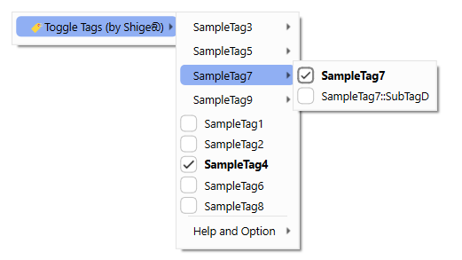
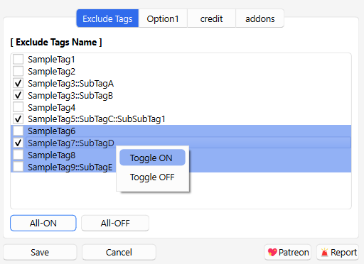
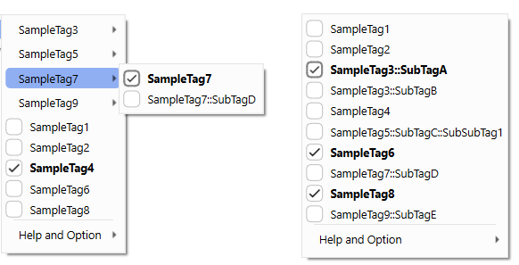

<!-- **[AnkiWeb Page](https://ankiweb.net/shared/info/🟢) | Code : `🟢`** -->

# 🏷️Toggle Tags via Context Menu

<!-- Customized -->

Quickly add or remove tags with a right click. 

This add-on is a fixed and Enhanced version for Anki25+ of the addon <a href="https://ankiweb.net/shared/info/2088508994" target="_blank">"Toggle Tags via Reviewer/Editor/Browser Context Menu"</a>, originally created by <a href="https://github.com/hikaru-y" target="_blank">Hikaru Y.</a> and credit goes to him.

## How to use

This add-on can be used from the right-click context menu of the Editor, Reviewer, and Browser. You can quickly add or remove tags by clicking on the tag name.

### Exclude Tags Name

 

This option allows you to exclude the selected tags from the context menu, it helps reduce having too many tags.

### Enable Tag Nesting
 

You can toggle whether to display tags nested or not.

### Note

The latest Anki Editor is undergoing development for new functions, so it is likely that this add-on will break again with future Anki updates, so if you find any bugs please contact me.

  

## 🚨Report

If you have any problems or requests feel free to send them to me.

 <!-- 1. <a href="https://ankiweb.net/shared/review/🟢" target="_blank">👍️Rate Comment</a> : You can contact me anonymously, and AnkiWeb will send you an email when I reply, a high rating increases priority of development. -->
  2. <a href="https://www.reddit.com/r/Anki/comments/1b0eybn/simple_fix_of_broken_addons_for_the_latest_anki/" target="_blank">👩‍🚀Reddit</a> : You can request me to repair broken Add-ons.
  2. <a href="https://forums.ankiweb.net/t/simple-fix-of-broken-add-ons-for-the-latest-anki-by-shige/41650" target="_blank">🌟AnkiForums</a> : You can request me to repair broken Add-ons, and it is ideal for open discussions.
  3. <a href="https://github.com/shigeyukey/my_addons/issues" target="_blank">🐙Github </a> : Makes it easier to track problems.
  4. <a href="https://www.patreon.com/Shigeyuki" target="_blank">💖Patreon DM</a> : Response will be prioritized.

   

<h4><a href="http://patreon.com/Shigeyuki">💖Please Support Shige's Anki add-ons development!</a></h4>

Hi thank you for using this add-on, I'm Shigeඞ! I'm looking for supporters for my add-ons development, because I like Anki! So far I fixed and customized 60+ discontinued add-ons and created 30+ new add-ons. If you support my volunteer development you will get 14 add-ons for patrons only and 15 game themes included in AnkiArcade ($5/month). If you have any ideas or requests feel free to send them to me, thanks! :D

 
[Get Patrons only addons](https://www.patreon.com/Shigeyuki) | [Patrons Q and A](https://shigeyukey.github.io/shige-addons-wiki/patrons_q_and_a.html) | [Contact](https://shigeyukey.github.io/shige-addons-wiki/contact.html)  

<!-- ## 📥 How do I install this add-on?

1. This add-on works with Anki for desktop (it does not work on mobile). Download Anki from the [official website](https://apps.ankiweb.net/) if you haven't already.
2. Copy and paste the add-on code ( `🟢` )  into Anki and you can install it. ( *Menu -> Tools -> Add-ons -> Get Add-ons -> Code \[ add-on code ]* )
3. When I develop bug fixes, create new features, or compatibility for New Anki, I will notify you and you can install it.
4. Add-ons will be broken when the official Anki gets a major update, so if you like this add-on please support my volunteer development by rating, sharing, and donating. Thank you!

[Click here and please Rate this add-on, Thank you! :-)  
 ](https://ankiweb.net/shared/review/🟢) -->