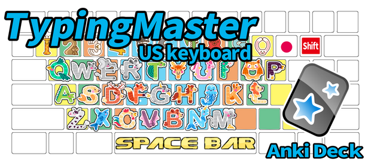
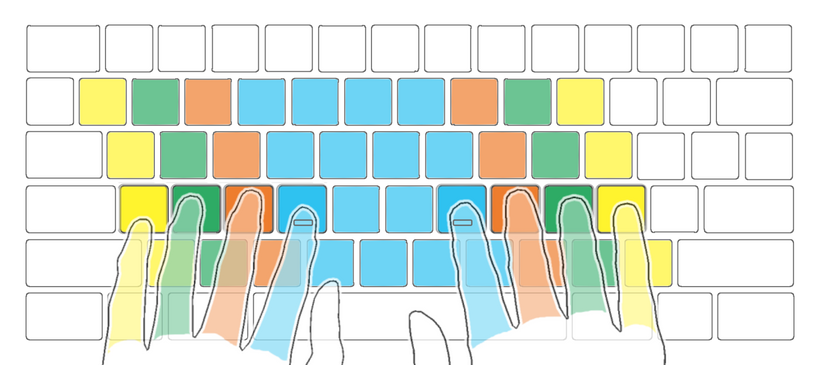
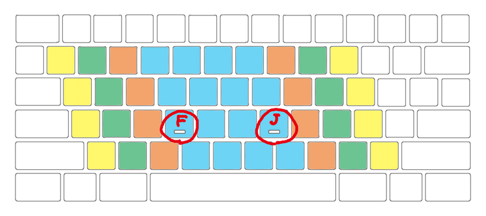
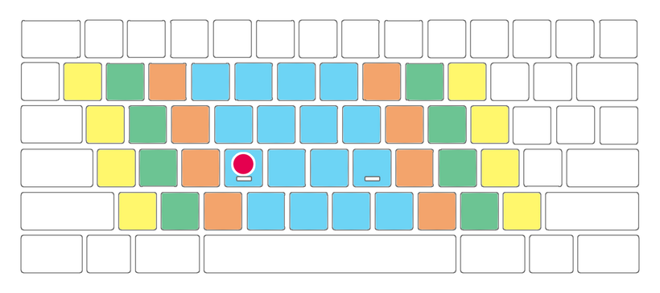
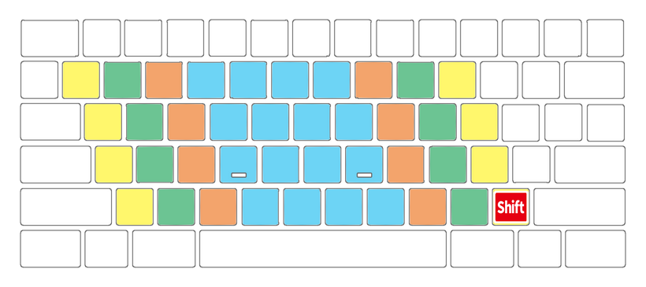
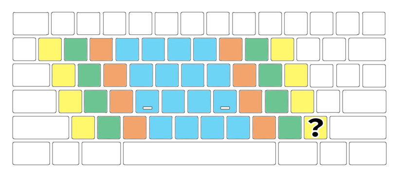
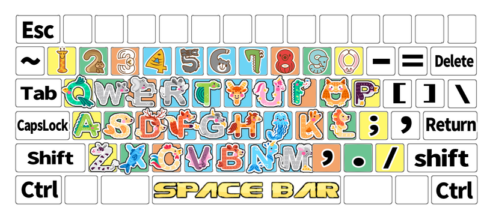

# ⌨TypingMaster US Shared Decks
#### Anki deck for mastering PC touch typing that I made.

(How to use)TypingMaster - US keyboard, Anki deck, 78 notes, 77 audio & 156 images, 15.9MB

I released TypingMaster (shared deck). When you become a Patreon, you can download it from [this download page.](https://www.patreon.com/posts/typingmaster-81568193?utm_medium=clipboard_copy&utm_source=copyLink&utm_campaign=postshare_creator&utm_content=join_link)

Description
This deck is for memorizing keyboards and mastering typin(US keyboard). These images were created by me using illustration materials and painting software.

The color of the keyboard means the position of the fingers. Like this.

The small ridges on F and J are guiding keys. Helps you adjust your left and right hands without looking at the keyboard.

Questions are marked with red circles.

The answer is this.

Keys that press the shift key at the same time are presented with a red square and letter.Like this.

The answer is this.

Image of all keys (shift key is hidden)

## notes:
1. Alphabet ...26 notes (animals illustration)
1. Number ...10 notes (animals illustration)
1. Others ... 42 notes (text image)
1. Sound .... key names

## Deck:
1. TypingMaster
   1. 01_Easy deck... Alphabet only
   2. 02_Hard deck... Numbers and common keys
   3. 03_Extreme deck... Other special key

## == Change log ==

2023/4/23  Update: Adjusting CSS and HTML, and text adjustment.
2023/4/16  First release

## ===↓↓↓Download Deck↓↓↓===
### [Download from this download page.](https://www.patreon.com/posts/typingmaster-81568193?utm_medium=clipboard_copy&utm_source=copyLink&utm_campaign=postshare_creator&utm_content=join_link)

Thank you for reading! If you like this deck, please hit the heart button. Enjoy Anki! 