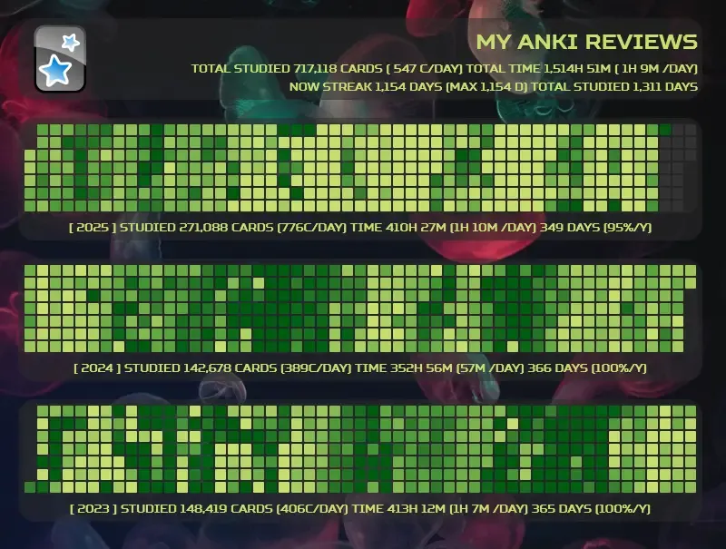
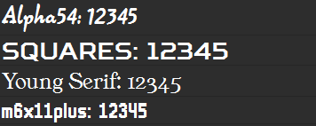
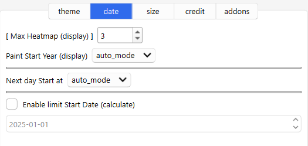
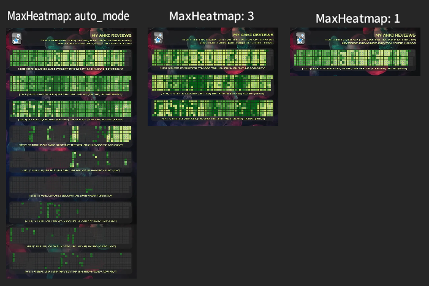

# 🎂Yearly Heatmap Generator

<!--

(Not Free)🎂Yearly Heatmap Generator (Created by Shigeඞ)

 -->

<!-- Created -->

<!-- 🟢 not free yet -->

Hi I'm Shigeඞ! This add-on was developed as a special thanks for the support from my patrons [($5/month)](https://www.patreon.com/Shigeyuki) so it is not yet available for free.

<!-- If you want it for free, download [this empty add-on](https://ankiweb.net/shared/info/🟡) (`🟡`) and please wait, when it becomes free I will notify you and you can install it.

<!-- Patreon: [🟡](🟡) -->

<!-- 🟢 not free yet -->

Generate all heatmaps as an image (default: 800px PNG). Colors and designs can be customized as options. You can use it when you want to share yearly learning progress or when you want to share Streeck achievements.

* **Notes:** This add-on is only for generating the heatmap image so does not have a feature to display the heatmap on Anki's Home screen. The Anki icons are used only to refer to the [official Anki](https://apps.ankiweb.net/) ([Anki License](https://github.com/ankitects/anki/blob/main/LICENSE)), so this add-on is not related to the official Anki.

# How to use

You can generate and preview images from the Tools add-on menu.
* AnkiMenu -> Tools ->  Yearly Heatmap Generator -> Show Heatmap Image

## Heatmap Viewer

1. **Reload**
    * Recalculate reviews and options and regenerate images.
2. **Open Image Folder**
    * Open the user folder where generated images are saved. When you regenerate new images, old images are automatically deleted.
3. **Option**
    * Open the add-on's options window.
4. **Copy Image to Clipboard**
    * Copy the previewed image to the clipboard. This copied image supports only the PNG file format.
    * You can also copy the image by right click.
5. **Copy Path**
    * Copies the file path of the saved image to the clipboard.

## Review Data Text

 * **Title Text**
    * Displays the total review count, time, and streak for all periods.
    * Display the Anki icon on the left. This icon can be changed in the options.
* **Year Text**
    * Display the total reviews, time, and days studied per year below the heatmap.

## Option

Pressing the Save button will save options and then quickly generate or regenerate the image.

### theme tab

* **Now Color**
    * Change the current heatmap color theme.
    * Themes: limeGreen, iceBlue, magenta, flameRed, oliveGreen, lavenderPurple, grapePurple, sakuraPink, amberOrange, rainbow
        * Themes: limeGreen, iceBlue, magenta, flameRed, oliveGreen, lavenderPurple, grapePurple, sakuraPink, amberOrange, rainbow

* **Dark Mode**
    * Switch between dark mode and light mode for generated heatmaps and text.
    * Auto_mode uses the current Anki settings.
* **Anki Icon**
    * Change the displayed Anki icon.
    * Icons: Anki for desktop, AnkiMobile, AnkiDroid, Anki-tan
    * 
    * These icons are used only for the purpose of referring to Anki (except Anki-tan★) and this add-on is not related to the official Anki. (URL: [Official Anki](https://apps.ankiweb.net/), [AnkiMobile](https://itunes.apple.com/us/app/ankimobile-flashcards/id373493387), [AnkiDroid](https://play.google.com/store/apps/details?id=com.ichi2.anki))

* **Font Name**
    * Change the font type of the text.
    * Font type: Arial, Alpha54, Squares, Young_Serif, m6x11plus
    * These fonts are included in the add-on. (except Arial)
    * 
* **Background Image**
    * Change the background image of the heatmap.
    * None hides the image. (Dark-mode: Gray, Light-mode: White)

### Date tab

The options on this tab are for date calculations.

* **Max Heatmapo (display)**
    * Maximum number of heatmaps to display. e.g.
    * 
    * auto_mode: Show all heatmaps. (default)
    * This option only hides the heatmap, so reviews for hidden heatmaps are still calculated and included in the total score calculation.

* **Paint Start Year (display)**
    * Specify the year to start displaying the heatmap.
    * This option only hides the heatmap so hidden heatmaps are still calculated.
* **Next day Start at**
    * Change the time the day begins. This auto fetches Anki settings so basically you don't need to change it.
* **Enable Limit Start Date (calculate)**
    * Specify the date to start calculating heatmaps and scores. Data prior to this date will not be fully calculated.

### Size tab

* **Save image format**
  * Change the format of the image to be saved.
  1. **Png** (default) : A common image format. It has large file sizes but high quality.
  2. **Jpg** : A common image format. It has smaller file sizes but is prone to quality degradation.
  3. **Webp** : A relatively new image format. It's very lightweight with high quality, but sometimes it may not be supported by apps or websites. Cannot be saved to the clipboard.

* **Image Width (px)**
  * Specify the image width in pixels.
  * The default is 800px.
  * Occasionally there may be slight variations in the value.

* **Image Aspect**
    * Change the image aspect ratio. e.g.
    * 
    1. auto_mode
        * Auto mode combines all heatmaps into a single image.
        * A single heatmap results in a shorter image.
        * If there are many heatmaps, the image will become very long.
    * Other
      * Other sizes will fix the image aspect ratio.
      * If there are too many heatmaps to fit into a single image, a second or third image will be generated.
      2. square_1_1
      3. portrait_4_5
      4. vertical_9_16
      5. wide_1_91_1
      6. landscape_16_9
      7. portrait_2_3

## Credit

* The code for this add-on was newly written to optimize image generation and to study Anki's database mechanisms, so there are almost no direct code references. But inspired by [Thore Tyborski's](https://github.com/ThoreBor) [Anki Leaderboard](https://github.com/ThoreBor/Anki_Leaderboard) and [Glutanimate's](https://glutanimate.com/support-my-work/) [Review heatmap](https://ankiweb.net/shared/info/1771074083).
* The icons used are the official Anki icons. ([Anki License](https://github.com/ankitects/anki/blob/main/LICENSE)) (Me and my add-on are not related to the official Anki.)
* The background images use images licensed under the [Unsplash License.](https://unsplash.com/license)
* [Anki-tan](https://shigeyukey.github.io/shige-addons-wiki/Anki-tan.html) is an unofficial mascot character I drew (CC4, not related to the official Anki).

## Notes

* This add-on is only for generating the heatmap image so does not have a feature to display the heatmap on Anki's Home screen.
* Only year display is supported, month display is not supported.
* Since it is an image, there is no tooltip function to display the review scores from the heatmap.

<!-- ## Change log -->

 

<h4><a href="http://patreon.com/Shigeyuki">💖Please Support Shige's Anki add-ons development!</a></h4>

Hi thank you for using this add-on I'm Shigeඞ!
1. \[ 🛠️Fix add-ons ] So far I fixed and customized 80+ broken add-ons for free and developed over 30 add-ons as a hobby ([all add-ons](https://ankiweb.net/shared/addons?search=Please%20Support%20Shige%27s%20Anki%20add-ons%20development&sort=rating)). If you have requests to fix broken add-ons feel free to contact me. [Fix broken addons (Free)](https://new.reddit.com/r/Anki/comments/1b0eybn/simple_fix_of_broken_addons_for_the_latest_anki/)
2. \[ 💖Donation ] I'm looking for supporters for my add-ons development because I like Anki!👍️ If you support my volunteer development you will get 14 add-ons for patrons only and 15 game themes included in AnkiArcade ($5/month).

 
[Get Patrons only addons](https://www.patreon.com/Shigeyuki) | [Patrons Q and A](https://shigeyukey.github.io/shige-addons-wiki/patrons_q_and_a.html) | [Contact](https://shigeyukey.github.io/shige-addons-wiki/contact.html)  

**[[ Special Thanks ]](https://shigeyukey.github.io/shige-addons-wiki/patrons_credit.html#patrons)**  
 So far I received donations from 574 patrons and without their support I never could develop this, thank you very much!🙏  
  **Patrons:** Arthur Bookstein Haruka  Luis Alberto, Letona Quispe 07951350313540  Lily Tim Daniel Kohl-Fink NamelessGO Kyle Mondlak ElAnki Matthew Hartford Abhi S findus161 Jonathan Contreras K  Peasant of Anki Juan Salgado Jesse Asiedu David C Ernest Chan Yaeerrrrrr Christopher Lam Elisabeth Barber Steven Banner GP O'Byrne Xiuxuan Wang KM Kolorophyll  Jake Stucki Kaitlyn Bowler Isabel Guan gus forester Heidi  Leonora Lomoki Akporyoe ellie Tobias Klös Aydin Herik Ujwal Chadha Iggi Austin Regal Mia Hoang Hung iuventius Patrick ellis Orlando Frey Take Root tarek qiting zeng Carly Burdorf Muneeb Khan Zarina Balde Sameer Al Matheus Chagas Bryn Price pie_is_good Svel1989 Vivian Cao Keeler Kime Kurt Grabow Pansanity Gabriel Farrugia Terence Bartenbach R Rebecca Lis Y. Fahim Shaik Augusto Stein Ashok Rajpurohit mootcourt NoirHassassin alpha male, shredded af Morgan Torres Dennis Obis Will S. Anh-Tai Nguyen Tae Lee Devon Williams alex han Joseph Howell Simeon Gabriel Vinicio Guedes sab hoque only Ythalo Vlogs Ketan Pal Aurora Dzurko Kevin Galvez Tyler Schulte Kmyungc Mac Meeyah Davis Eric Allen Douglas Beeman Andrew Yick Robert Remedios Marley Easterbrook Temi Jide Ansel Ng Azfar Hussain Haley Schwarz Woody kenken  [...full list](https://shigeyukey.github.io/shige-addons-wiki/patrons_credit.html#patrons)